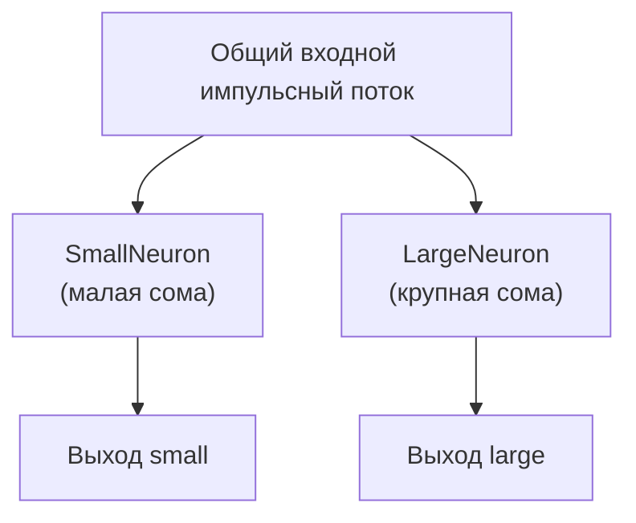

## NM-PN-NeuronSizeActivity — влияние размера сомы на активность нейрона

**Путь:** `Bin/Configs/SpikeSamples/NM-Neurons/NM-PN-NeuronSizeActivity`
**Статус валидации:** VALID (см. `Reports/SpikeSamples-Validation-Report.md`)

### Назначение конфигурации

Эта конфигурация демонстрирует один из ключевых результатов работ [1], [2]:

> **крупные нейроны (с большой сомой) при тех же входных воздействиях отвечают более редкими разрядами по сравнению с маленькими нейронами.**

Конфигурация содержит несколько нейронов с различным числом соматических участков мембраны и сопоставляет их ответы на одинаковые входные импульсные потоки.

### Структура модели

- **Нейроны:** несколько экземпляров `NPulseNeuron`, отличающиеся:
  - числом участков мембраны сомы (размер клетки);
  - параметрами обратной связи (коэффициент `FeedbackGain` и глубина ОС перезарядки).
- **Мембрана:** `NPulseMembrane` / `NPulseMembraneCommon`
  - в каждой модели — базовый набор возбуждающих и тормозных каналов и соответствующих синапсов;
  - участки, охваченные обратной связью от LT‑зоны, определяют «сому» нейрона.
- **Входы:** для сравнения используются одинаковые по частоте и амплитуде импульсные потоки.

Схематично:

### Эксперимент и моделируемые реакции

Основной сценарий:

- один и тот же входной импульсный поток подаётся на *малый* и *крупный* нейрон;
- записывается:
  - мембранный потенциал в области LT‑зоны;
  - частота и число выходных спайков за фиксированный интервал времени.

Ожидаемые результаты (в соответствии со статьями):

- **малый нейрон** (меньшая ёмкость, большее эффективное сопротивление) даёт более частые разряды и/или пачки импульсов;
- **крупный нейрон** (большая ёмкость, меньшая чувствительность) отвечает одиночными импульсами с меньшей частотой;
- на графиках зависимости частоты разрядов от размера сомы видно:
  - спад средней частоты по мере увеличения числа соматических участков;
  - изменение числа импульсов в пачке.

### Параметры модели

Численные параметры задаются в `Parameters.xml` и включают:

- размеры сомы (через количество участков мембраны и их параметры);
- сопротивления и ёмкости мембранных участков (`Resistance`, `Capacity`, `RestingResistance`, `FBResistance`);
- пороги и коэффициенты обратной связи (параметры генератора LT‑зоны).

Конкретные значения подобраны так, чтобы воспроизвести качественные зависимости, показанные в графиках работ [1], [2] (рис. 5 и 9 в описаниях).

### Связанные материалы

- `SpikeSamples/NM-Neurons/NM-PN-01-Neuron-1M1St1In1` — базовый пример малого нейрона.
- `SpikeSamples/NM-Neurons/NM-PN-03/05/06-*` — нейроны с более сложной сомой и дендритами.
- Интегральная документация:
  - `Bin/Docs/SpikeSamples/NeuronReactions.md`
  - `Bin/Docs/SpikeSamples/ImpulseProcessingModel.md`

## Литература

1. Бахшиев А.В., Романов С.П. Воспроизведение реакций естественных нейронов как результат моделирования структурно-функциональных свойств мембраны и организации синаптического аппарата // Нейрокомпьютеры: разработка, применение, №7, 2012. – с.25-35. [онлайн](https://neuromodeler.ru/index.php?option=com_content&view=article&id=20:2012-07-19-04-53-55&catid=67&lang=ru&Itemid=676) | [elibrary](https://www.elibrary.ru/item.asp?id=17997711)

2. Бахшиев А.В., Романов С.П. Математическое моделирование процессов преобразования импульсных потоков в естественном нейроне // Нейрокомпьютеры: разработка, применение, №3, 2009. – с.71-80. [онлайн](https://neuromodeler.ru/index.php?option=com_content&view=article&id=24:2012-11-07-16-42-21&catid=67&lang=ru&Itemid=676) | [elibrary](https://www.elibrary.ru/item.asp?id=13070281)

## NM-PN-NeuronSizeActivity — влияние размера сомы на активность нейрона

**Путь:** `Bin/Configs/SpikeSamples/NM-Neurons/NM-PN-NeuronSizeActivity`
**Статус валидации:** VALID (см. `Reports/SpikeSamples-Validation-Report.md`)

### Назначение конфигурации

Эта конфигурация предназначена для систематического исследования **зависимости активности нейрона от размера сомы** при фиксированных параметрах синапсов и ионных механизмов. Она агрегирует идеи, заложенные в примеры `NM-PN-01..08`, и соответствует экспериментам из статей, где:

- сравниваются малые и крупные нейроны при одинаковой входной стимуляции;
- анализируется изменение частоты и структуры спайковых паттернов.

### Структура модели

В конфигурации описывается набор нейронов или набор режимов одного нейрона, отличающихся:

- числом участков сомы (размер мембраны, охваченной обратной связью);
- возможно, числом и распределением дендритных участков;
- при этом параметры:
  - синапсов (`NPulseSynapse`),
  - каналов (`NPulseChannel`),
  - LT‑зоны (`NPulseLTZone`)

остаются неизменными или меняются по заранее заданной схеме, соответствующей таблицам параметров из статьи.

### Эксперимент и моделируемые реакции

Типичный сценарий:

- для каждого варианта размера сомы:
  - подаётся одинаковый импульсный вход (частота, амплитуда, длительность);
  - регистрируется выходной спайковый поток и мембранный потенциал;
  - измеряются:
    - число спайков в пачке;
    - интервалы между спайками;
    - средняя частота на заданном интервале.
- результаты сопоставляются между вариантами:
  - малый нейрон → более высокая частота и более длинные пачки;
  - крупный нейрон → меньшая частота и, возможно, одиночные спайки.

### Интерпретация

Конфигурация демонстрирует ключевой биофизический тезис:

- увеличение ёмкости и «размера» мембраны (большее количество участков сомы) приводит к:
  - более медленному накоплению потенциала;
  - сглаживанию колебаний;
  - снижению чувствительности к отдельным входным импульсам.

Тем самым моделируются отличия между малыми вставочными нейронами и крупными мотонейронами.

### Связанные материалы

- Базовые конфигурации:
  - `SpikeSamples/NM-Neurons/NM-PN-01-Neuron-1M1St1In1`
  - `SpikeSamples/NM-Neurons/NM-PN-02-Neuron-1M1St3In3`
  - `SpikeSamples/NM-Neurons/NM-PN-03-Neuron-4M4D3St3In`
  - `SpikeSamples/NM-Neurons/NM-PN-04..08-*`
- Интегральная документация:
  - `Bin/Docs/SpikeSamples/NeuronReactions.md`
  - `Bin/Docs/SpikeSamples/ImpulseProcessingModel.md`

## Литература

1. Бахшиев А.В., Романов С.П. Воспроизведение реакций естественных нейронов как результат моделирования структурно-функциональных свойств мембраны и организации синаптического аппарата // Нейрокомпьютеры: разработка, применение, №7, 2012. – с.25-35. [онлайн](https://neuromodeler.ru/index.php?option=com_content&view=article&id=20:2012-07-19-04-53-55&catid=67&lang=ru&Itemid=676) | [elibrary](https://www.elibrary.ru/item.asp?id=17997711)

2. Бахшиев А.В., Романов С.П. Математическое моделирование процессов преобразования импульсных потоков в естественном нейроне // Нейрокомпьютеры: разработка, применение, №3, 2009. – с.71-80. [онлайн](https://neuromodeler.ru/index.php?option=com_content&view=article&id=24:2012-11-07-16-42-21&catid=67&lang=ru&Itemid=676) | [elibrary](https://www.elibrary.ru/item.asp?id=13070281)

