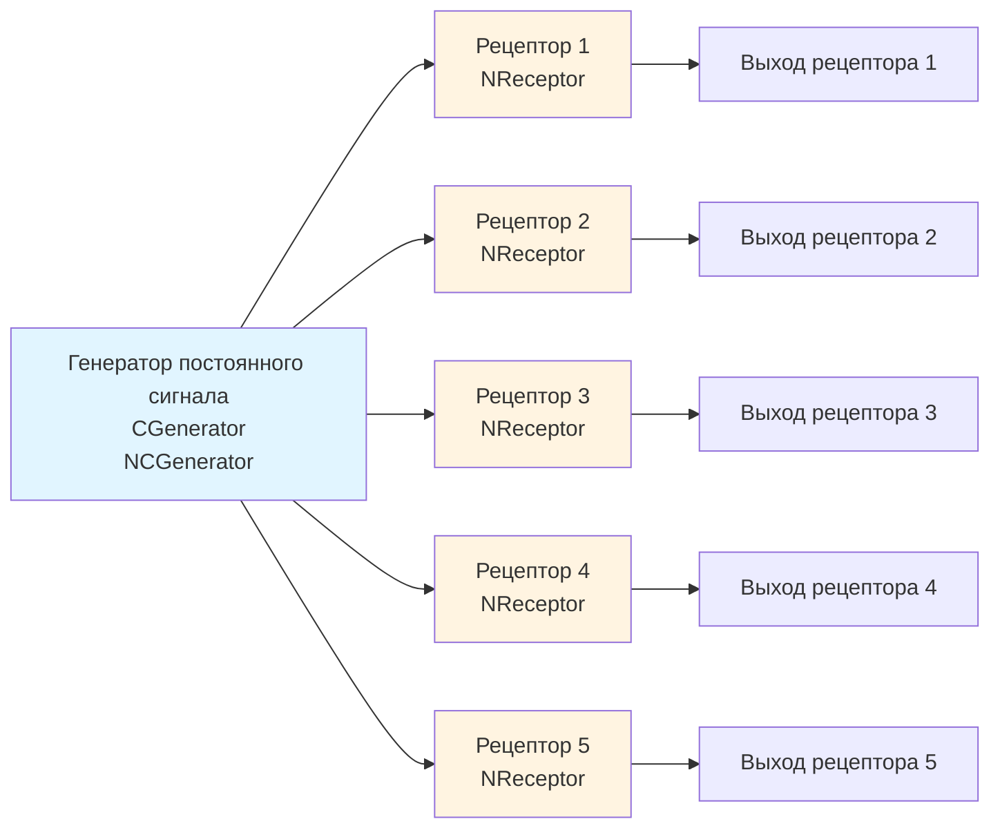

## NReceptor — модель рецептора

**Путь:** `Bin/Configs/SpikeSamples/NeuralElements/NReceptor`
**Статус валидации:** VALID (см. `Reports/SpikeSamples-Validation-Report.md`)

### Назначение конфигурации

Конфигурация демонстрирует **модель рецептора** — компонента, преобразующего внешние стимулы в нейронные сигналы. Конфигурация использует компонент `NReceptor` для моделирования рецепторов и генератор постоянного сигнала (`NCGenerator`) для создания входных стимулов.

### Структура конфигурации

Конфигурация содержит:

- **CGenerator** (`NCGenerator`) — генератор постоянного сигнала
- **5 рецепторов** (`NReceptor`) — компоненты рецепторов (Receptor, Receptor2, Receptor3, Receptor4, Receptor5)

### Биологическая мотивация

Рецепторы являются важной частью сенсорных систем:

- **Преобразование стимулов** — рецепторы преобразуют внешние стимулы (свет, звук, давление, температура и т.д.) в нейронные сигналы
- **Кодирование информации** — рецепторы кодируют информацию о стимулах в виде импульсных последовательностей
- **Передача сигналов** — рецепторы передают сигналы в центральную нервную систему через афферентные нейроны

### Структура модели

Обобщённая схема модели рецептора:

### Эксперимент и моделируемые реакции

#### Цель эксперимента

Изучение работы рецепторов:
- Преобразование внешних стимулов в нейронные сигналы
- Кодирование информации о стимулах в виде импульсных последовательностей
- Передача сигналов от рецепторов

#### Сценарии экспериментов

1. **Базовое тестирование рецепторов:**
   - Генератор создаёт постоянный входной сигнал
   - Рецепторы преобразуют сигнал в нейронные выходы
   - Наблюдение работы рецепторов

2. **Влияние входного сигнала:**
   - Изменение величины входного сигнала
   - Наблюдение влияния на выходные сигналы рецепторов
   - Анализ кодирования информации

#### Ожидаемые результаты

- **Преобразование сигналов:** рецепторы должны преобразовывать входные стимулы в нейронные сигналы
- **Кодирование информации:** информация о стимулах должна кодироваться в виде импульсных последовательностей

### Параметры модели

Основные параметры задаются в `Model_00.xml` и `Parameters_00.xml`:

#### Параметры генератора постоянного сигнала

- Параметры генерации постоянного сигнала

#### Параметры рецепторов

- Параметры преобразования входных стимулов в нейронные сигналы
- Параметры кодирования информации
- Параметры передачи сигналов

Точные численные значения можно смотреть в `Parameters_00.xml`.

### Ограничения документации

**⚠️ Недостаточность источников:** Для создания полной документации по рецепторам требуется дополнительная информация:

- Детальное описание механизмов преобразования внешних стимулов в нейронные сигналы
- Параметры различных типов рецепторов (фоторецепторы, механорецепторы, хеморецепторы и т.д.)
- Связь с афферентными нейронами и сенсорными системами
- Математические модели преобразования стимулов

**Планируемые источники:**
- Дополнительные публикации по рецепторам и сенсорным системам
- Документация по компоненту `NReceptor` в библиотеке NMSDK

### Связанные материалы

- Описание конфигурации:
  - `Description.rtf` — подробное описание конфигурации (в формате RTF)
- Теория и функциональное описание:
  - [`Bin/Docs/SpikeSamples/NeuronReactions.md`](../../../../Docs/SpikeSamples/NeuronReactions.md) — реакции одиночных нейронов
  - [`Bin/Docs/SpikeSamples/ImpulseProcessingModel.md`](../../../../Docs/SpikeSamples/ImpulseProcessingModel.md) — модель преобразования импульсных потоков
- Связанные конфигурации:
  - `NM-AfferentNeurons` — афферентные нейроны, использующие рецепторы

### Примечания

Данная документация является базовой и будет расширена после получения дополнительных источников информации по рецепторам и сенсорным системам.
