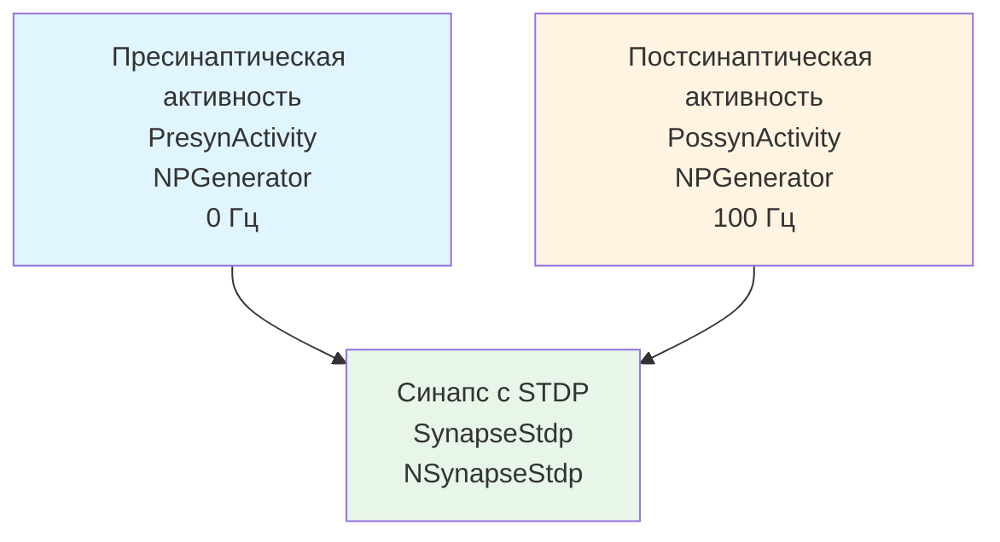

## STDP-Simple-01 — простая тестовая модель STDP

**Путь:** `Bin/Configs/SpikeSamples/STDP/STDP-Simple-01`
**Статус валидации:** VALID (см. `Reports/SpikeSamples-Validation-Report.md`)

### Назначение конфигурации

Конфигурация демонстрирует **простую тестовую модель STDP (Spike-Timing-Dependent Plasticity)** — механизма синаптической пластичности, зависящего от временной корреляции между пресинаптическими и постсинаптическими спайками. Конфигурация использует компонент `NSynapseStdp` для моделирования STDP и два генератора импульсов для создания пресинаптической и постсинаптической активности.

### Структура конфигурации

Конфигурация содержит:

- **PresynActivity** (`NPGenerator`) — генератор импульсных сигналов для пресинаптической активности (частота: 0 Гц)
- **PossynActivity** (`NPGenerator`) — генератор импульсных сигналов для постсинаптической активности (частота: 100 Гц)
- **SynapseStdp** (`NSynapseStdp`) — компонент синапса с STDP-пластичностью

### Структура модели

Обобщённая схема простой модели STDP:

**Примечание:** Выходы системы — `PresynActivity.Output` и `PossynActivity.Output` (используются для мониторинга активности генераторов).

### Эксперимент и моделируемые реакции

#### Цель эксперимента

Изучение механизмов STDP:
- Влияние временной корреляции между пресинаптическими и постсинаптическими спайками на изменение синаптического веса
- Наблюдение изменения синаптического веса в зависимости от временных интервалов между спайками
- Анализ механизмов синаптической пластичности

#### Сценарии экспериментов

1. **Базовое тестирование STDP:**
   - Генераторы создают пресинаптические и постсинаптические спайки с различными временными интервалами
   - Компонент синапса обрабатывает сигналы и изменяет синаптический вес
   - Наблюдение изменения синаптического веса

2. **Влияние временной корреляции:**
   - Изменение временных интервалов между пресинаптическими и постсинаптическими спайками
   - Наблюдение влияния на изменение синаптического веса
   - Анализ механизмов усиления и ослабления синапсов

#### Ожидаемые результаты

- **Изменение веса:** синаптический вес должен изменяться в зависимости от временной корреляции между спайками
- **Усиление/ослабление:** пресинаптические спайки, предшествующие постсинаптическим, должны усиливать синапс, а следующие после — ослаблять

### Параметры модели

Основные параметры задаются в `Model_00.xml` и `Parameters_00.xml`:

#### Параметры генераторов импульсов

- **PresynActivity:** Frequency: 0 Гц, Amplitude: 1, PulseLength: 0.001 с, AvgInterval: 5 с
- **PossynActivity:** Frequency: 100 Гц, Amplitude: 1, PulseLength: 0.001 с, AvgInterval: 5 с

#### Параметры синапса с STDP

- Параметры механизма STDP
- Параметры изменения синаптического веса
- Параметры временных окон для усиления и ослабления

Точные численные значения можно смотреть в `Parameters_00.xml`.

### Ограничения документации

**⚠️ Недостаточность источников:** Для создания полной документации по STDP-механизмам требуется дополнительная информация:

- Математические модели STDP (дискретный, интегральный, вероятностный, стабильный, триплет, зеркальный варианты)
- Детальное описание механизмов изменения синаптического веса
- Параметры временных окон для усиления и ослабления синапсов
- Связь с биологическими механизмами синаптической пластичности

**Планируемые источники:**
- [B] (математические модели STDP, варианты: дискретный, интегральный, вероятностный, стабильный, триплет, зеркальный)
- Дополнительные публикации по STDP-механизмам

### Связанные материалы

- Описание конфигурации:
  - `Description.rtf` — подробное описание конфигурации (в формате RTF)
- Теория и функциональное описание:
  - [`Bin/Docs/SpikeSamples/ImpulseProcessingModel.md`](../../../../Docs/SpikeSamples/ImpulseProcessingModel.md) — модель преобразования импульсных потоков

### Примечания

Данная документация является базовой и будет расширена после получения дополнительных источников информации по STDP-механизмам.

## Литература

1. Зарубин К.В. Исследование методов обучения спайковых нейронных сетей: выпускная квалификационная работа бакалавра. 2022. [онлайн](https://doi.org/10.18720/SPBPU/3/2022/vr/vr24-1435)
