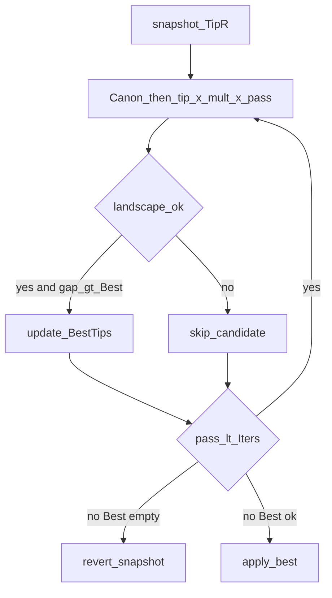
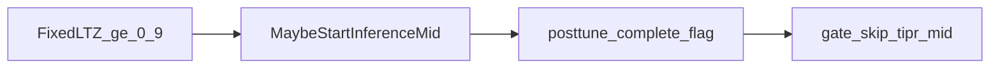

# Пост-тюнинг в модуле-учителе (PostTune)

**English:** [`POST_TRAIN_TUNING.md`](POST_TRAIN_TUNING.md)  
**Связано:** [`RELIABILITY_MAP.ru.md`](RELIABILITY_MAP.ru.md) §4.7 · [`RECIPE_COVERAGE.md`](RECIPE_COVERAGE.md) · [`SUCCESSFUL_EXPERIMENTS.md`](SUCCESSFUL_EXPERIMENTS.md)

После синхронизации длин и нормализации амплитуд учитель может сам выполнить рецепт **tip-resistance + silent mid FixedLTZ**, без обязательного Python `apply_tiprmin` / silent probe.

**По умолчанию этап включён** (`EnablePostTrainTuning=true` в `ADefault`). Старые XML без свойства при cold retrain получают PostTune.

## Фазы

| | `NNeuronTimeLearner` | `NNeuronTimeLearnerBranch` |
|--|--|--|
| 0 | Sync | Sync |
| 1 | Normalize | Normalize |
| 2 | Done | Done |
| 3 | **PostTune** | CalibrateLtz (legacy, только если tuning **OFF**) |
| 4 | — | **PostTune** |

Порядок: Sync → Normalize → (PostTune **или** legacy CalibrateLtz) → Done.

При `EnablePostTrainTuning=1` Branch **не** вызывает `ScaleTipResistancesForParallelActivation` и **не** входит в `kPhaseCalibrateLtz`.

## Свойства (оба класса)

| Свойство | Default | Смысл |
|----------|---------|--------|
| `EnablePostTrainTuning` | `true` | Мастер-флаг |
| `PostTrainTipResistanceMode` | `1` (CanonRmin) | 0 Off · 1 CanonRmin · 2 FlatLastR · 3 KeepDone · 4 SearchSynthetic |
| `EnablePostTrainMidThreshold` | `true` | Silent-mid FixedLTZ |
| `PostTrainMidMetric` | `0` Auto | TL→LTZ peak; Branch→soma peak |
| `TipResistanceCanonFloor` | `2e7` | Пол / первые tips CanonRmin |
| `TipResistanceCanonLast` | `8.6e7` | Последний tip / FlatLastR |
| `PostTrainSilentThreshold` | `1.0` | Порог на время зондов |
| `PostTrainSyntheticFoilCount` | `8` | Макс. чужих паттернов |
| `PostTrainTipSearchIters` | `12` | Лимит для mode=4 |
| `PostTrainTuneComplete` | `false` | Служебно: PostTune закончен |
| `AutoScaleIterationGap` | `true` | gap/delay = span+settle+slack (XML `IterationGap` не поднимает пол) |

Канон тайминга: [`docs/TIMING_AND_GAP.ru.md`](docs/TIMING_AND_GAP.ru.md).

## Режимы tip-resistance

| Mode | Действие |
|------|----------|
| 0 Off | TipR не трогать; mid по текущему |
| 1 CanonRmin | `[floor]×(N−1)+[last]`; `ResistanceMin≥floor`; Exc sync |
| 2 FlatLastR | `[last]×N` (AsymRm span25) |
| 3 KeepDone | snapshot с конца Normalize |
| 4 SearchSynthetic | старт CanonRmin; tip×mult×pass; BestTips **только** при `landscape_ok`; иначе revert на **KeepDone snapshot** (Branch: ScaleTipR×N до Canon) |

Сводка mode→span: [`RELIABILITY_MAP.ru.md`](RELIABILITY_MAP.ru.md) §4.7.

## Алгоритм mid-зондов (паритет с phase8 / phase9 / pack A)

**TipR** считается в Train PostTune. **Silent mid** — в **Test inference** (тот же C++, без Python):

| Класс | Метрика mid | Gate |
|-------|-------------|------|
| Branch | soma peak | `phase8 --skip-tipr-mid` |
| TL (AsymRm) | LTZ peak (Auto) | `phase9 --skip-tipr-mid` |

1. Train PostTune: TipR (+ Exc). Если Train free-run даёт инверсии foils / gap≪1 → `FixedLTZ=1.0` (silent), `Need=0`.
2. Test `ABuild`: при `FixedLTZ≥0.9` — `Dataset.StateGeneration=0` (не играть pack до mid).
3. Test `MaybeStartInferenceMidProbes`: играет **текущую Matrix** (pack A), без лишнего `Neuron->Reset`; mid = `0.5*(tgt+max_below)` иначе `tgt*0.99`; flag `posttune_complete.flag`. Analyzer на время mid выключен.
4. Gate `--skip-tipr-mid`: если thr silent → pass1 до flag → flush mid в XML → pass2 gate.

SearchSynthetic (mode=4) выполняется **только** в Train PostTune loop (`PostTrainTipSearchIters=12` полных pass).  
Кандидат в BestTips только если `LandscapeOk(tgt, foils)` (все foils &lt; tgt) **и** `gap > BestGap`. Иначе в конце — `search_reverted=1` + snapshot.  
**Test-only / `--skip-train` smoke ≠ валидация Search**. Приёмка: `posttune_verify --case br100_search` (без skip-train); PASS если TipR≠keep **или** `search_reverted=1`; mid только `cpp`; fires **строго** `10000000`. См. [`POST_TRAIN_VERIFY.ru.md`](POST_TRAIN_VERIFY.ru.md) §V5b.

Код: `NNeuronPostTrainTune.*` (`LandscapeOk`, `ComputeMidThreshold`), `NNeuronTimeLearner` / `Branch::{MaybeStartInferenceMidProbes,FinalizePostTuneMid,SetupPostTuneFreeRunProbes}`.

## Verify (P0 cold/smoke)

Сводка: [`_repro/POSTTUNE_VERIFY_RESULT.md`](_repro/POSTTUNE_VERIFY_RESULT.md) · план: [`POST_TRAIN_VERIFY.ru.md`](POST_TRAIN_VERIFY.ru.md)

| case | TipR | mid (C++) | vs gold | fires |
|------|------|-----------|---------|-------|
| br25_on CanonRmin | `2e7×3+8.6e7` | ≈0.07180 | ±5% | `10000000` |
| br25_off CalibrateLtz | ScaleTipR (≠канон) | 0.0163 | (legacy path) | `10000000` |
| asym25 FlatLastR | `8.6e7×4` | ≈0.037589 | ±5% | `10000000` |

## Скрипты

- `scripts/repro_cold_lib.py` → `post_train_hygiene`: при PostTune ON и TipR уже канон/flat — **skip** Python tiprmin (`--force-python-hygiene` в harness для отладки).
- `SelectivityBranch/scripts/phase8_tiprmin_gate.py` → `--skip-tipr-mid`: TipR с Train; mid из C++ inference (два NM, если thr silent).
- `SelectivityAsymRm/scripts/phase9_preinh_bc_gate.py` → `--skip-tipr-mid`: то же для TL / LTZ mid.

## Регресс

Клон с явным `EnablePostTrainTuning=0` сохраняет прежний путь Branch CalibrateLtz (байт-в-байт относительно pin до PostTune).  
Примеры: `SelectivityBranch/EXP_br_span25_packA_gen_C1e9_posttune_off`.
