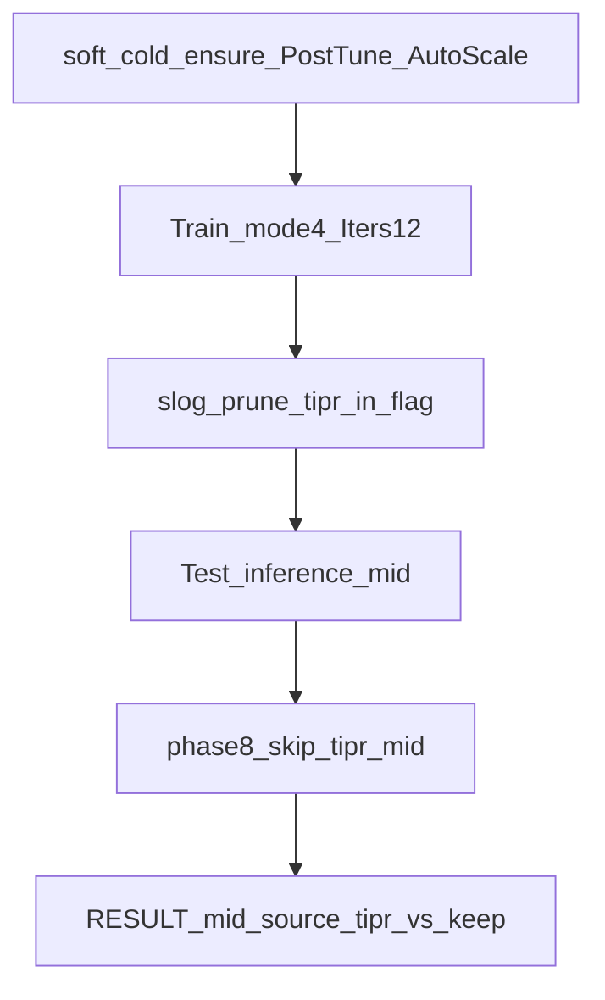

# Проверка C++ PostTune — план экспериментов

Статус кода/доков/клонов: **готово**.  
Статус cold+gate vs gold: **V1–V6 PASS** при `mid_source=cpp` (см. [`_repro/POSTTUNE_VERIFY_RESULT.md`](_repro/POSTTUNE_VERIFY_RESULT.md)).

Критерии: TipR vector, FixedLTZ (±5% к gold mid), fires/acc, `IsNeedToTrain=0`. На Train **без** Python `apply_tiprmin`; mid — **только** C++ на Test (`inference=1` в `posttune_complete.flag`). Статусы `*_gold_mid` **запрещены**.

## Матрица

| # | Клон | TipR mode | Ожидание | Статус |
|---|------|-----------|----------|--------|
| V1 | `SelectivityBranch/EXP_br_span25_packA_gen_C1e9_posttune` | 1 CanonRmin | TipR `2e7×3+8.6e7`; mid≈gold Test `0.0718` (±5%); fires 8/8; Need→0 | **PASS** fires `10000000` mid≈0.07180 |
| V2 | `…/EXP_br_span25_packA_gen_C1e9_posttune_off` | OFF → CalibrateLtz | Need→0; путь ScaleTipR (TipR ≠ канон допустим); gate с Python tiprmin OK | **PASS** fires `10000000` mid≈0.0163 |
| V3 | `SelectivityAsymRm/EXP_span25ms_packA_gen_posttune` | 2 FlatLastR | TipR `8.6e7×4`; mid≈gold `0.03759`; 8/8 | **PASS** mid≈0.037589 fires `10000000` |
| V4 | `SelectivityAsymRm/EXP_span50ms_packA_gen_posttune` | 1 CanonRmin | TipR Canon; **cpp** mid ±5% к `0.011759`; fires `10000000` | **PASS** mid≈0.011646 `mid_source=cpp` |
| V5 | `…/EXP_br_span100_…_posttune_keep` | 3 KeepDone | TipR snapshot; cpp mid; fires `10000000` | **PASS** mid≈0.00718 |
| V5b | `…/EXP_br_span100_…_posttune_search` | 4 SearchSynthetic | **полный Train** mode=4, `SearchIters=12`, `AutoScaleIterationGap=1`; trial BestTips + free-run reject; TipR≠keep **или** `search_reverted=1`; cpp mid; fires **строго** `10000000` | **PASS** TipR search `search_reverted=1` (Train silent); mid≈0.00714; fires `10000000` |
| V6 | `SelectivityPhaseA/Phase6/EXP_480_gen_posttune` | 1 CanonRmin | TipR Canon; **cpp** mid ±5% к tiprmin `0.016894`; fires `10000010` | **PASS** mid≈0.016896 `mid_source=cpp` |

### SearchSynthetic PASS criteria (V5b)

1. Soft-cold Train + `PostTrainTipResistanceMode=4`, `PostTrainTipSearchIters=12`, `AutoScaleIterationGap=1`.
2. В EventsLog: `phase -> PostTune mode=4`, `gapEff=` ≪1.5, `SearchSynthetic:` (`skip_candidate` / `apply_best` / `free_run_reject_best` / `revert`).
3. После Train: TipR **≠** keep-клон **или** `search_reverted=1` в flag (trial BestTips + free-run reject).
4. Test: C++ inference mid (`inference=1`, mid&lt;0.9) + gate fires **`10000000`** (не `10000010`).
5. `--skip-train` для `br100_search` **запрещён** в `posttune_verify.py`.
6. `train_t≈2400` (при AutoScale gapEff≈0.3); polls≥800.

**Wall:** Search@12 при `gapEff≈0.35` — порядка ~1.5 h wall (замер ~5010 s); mid br25 Auto `gapEff=0.25` vs legacy `1.5` (sim ~6×). См. [`docs/TIMING_AND_GAP.ru.md`](docs/TIMING_AND_GAP.ru.md).

**Hang / reliability:** чистить `StatisticLog`/`EventsLog` после кейса; abort при slog&gt;3G; `phase8`/`phase9` `run_nm` — span-aware hard deadline + SIGTERM после ≥8 строк CSV.

## Протокол одного прогона (V1–V3)

1. Пересобрать `NeuroModelerConsole` с pin PostTune (символ `EnablePostTrainTuning`).
2. Soft-cold Train (`repro_cold_lib.soft_cold_reset_train`).
3. Train: `NeuroModelerConsole -c Train/Project.ini -s -t <T> -x -S` до `IsNeedToTrain=0`  
   - Branch25: `-t 320`  
   - AsymRm25: `-t 160` (как FastSpan family floor; при Need=1 — удлинить)
4. Снять с Train **до** Python hygiene: `TipSynapseResistance`, `FixedLTZThreshold`, `ResistanceMin`, `IsNeedToTrain`, `PostTrainTuneComplete`, `TrainingPhase`.
5. Gate:
   - V1/V3/V4/V5/V6: `phase8` / `phase9` с `--skip-tipr-mid` (overlay + C++ inference mid two-pass).
   - V2: обычный tiprmin+mid (legacy) **или** `--force-python-hygiene`.
6. Сравнить с gold Test: TipR, thr (±5%), fires mask, `acc_legacy`, last-pulse; колонки RESULT: `mid_source`, `tipr_vs_keep`.

## Артефакты

- Логи: `<clone>/Train/run_posttune_verify.log`, `Test/run_gate.log`
- Runtime (не коммитить): `posttune_mid_dbg.txt`, `posttune_tipr_live.txt` — в [`StructTrain/.gitignore`](.gitignore)
- Сводка: [`_repro/POSTTUNE_VERIFY_RESULT.md`](_repro/POSTTUNE_VERIFY_RESULT.md)
- Оркестратор: [`scripts/posttune_verify.py`](scripts/posttune_verify.py)

## Вне scope этой проверки

Pack B/C matrix, InitSoma overlay, FastSpan plateau Need, полный PHASE12 wave.
