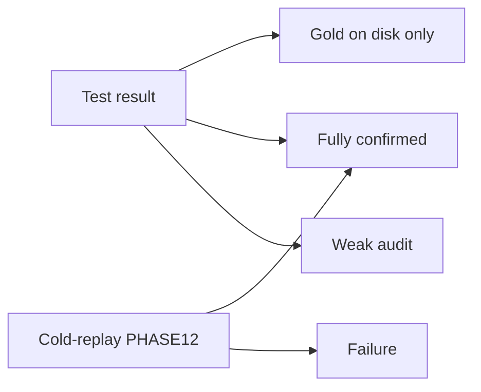

# StructTrain reliability map

**Snapshot:** 2026-09-19 · PulseLib pin `d6baf6e`  
**Русская версия (полная):** [`RELIABILITY_MAP.ru.md`](RELIABILITY_MAP.ru.md)

This document answers: **which solutions are fully trustworthy**, and which have a strong on-disk test result but were **not confirmed** by retrain-from-scratch (cold-replay), or remained only partially selective.

Authoritative per-experiment cold statuses: [`PHASE12_VALIDATION.md`](PHASE12_VALIDATION.md). Strong-test registry: [`SUCCESSFUL_EXPERIMENTS.md`](SUCCESSFUL_EXPERIMENTS.md). Here: **interpretation** by learning approach, neuron parameter group, pattern length, and trust level.

Pattern lengths (25 / 50 / 100 / ~480 / 200–400 ms) and experiment families are treated **evenly**. PHASE12 wave numbers are not the organizing axis.

---

## 1. How to read

Two independent quality layers:

1. **Test result** — selectivity on eight probes (target + non-targets), one spike per probe, target response not earlier than the last portion of the pattern (“last-pulse” rule).
2. **Cold-replay** — retrain from dendrite lengths `1 1 1 1` with the tip-resistance recipe; the “still needs training” flag must clear; then the same test gates.

Only the intersection is **fully confirmed**.

### Trust levels

| Tag | Full name | Meaning |
|-----|-----------|---------|
| **T1** | Fully confirmed | Test at least 7 of 8 + last-pulse **and** PHASE12 `VALIDATED` / `VALIDATED_CLONE` |
| **T2** | Gold on disk only | Strong test (often 7–8 of 8), artifact kept; cold did not reproduce (`ARTIFACT_KEEP`) or was not finished |
| **T3** | Weak audit | Formal audit with partial selectivity 4–6 of 8; PHASE12 historical `ARTIFACT` |
| **T4** | Failure / open cause | Cold failure (`FAIL_ROOTCAUSE`), stuck “needs training”, or demoted from registry |
| **T5** | Out of scope | Orphans, diagnostic clones, harnesses |

### Glossary (plain language)

| Term | Meaning |
|------|---------|
| **Selectivity N of 8** | Correct target / quiet non-targets on N of eight probes |
| **Partial selectivity** | 4–6 of 8 |
| **False alarm** | Neuron fires on a non-target |
| **Last-pulse response** | Target response not before ~80% of pattern duration |
| **Cold-replay** | Retrain from untrained lengths with controlled tip-resistance |
| **Needs-training flag** | Trainer `IsNeedToTrain`; must be 0 for cold success |
| **Dendrite lengths (L)** | Four structure-band lengths after training |
| **Firing threshold** | Test threshold after a silent probe |
| **LTZone potential** | Classic-learner mid metric |
| **Soma amplitude sum** | Branch mid metric |
| **Flat mid-pattern potential** | After cold, mid profile has no usable target/non-target gap |
| **Tip-resistance at Rmin recipe** | Tip resistances `2e7 2e7 2e7 8.6e7`, floor `ResistanceMin=2e7`, then silent mid |
| **Tip-resistance at Done** | Resistances from a finished train (unique per Train; fallback if Rmin hurts) |
| **Rmin canon** | Fixed post-step vector `2e7 2e7 2e7 8.6e7` |
| **Flat tip-resistance 8.6e7×4** | All four tips `8.6e7` (AsymRm at 25 ms) |
| **True-class spike** | Neuron response on the target probe (usually first bit of `fires` = 1) |
| **Capacitance 1e9** | Membrane C=1e9 in the short-span recipe |
| **Stimulus packs A / B / C** | Different non-target matrices; A = cold train, B/C = matrix clones |
| **No presynaptic inhibition** | Baseline generator |
| **Presynaptic inhibition ≈2.5** | Generator with presynaptic inhibition coefficient ~2.5 |
| **Next-segment inhibition** | Branch flag `EnableNextSegmentInhibition=1` |

---

## 2. Learning approaches

### Classic `NNeuronTimeLearner`

Multiple dendrites. Test threshold usually from **peak LTZone potential** on a silent probe. Used in Phase A, PSI, TimeNeuron, AsymRm, LtzCal twin, FastSpan, Phase6 (~480 ms).

Strong on 25 ms AsymRm (T1). Weaker than Branch on cold at 50/100 ms (flat potential) and ~480 ms (lengths stuck; test ceiling 7 of 8).

### `NNeuronTimeLearnerBranch`

Single dendrite; tips `Dendrite1_{length}`. Threshold from **soma amplitude sum**. Widest **T1** cluster on short spans. Best ~480 ms **test** is 8 of 8 with tip-resistance, but cold is T2. Legacy Branch without tip-resistance demoted.

### Levers on the same learner

| Lever | Effect vs no inhibition |
|-------|-------------------------|
| Presynaptic ≈2.5 | Shorter L on Branch 25 ms; lower threshold; cold usually follows parent |
| Next-segment inhibition | T1 on Branch 25/50 ms; on 100 ms cold does **not** grow lengths (unlike gen/preinh at 100 ms) |

### LtzCal twin

Weight sync from AsymRm (or Phase6), not a separate learning algorithm. T1 only where AsymRm parent is T1 (25 ms).

### FastSpan vs AsymRm

Same classic learner + capacitance 1e9. AsymRm ≥50 ms: needs-training already 0 but flat potential. FastSpan 25 ms: lengths match gold but needs-training stays 1 (T4 parent).

### Approach comparison

| Approach | Threshold metric | Typical cold failure | Where T1 |
|----------|------------------|----------------------|----------|
| Classic | LTZone potential | Flat potential; lengths stuck; needs-training stuck (FastSpan) | AsymRm/LtzCal 25 ms only |
| Branch | Soma amplitude sum | Lengths stuck (~480 ms; nextseg 100 ms) | Short-span (see matrix) |
| LtzCal twin | Same as parent | Same as AsymRm parent | 25 ms only |
| FastSpan | LTZone | Needs-training with matched L | No T1 |

---

## 3. Neuron parameter groups

| Group | Fully confirmed | Gold on disk only |
|-------|-----------------|-------------------|
| Legacy fixed LTZone threshold | — | — (typically T3) |
| Capacitance 1e9 + tip-resistance at Rmin + silent mid | Branch short; AsymRm/LtzCal 25 ms | AsymRm/LtzCal 50–100; FastSpan; Phase6; Branch ~480; nextseg 100 |
| Tip-resistance at Done | Branch 100 ms gen (+ clones) | Some Phase6 / diag |
| Presynaptic ≈2.5 on recipe | Where parent is T1 | Follows parent elsewhere |
| Next-segment inhibition | Branch 25 and 50 ms | Branch 100 ms and Branch ~480 nextseg |

**Legacy vs recipe:** recipe jumps short-span (and tip-resistance ~480 ms clones) to 7–8 of 8 selectivity; still not T1 without successful cold.

**LTZone vs soma mid:** do not swap metrics across families — AsymRm often has soma sum 0; Branch relies on soma.

**Tip-resistance at Rmin vs Done:** Done is the fallback when Rmin makes a non-target stronger (Branch 100 ms gen). On ~480 ms Phase6, “threshold only + Done tip-resistance” still 7 of 8 — tip-resistance is not the main lever against the hard foil.

---

## 4. Comparison: with tip-resistance vs without

Only pairs with **numeric** test results in the journals. Columns: accuracy (N of 8), whether the **true class (target) spiked**, short conclusion. Full tables and caveats: [`RELIABILITY_MAP.ru.md`](RELIABILITY_MAP.ru.md) §4.

| Context | Without (acc / target spike) | With tip-resistance at Rmin (acc / target spike) | Takeaway |
|---------|------------------------------|--------------------------------------------------|----------|
| Phase6 gen ~480 ms | baseline 4 of 8 / yes; thr_only Done 7 of 8 / yes | tiprmin 7 of 8 / yes (`10000010`) | Rmin ≡ Done+mid; gain vs legacy baseline is mid, not Rmin alone |
| Phase6 preinh ~480 ms | PSI EXP04 6 of 8 / yes | 7 of 8 / yes | Better; threshold and tip-resistance both changed |
| Branch ~480 ms gen | legacy demote 6 of 8 / yes | **8 of 8** / yes (`10000000`) | Tip-resistance at Rmin is the key lever |
| Branch ~480 ms nextseg | demote 7 of 8 / yes | **8 of 8** / yes | Same |
| Branch ~480 ms preinh | demote 7 of 8 / yes | 7 of 8 / yes | Target ok; one non-target remains |
| Branch 100 ms gen | — | Rmin **7 of 8** / yes | Done tip-resistance **8 of 8** / yes — Rmin worse here |
| AsymRm 50/100 ms | no FAIL CSV; base×4 gap negative | **8 of 8** / yes | Rmin needed for positive gap; no paired N/8 “without” |
| FastSpan historical → C1e9 | often 1 of 8 fire-all | 8 / 5 / 7–8 of 8 / yes when PASS | Mixed (neuron + train + tip-resistance) |
| FastResponse EXPD001/002 | 7 of 8 / yes (one miss) | silent / fire-all | Tip-resistance **broke or hurt** |

### Tip-resistance value generalization

Do successful configs share **one** tip-resistance vector across pattern lengths and learners?

**C++ PostTune** (canon / flat / KeepDone / Search in-teacher): [`POST_TRAIN_TUNING.md`](POST_TRAIN_TUNING.md).

| Class on Test | Vector | Where successful |
|---------------|--------|------------------|
| **Rmin canon** | `2e7 2e7 2e7 8.6e7`, ResistanceMin=`2e7` | Most: AsymRm 50/100; Branch 25/50 (+ levers); Branch 100 preinh/nextseg; br480 tiprmin; Phase6 tiprmin; FastSpan C1e9; LtzCal twin 50/100 |
| **Flat 8.6e7×4** | `8.6e7` four times | **AsymRm / LtzCal twin at 25 ms only** (8 of 8) |
| **Done (unique)** | train-dependent | **Branch 100 ms gen** (~`7.4e7 8.9e7 1.3e8 5.1e8`, 8 of 8); Phase6 thr_only (~`2.58e7…8.6e7`, 7 of 8 = tiprmin) |

| Span | Learner | Test vector | Acc | Target spike |
|------|---------|-------------|-----|--------------|
| 25 ms | AsymRm / LtzCal | flat 8.6e7×4 | 8/8 | yes |
| 25 ms | Branch / FastSpan C1e9 | Rmin canon | 8/8 | yes |
| 50 ms | AsymRm / Branch / FastSpan | Rmin canon | 8/8 | yes |
| 100 ms | AsymRm / Branch preinh·nextseg / FastSpan | Rmin canon | 7–8/8 | yes |
| 100 ms | Branch **gen** | **Done** (shared A/B/C) | 8/8 | yes |
| ~480 ms | Phase6 tiprmin / Branch tiprmin | Rmin canon | 7–8/8 | yes |
| ~480 ms | Phase6 thr_only | Done (≠ Rmin) | 7/8 same as tiprmin | yes |

**Verdict:** The **procedure** (fixed Rmin post-step) generalizes across 50/100/~480 ms and classic/Branch/FastSpan — not a per-run learned optimum. Exceptions: AsymRm25 flat base; Branch100 gen Done. Done vectors differ across trains; on Phase6 classic, Rmin and Done give the **same** accuracy, so “best” resistances are not unique. Full prose: [`RELIABILITY_MAP.ru.md`](RELIABILITY_MAP.ru.md) §4.7.

---

## 5. Summary matrix: pattern length × family

Cell: **trust** · test score · cold note.

### Classic learner

| Family | 25 ms | 50 ms | 100 ms | ~480 ms | 200–400 ms |
|--------|-------|-------|--------|---------|------------|
| Phase A / TimeNeuron | — | — | — | **T3** · 4–6/8 · artifact | — |
| PSI (legacy neuron) | partial | partial | partial | **T3** · 4–6/8 | **T3** · 3–5/8 |
| PSI + capacitance 1e9 short | **T3** · 4–6/8 | same | same | — | — |
| AsymRm packs A/B/C | **T1** · 8/8 | **T2** · 8/8 · flat potential | **T2** · 8/8 · flat potential | — | — |
| LtzCal twin | **T1** · 8/8 | **T2** | **T2** | Phase6 twin **T2** · 7/8 | — |
| FastSpan capacitance 1e9 | **T4** parent · Need=1; siblings **T2** | gen weak; preinh **T2** | **T2** · 7–8/8 | — | — |
| Phase6 tip-resistance | — | — | — | **T2** · 7/8 · lengths stuck | — |

### Branch

| Family | 25 ms | 50 ms | 100 ms | ~480 ms | 200–400 ms |
|--------|-------|-------|--------|---------|------------|
| No inhib. + capacitance 1e9 | **T1** | **T1** | **T1** (Done tip-resistance on gen) | — | — |
| Presynaptic ≈2.5 + capacitance 1e9 | **T1** | **T1** | **T1** | **T2** · 7/8 | — |
| Next-segment inhib. + capacitance 1e9 | **T1** | **T1** | **T2** · lengths stuck | **T2** · 8/8 | — |
| Tip-resistance (~480) | — | — | — | **T2** · 8/8 | — |
| Legacy Branch (no tip-resistance) | — | — | — | **T4/T5** demoted | — |

---

## 6. Families (detail)

Same columns as the Russian doc: group · length · lever · test · threshold / tip-resistance · PHASE12 · trust · not verified. Full prose comparisons live in [`RELIABILITY_MAP.ru.md`](RELIABILITY_MAP.ru.md) §5; below is the status detail.

### Phase A / TimeNeuron / legacy PSI — T3

Partial selectivity 4–6 of 8 on ~480 ms and long PSI spans; weaker than Phase6 (7 of 8) and Branch tip-resistance (8 of 8) on the same long pattern. Cold recipe not a PHASE12 goal (`ARTIFACT`).

### AsymRm — T1 at 25 ms; T2 at 50/100 ms

Pack A gen/preinh + B/C clones: 8 of 8. Cold validated only at 25 ms. At 50/100 ms needs-training clears but mid-pattern LTZone stays flat (tip-resistance overlay without retrain does not fix). Threshold gap worsens with span.

### LtzCal twin — inherits AsymRm

T1 at 25 ms sync; T2 at 50/100 ms.

### FastSpan — T4 parent at 25 ms; T2 siblings

Parent: lengths match gold, needs-training stays 1. Siblings kept without separate cold. Span50 gen remains partial / out of strong registry.

### Phase6 (~480 ms) — T2, test 7 of 8

All tip-resistance / threshold-only / preinh / twin: 7 of 8; cold lengths stuck at `1 1 1 1`. One harder non-target than Branch tip-resistance (8 of 8) on the same pattern; much stronger than legacy Phase A (4–6 of 8). No stimulus packs B/C. Foil6 clones stay 7 of 8.

### Branch short gen/preinh — T1 on 25/50/100 ms

Eighteen roots (pack A + B/C). Gen at 100 ms uses tip-resistance at Done. Broadest fully confirmed cluster.

### Branch next-segment inhibition short — T1 at 25/50; T2 at 100 ms

At 100 ms gold test is 8 of 8 but cold does not grow lengths.

### Branch tip-resistance ~480 ms — T2

`EXP_br480_tiprmin` and nextseg: **8 of 8**; preinh: **7 of 8**. Best test scores on this pattern length; cold not confirmed. Legacy Branch trio demoted.

### Out of scope — T5

FastResponse tip-resistance, stalled LtzCalBranch, RegressionFull480 harness, foil6/mid-only diagnostics.

---

## 7. Checklist

### Fully confirmed (T1) — working and reproducible

- Branch short capacitance 1e9, gen/preinh, packs A/B/C, **25 / 50 / 100 ms** (18).
- Branch next-segment inhibition, packs A/B/C, **25 and 50 ms** (6).
- AsymRm packs A/B/C gen/preinh, **25 ms** (6).
- AsymRmLtzCal twin packA gen/preinh, **25 ms** (2).

**About 32** fully confirmed roots.

### Gold on disk only (T2)

- AsymRm and LtzCal at **50 and 100 ms**.
- FastSpan siblings.
- All Phase6 tip-resistance variants at **~480 ms**.
- Branch tip-resistance / nextseg / preinh at **~480 ms**.
- Branch next-segment inhibition at **100 ms**.

### Weak audit (T3) / failure (T4) / out of scope (T5)

- T3: Phase A, TimeNeuron, most legacy PSI; PSI short capacitance 1e9 partial; FastSpan 50 ms gen.
- T4: FastSpan 25 ms gen (needs-training stuck); demoted legacy Branch.
- T5: FastResponse tip-resistance, stall twins, harness, foil6 diag clones.

---

## 8. Pointers

| Document | Role |
|----------|------|
| [`RELIABILITY_MAP.ru.md`](RELIABILITY_MAP.ru.md) | Full Russian narrative (preferred for reading) |
| [`PHASE12_VALIDATION.md`](PHASE12_VALIDATION.md) | Per-id cold statuses |
| [`SUCCESSFUL_EXPERIMENTS.md`](SUCCESSFUL_EXPERIMENTS.md) | Strong-test registry |
| [`RECIPE_COVERAGE.md`](RECIPE_COVERAGE.md) | Recipe coverage by family |
| [`QUALITY_BACKLOG_PROPOSALS.ru.md`](QUALITY_BACKLOG_PROPOSALS.ru.md) | Next steps for T2/T4 |
| Phase journals PHASE5–11, Branch PHASE7–8, Phase6 recipe, `_repro/_invest/` | Campaign detail |
