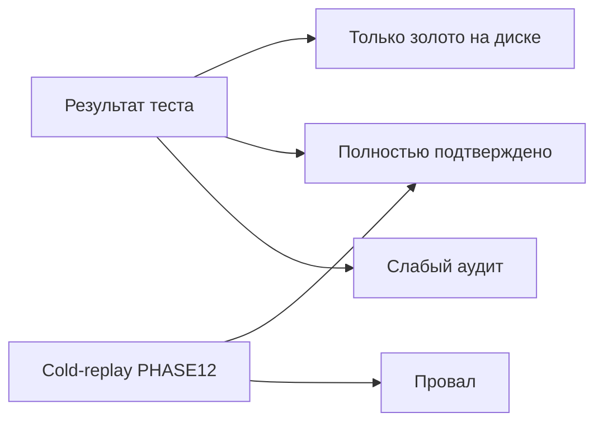

# Карта надёжности StructTrain

**Срез:** 2026-09-19 · библиотека PulseLib pin `780ffc7`  
**English:** [`RELIABILITY_MAP.md`](RELIABILITY_MAP.md)

Этот документ отвечает на вопрос: **каким решениям можно доверять полностью**, а какие имеют сильный результат на диске, но **не подтверждены** повторным обучением с нуля (cold-replay), либо так и остались со слабой селективностью.

Статусы по каждому эксперименту по-прежнему ведутся в [`PHASE12_VALIDATION.md`](PHASE12_VALIDATION.md). Реестр сильных тестов — в [`SUCCESSFUL_EXPERIMENTS.md`](SUCCESSFUL_EXPERIMENTS.md). Здесь — **интерпретация**: подходы к обучению, группы параметров нейрона, размер паттерна, уровень доверия.

Размеры паттерна (25 / 50 / 100 / ~480 / 200–400 мс) и семьи экспериментов изложены **равноправно**. Ось «волны PHASE12» здесь не используется.

---

## 1. Как читать

Два независимых слоя качества:

1. **Результат теста** — селективность на восьми пробниках (цель + чужие), один спайк на пробник, ответ на цели не раньше последней доли паттерна (критерий «последний импульс»).
2. **Cold-replay** — повторное обучение с обнулённых длин дендритов и контрольным рецептом tip-resistance; признак «ещё нужно обучать» должен стать нулём; затем те же ворота теста.

Только пересечение обоих слоёв даёт **полностью подтверждённое** решение.

### Уровни доверия

| Метка | Полное имя | Смысл |
|-------|------------|--------|
| **T1** | Полностью подтверждено | Тест не хуже 7 из 8 + ответ на последнем импульсе **и** PHASE12: `VALIDATED` или `VALIDATED_CLONE` (воспроизведено) |
| **T2** | Только золото на диске | Тест сильный (часто 7–8 из 8), эталон сохранён; cold не воспроизвёл (`ARTIFACT_KEEP`) или не доведён |
| **T3** | Слабый аудит | Формальный аудит при частичной селективности 4–6 из 8; PHASE12 — исторический артефакт (`ARTIFACT`) |
| **T4** | Провал / открытая причина | Явный провал cold (`FAIL_ROOTCAUSE`), застрявший «ещё нужно обучать», или снятие с реестра |
| **T5** | Вне объёма проверки | Сироты, диагностические клоны, служебные harness |

### Глоссарий

| Термин | Значение |
|--------|----------|
| **Селективность N из 8** | На восьми пробниках цель отвечает правильно, чужие — без ложной тревоги в окне ответа; «N» — число успешных пробников |
| **Частичная селективность** | 4–6 из 8: аудит может пройти, но это не полная селективность |
| **Ложная тревога** | Ответ нейрона на чужой стимул (в окне или поздний) |
| **Ответ на последнем импульсе** | На цели момент ответа не раньше ~80 % длительности паттерна |
| **Cold-replay / soft-cold** | Обучение заново с длин `1 1 1 1`, сброс в необученное состояние, контрольный tip-resistance |
| **Признак «ещё нужно обучать» (Need)** | Флаг тренера `IsNeedToTrain`; для успеха cold должен стать 0 |
| **Длины дендритов (L)** | Четыре числа полос структуры после обучения (эталон «золота») |
| **Порог срабатывания** | Порог, при котором нейрон отвечает в тесте (после тихого зонда) |
| **Потенциал зоны LTZone** | Метрика для выбора порога у классического learner (`ltz_potential_max`) |
| **Сумма амплитуд на соме** | Метрика порога у Branch (`soma_amp_sum`) |
| **Плоский профиль потенциала** | После cold потенциал в середине паттерна не даёт рабочего зазора цель/чужой — ворота mid не проходят |
| **Рецепт tip-resistance при Rmin** | Сопротивления кончиков `2e7 2e7 2e7 8.6e7`, пол `ResistanceMin=2e7`, затем порог по тихому зонду |
| **Tip-resistance на Done** | Значения сопротивлений с завершённого обучения (запасной путь, если Rmin ломает селективность) |
| **Спайк на истинном классе** | Ответ нейрона на целевом пробнике (в маске `fires` обычно первая позиция = 1) |
| **Ёмкость 1e9** | Параметр мембраны нейрона C=1·10⁹ в рецепте коротких паттернов |
| **Пакет стимулов A / B / C** | Разные матрицы чужих пробников при том же интервале стимулов; A — холодное обучение, B/C — клоны матрицы |
| **Без пресинаптического торможения** | Базовый генератор (gen) |
| **Пресинаптическое торможение ≈2.5** | Генератор с коэффициентом пресинаптического торможения около 2.5 |
| **Торможение следующего сегмента** | Флаг `EnableNextSegmentInhibition=1` у Branch |

Статусы PHASE12 при первом появлении:

- `VALIDATED` — cold родителя воспроизведён;
- `VALIDATED_CLONE` — клон пакета B/C прошёл ворота после родителя;
- `ARTIFACT_KEEP` — эталон теста сохранён, cold не доведён до воспроизведения;
- `ARTIFACT` — исторический артефакт без цели cold;
- `FAIL_ROOTCAUSE` — cold провален, причина задокументирована;
- `OUT` — снят с линии валидации.

---

## 2. Подходы к обучению

### 2.1. Классический `NNeuronTimeLearner`

Несколько дендритов; обучение длин и амплитуд синапсов во времени. Порог теста в рецептных кампаниях обычно выбирают по **максимуму потенциала зоны LTZone** на тихом зонде (при «глухом» пороге ответа).

Используется в: Phase A, пресинаптическое торможение (PSI), TimeNeuron, AsymRm, twin LtzCal, FastSpan, Phase6 на паттерне ~480 мс.

**Сильные стороны:** хорошо изученный контур; на коротком паттерне 25 мс с рецептом ёмкость 1e9 + tip-resistance даёт полную селективность и подтверждённый cold (AsymRm).  
**Слабые стороны относительно Branch:** на 50 и 100 мс cold часто даёт **плоский профиль потенциала** при уже нулевом Need; на ~480 мс потолок теста — 7 из 8 (трудный чужой пробник); cold на длинных паттернах часто **не растит длины** с `1 1 1 1`.

### 2.2. `NNeuronTimeLearnerBranch`

Один дендрит; кончики генератора привязаны к `Dendrite1_{длина}`. Порог — по **сумме амплитуд на соме** (при глухом пороге ответа ≈1.0 потенциал зоны сам по себе не режет чужие). Оценка задержки на сегмент в XML обычно не копируется с AsymRm (runtime по умолчанию).

Используется в: Branch short-span, Branch с торможением следующего сегмента, Branch tip-resistance на ~480 мс.

**Сильные стороны:** самый широкий кластер **полностью подтверждённых** решений на 25 / 50 / 100 мс (без торможения следующего сегмента на 100 мс — тоже T1). На ~480 мс лучший зафиксированный тест — **8 из 8** (tip-resistance).  
**Слабые стороны:** старый канон без tip-resistance снят с реестра (поздние ложные тревоги / качество ответа); cold на ~480 мс и на 100 мс с торможением следующего сегмента не воспроизводит эталон.

### 2.3. Рычаги на том же learner

| Рычаг | Что меняет | Сравнение с базой без торможения |
|-------|------------|-----------------------------------|
| Без пресинаптического торможения | Базовый генератор | Эталон длин и порогов |
| Пресинаптическое торможение ≈2.5 | Сильнее подавляет пресинаптический вход | На Branch 25 мс длины короче, порог ниже; cold обычно следует родителю того же размера |
| Торможение следующего сегмента | Внутридендритное торможение соседнего сегмента | На Branch 25 и 50 мс — полностью подтверждено; на 100 мс cold **не растит длины** (в отличие от варианта без этого рычага на 100 мс) |

Эти рычаги **не** меняют класс learner; меняют синаптику / флаги структуры.

### 2.4. Twin LtzCal (калибровка зоны)

Не отдельный алгоритм обучения: копия модели/параметров с эталона AsymRm (или Phase6), синхронизация весов и гигиена tip-resistance. Полностью подтверждено **только** там, где родитель AsymRm тоже полностью подтверждён (сейчас — паттерн 25 мс).

### 2.5. FastSpan на фоне AsymRm

Тот же классический learner и рецепт ёмкости 1e9, но отдельная семья cold-train конфигов. На тесте часто 7–8 из 8. Отличие по cold: у AsymRm от 50 мс Need уже 0, но потенциал плоский; у FastSpan на 25 мс длины сходятся к эталону, а **Need остаётся 1** (нормализация амплитуд / конец обучения) — уровень T4 у родителя, остальные FastSpan — T2 без отдельного cold.

### 2.6. Сравнение подходов (сводка)

| Подход | Как выбирается порог | Типичный сбой cold | Где T1 |
|--------|----------------------|--------------------|--------|
| Классический learner | Потенциал зоны LTZone | Плоский потенциал (AsymRm ≥50 мс); длины не растут (~480 мс); Need=1 (FastSpan 25 мс) | AsymRm и LtzCal только 25 мс |
| Branch | Сумма амплитуд на соме | Длины не растут (~480 мс; nextseg 100 мс) | Short-span широко (см. матрицу) |
| Twin LtzCal | Как у родителя (зона) | Как у родителя AsymRm | Только 25 мс |
| FastSpan | Потенциал зоны | Need при совпавших длинах | Нет T1 |

---

## 3. Группы параметров нейрона

### 3.1. Старый набор (до рецепта tip-resistance)

Фиксированный или слабо калиброванный порог зоны LTZone, нейроны без обязательной ёмкости 1e9 и без полного контура tip-resistance при Rmin. Типично Phase A, TimeNeuron, широкий ряд пресинаптического торможения на ~480 мс и длинных span.

**Результат:** частичная селективность 4–6 из 8, уровень **T3**. Исторически полезны как база, не как доказательство полного рецепта.

### 3.2. Рецепт «ёмкость 1e9 + tip-resistance при Rmin + порог по тихому зонду»

После PHASE5: мембрана C=1e9 на коротких паттернах; сопротивления кончиков при минимуме R; пол Rmin; чистый Test; порог между целью и самым трудным чужим по выбранной метрике (зона или сома).

**Сравнение со старым набором:** скачок к селективности 7–8 из 8 на коротких паттернах и на tip-resistance клонах ~480 мс. Это необходимое, но **не достаточное** условие T1: нужен ещё успешный cold.

### 3.3. Tip-resistance при Rmin против tip-resistance на Done

- **При Rmin** — канон cold и большинства short-span.  
- **На Done** — запасной путь, если при Rmin чужой стимул по соме выше цели (пример: Branch 100 мс без пресинаптического торможения — полностью подтверждён именно через Done).  
- На паттерне ~480 мс у классического Phase6 вариант «только порог, tip-resistance Done» даёт те же 7 из 8, что и tip-resistance при Rmin: **tip-resistance не главный рычаг** против трудного чужого пробника.

### 3.4. Порог по потенциалу зоны против порога по сумме сомы

| Метрика | Где | Особенность |
|---------|-----|-------------|
| Потенциал зоны LTZone | AsymRm, FastSpan, Phase6, LtzCal | На AsymRm ≥50 мс после soft-cold сумма на соме часто 0; если зона плоская — ворота mid не работают |
| Сумма амплитуд на соме | Branch | Не переносить на AsymRm как замену: там сома часто нулевая |

### 3.5. Торможения: параметр vs класс learner

Пресинаптическое торможение и торможение следующего сегмента — **параметры/флаги** поверх выбранного learner. Смена с классического на Branch — **смена класса** и метрики порога; это более глубокое отличие, чем включение торможения.

### 3.6. Сводка по группам параметров

| Группа параметров | Где полностью подтверждено | Где только золото на диске |
|-------------------|----------------------------|----------------------------|
| Старый фиксированный порог | — | — (типично T3) |
| Ёмкость 1e9 + tip-resistance при Rmin + mid | Branch short; AsymRm/LtzCal 25 мс | AsymRm/LtzCal 50–100; FastSpan; Phase6; Branch ~480; nextseg 100 |
| Tip-resistance на Done | Branch 100 мс gen (и клоны) | Часть Phase6 / diag |
| Пресинаптическое ≈2.5 на рецепте | Branch и AsymRm там, где parent T1 | Следуют parent на 50–100 / ~480 |
| Торможение следующего сегмента | Branch 25 и 50 мс | Branch 100 мс и Branch ~480 nextseg |

---

## 4. Сравнение: с tip-resistance и без него

Ниже — только пары, где в журналах есть **численные** результаты теста. Колонки: точность (успешных пробников из 8), был ли **ответ (спайк) на истинном классе** (цель, обычно пробник 0; в маске `fires` первая цифра = 1), и краткий вывод.

Условности:

- **С tip-resistance при Rmin** — кончики `2e7 2e7 2e7 8.6e7` (+ обычно пол Rmin и порог по тихому зонду).
- **Без** — старый фиксированный порог зоны, сопротивления «как после обучения» (Done), только подбор порога без смены tip-resistance, или исторический конфиг до рецепта.
- Где вместе менялись ёмкость 1e9, cold-train и tip-resistance, пара **не чистая** — это отмечено.

Источники: [`PHASE6_480_RECIPE.md`](SelectivityPhaseA/PHASE6_480_RECIPE.md), [`PHASE7_BRANCH_QUALITY.md`](SelectivityBranch/PHASE7_BRANCH_QUALITY.md), [`PHASE8_SHORTSPAN.md`](SelectivityBranch/PHASE8_SHORTSPAN.md), [`PHASE5_SPAN50_100.md`](SelectivityAsymRm/PHASE5_SPAN50_100.md), [`SelectivityFastResponse/REPORT.md`](SelectivityFastResponse/REPORT.md), [`SelectivityFastSpan/JOURNAL.md`](SelectivityFastSpan/JOURNAL.md).

### 4.1. Паттерн ~480 мс — классический learner (Phase A → Phase6)

| Вариант «без» | Точность | Спайк на цели | Вариант «с tip-resistance при Rmin» | Точность | Спайк на цели | Вывод |
|---------------|----------|---------------|--------------------------------------|----------|---------------|--------|
| `EXP00` / `EXP_480_gen_baseline` (фиксированный порог ~0.0115, Done) | 4 из 8 | да (частичная селективность) | `EXP_480_gen_tiprmin` | 7 из 8 | да (`fires` `10000010`) | Сильнее; один чужой пробник всё ещё ложный |
| `EXP_480_gen_thr_only` (только новый порог, tip-resistance **Done**) | 7 из 8 | да (`10000010`) | `EXP_480_gen_tiprmin` | 7 из 8 | да (та же маска) | **Tip-resistance при Rmin не улучшил** точность относительно Done + порог |
| PSI `EXP04_preinh_250` (Done, порог ~0.030) | 6 из 8 | да (`10001010`) | `EXP_480_preinh250_tiprmin` | 7 из 8 | да (`10000010`) | Лучше, но менялись и порог, и tip-resistance |

**Итог на ~480 мс (классический):** переход от старого порога к рецепту поднимает 4→7 из 8; отдельно tip-resistance при Rmin против Done **не** даёт выигрыша (оба 7 из 8, спайк на цели есть).

### 4.2. Паттерн ~480 мс — Branch

| Вариант «без» (канон / mid без tip-resistance при Rmin) | Точность | Спайк на цели | Вариант «с tip-resistance при Rmin» | Точность | Спайк на цели | Вывод |
|----------------------------------------------------------|----------|---------------|--------------------------------------|----------|---------------|--------|
| `TimeNeuronTimeLearnerBranch` (снят: поздние ложные + качество ответа) | 6 из 8 (аудит не проходит) | да (`10100010`) | `EXP_br480_tiprmin` | **8 из 8** | да (`10000000`) | Tip-resistance при Rmin — ключевой рычаг |
| `…_NextSegInh` (снят) | 7 из 8 (аудит не проходит) | да (`10000010`) | `EXP_br480_nextseginh_tiprmin` | **8 из 8** | да | То же |
| `…_PreInh250` (снят) | 7 из 8 (аудит не проходит) | да (`10000010`) | `EXP_br480_preinh250_tiprmin` | 7 из 8 | да (`10001000`) | Цель отвечает; один чужой остаётся |
| Mid-порог на Done без tip-resistance при Rmin (diag) | demote / не 8 из 8 | да | tiprmin выше | 8 или 7 из 8 | да | Одного порога на Done **недостаточно** |

**Итог на ~480 мс (Branch):** без tip-resistance при Rmin — спайк на цели часто есть, но ложные/поздние ответы ломают аудит; с tip-resistance — 8 из 8 (gen/nextseg) или 7 из 8 (preinh).

### 4.3. Короткий паттерн — Branch

| Сравнение | «При Rmin» | Точность / цель | «На Done» или иначе | Точность / цель | Вывод |
|-----------|------------|-----------------|---------------------|-----------------|--------|
| Branch 100 мс gen | tip-resistance при Rmin | **7 из 8**, цель да, чужой выше цели | tip-resistance на Done + порог | **8 из 8**, цель да (`10000000`) | Здесь Rmin **хуже** Done |
| Branch 25 мс только Test tip-resistance (без cold C1e9) | Test-only tiprmin | FAIL / смешанные ответы | (не эталон) | — | Не считается решением short-span |

Остальные Branch 25/50/100 с рецептом (включая tip-resistance) — **8 из 8**, спайк на цели да; парного «тот же Train без tip-resistance» с полным gate-CSV в журналах нет.

### 4.4. AsymRm (короткий паттерн)

| Что есть в данных | Чего нет |
|-------------------|----------|
| С tip-resistance при Rmin: **8 из 8**, спайк на цели да, на 25/50/100 мс (реестр) | Зафиксированного FAIL-CSV «тот же Done L, tip-resistance base×4» с точностью N из 8 |
| PHASE5: при tip-resistance «все 8.6e7» зазор цель−чужой по зоне **отрицательный** (порог mid 8 из 8 недоступен); при Rmin зазор > 0 → 8 из 8 | Чистая пара A/B только по tip-resistance без прочих правок |

**Итог:** tip-resistance при Rmin для AsymRm **нужен по знаку зазора** на 50/100 мс; точную дельту «было 5 из 8 → стало 8 из 8» на одном и том же Train журналы не дают.

### 4.5. FastSpan и FastResponse (смешанные или отрицательные пары)

| Семья | Без полного рецепта tip-resistance | С tip-resistance при Rmin (и часто ёмкость 1e9) | Спайк на цели | Замечание |
|-------|-------------------------------------|--------------------------------------------------|---------------|-----------|
| FastSpan исторический | часто **1 из 8**, ответ на всех | C1e9 + tip-resistance: 8 / 5 / 7–8 из 8 | при PASS — да | Менялись и нейрон, и train, и tip-resistance |
| FastResponse EXPD001 | 7 из 8, пропуск на одном | tip-resistance копия: **тишина**, `00000000` | **нет** | Tip-resistance **сломал** ответ на цели |
| FastResponse EXPD002 | 7 из 8 | tip-resistance: ответ на всех, 1 из 8 | да, но без селективности | Tip-resistance **ухудшил** |

### 4.6. Сводка по роли tip-resistance

| Контекст | Влияет ли tip-resistance при Rmin на точность? | Спайк на истинном классе |
|----------|------------------------------------------------|---------------------------|
| Branch ~480 мс | Да, сильно (снятый 6–7 из 8 → 8 из 8) | И без, и с — обычно да; с ним уходят ложные |
| Classic ~480 мс Phase6 | Слабо относительно Done+порог (оба 7 из 8); сильно относительно старого baseline (4→7) | Да в сильных вариантах |
| Branch 100 мс gen | Rmin хуже Done (7→8 из 8 в пользу Done) | Да в обоих |
| AsymRm 50/100 мс | Нужен для положительного зазора (8 из 8); нет CSV «без» | Да при 8 из 8 |
| FastResponse | Часто ломает | Может пропасть (тишина) |

---

## 5. Сводная матрица: размер паттерна × семья

В ячейке: **уровень** · точность теста · статус cold (кратко).  
«—» = нет линии экспериментов в этой клетке.

### 5.1. Классический learner

| Семья | 25 мс | 50 мс | 100 мс | ~480 мс | 200–400 мс |
|-------|-------|-------|--------|---------|------------|
| Phase A / TimeNeuron | — | — | — | **T3** · 4–6/8 · артефакт | — |
| Пресинаптическое (старый нейрон) | частичная / вне сильной линии | то же | то же | **T3** · 4–6/8 · артефакт | **T3** · 3–5/8 · артефакт |
| Пресинаптическое + ёмкость 1e9 short | **T3** · 4–6/8 · cold не до 7/8 | то же | то же | — | — |
| AsymRm пакет A/B/C | **T1** · 8/8 · воспроизведено | **T2** · 8/8 · плоский потенциал | **T2** · 8/8 · плоский потенциал | — | — |
| LtzCal twin | **T1** · 8/8 · sync | **T2** · 8/8 · parent mid | **T2** · 8/8 · parent mid | Phase6 twin: **T2** · 7/8 · длины не растут | — |
| FastSpan ёмкость 1e9 | **T4** родитель · 8/8 · Need=1; siblings **T2** | **T3/T5** gen слаб; preinh **T2** | **T2** · 7–8/8 · без cold | — | — |
| Phase6 tip-resistance | — | — | — | **T2** · 7/8 · длины не растут | — |

### 5.2. Branch

| Семья | 25 мс | 50 мс | 100 мс | ~480 мс | 200–400 мс |
|-------|-------|-------|--------|---------|------------|
| Без торможения + ёмкость 1e9 | **T1** · 8/8 | **T1** · 8/8 | **T1** · 8/8 (Done tip-resistance у gen) | — | — |
| Пресинаптическое ≈2.5 + ёмкость 1e9 | **T1** · 8/8 | **T1** · 8/8 | **T1** · 8/8 | **T2** · 7/8 · cold Need / длины | — |
| Торможение следующего сегмента + ёмкость 1e9 | **T1** · 8/8 | **T1** · 8/8 | **T2** · 8/8 · длины не растут | **T2** · 8/8 · cold не воспроизвёл | — |
| Tip-resistance без пресинапт. (~480) | — | — | — | **T2** · 8/8 · cold не воспроизвёл | — |
| Старый канон Branch (без tip-resistance) | — | — | — | **T4/T5** · снят (поздние ложные тревоги) | — |

---

## 6. Детально по семьям

Шаблон колонок: эксперимент или группа · размер · рычаг · точность теста · порог / tip-resistance · PHASE12 · уровень · что не проверено.

### 6.1. Phase A, TimeNeuron, пресинаптическое торможение (старый набор)

**Особенности.** Классический learner без полного рецепта ёмкость 1e9 + tip-resistance. Дают ориентир «что было до рецепта»: частичная селективность при прохождении формального аудита. На том же паттерне ~480 мс они **слабее** tip-resistance клонов Phase6 и Branch (4–6 из 8 против 7–8 из 8).

| Группа | Размер | Рычаг | Тест | Порог / tip-resistance | PHASE12 | Уровень | Не проверено |
|--------|--------|-------|------|------------------------|---------|---------|--------------|
| Phase A EXP00 / 02 / 06 | ~480 мс | база / режим зоны | 4/8 | фиксированный порог зоны ~0.0115 | `ARTIFACT` | T3 | cold рецепта |
| Phase A EXP01 | ~480 мс | подбор порога зоны | 6/8 | FixedLTZ | `ARTIFACT` | T3 | полный tip-resistance cold |
| TimeNeuronTimeLearner | ~480 мс | классический learner | 4/8 | ~0.0115 | `ARTIFACT` | T3 | рецепт cold |
| PSI EXP01 / 14 / 15 | ~480 мс | k пресинапт. 0.5–2.7 | 4–6/8 | чаще FixedLTZ | `ARTIFACT` | T3 | C1e9+tip-resistance cold |
| PSI EXP21, 31–35 | 100–400 мс | span × preinh 2.5 | 4–5/8 | FixedLTZ | `ARTIFACT` (часть) | T3 | полный рецепт |
| PSI short + ёмкость 1e9 | 25–100 мс | tip-resistance + mid | 4–6/8 | tip-resistance при Rmin | не T1 | T3 | доведение до 7–8 и cold |

### 6.2. AsymRm (короткий паттерн, классический learner)

**Особенности.** Эталон рецепта для классического learner: ёмкость 1e9, tip-resistance при Rmin, порог по потенциалу зоны. Пакеты B/C — смена матрицы чужих при тех же длинах/пороге родителя A. По сравнению с Branch: T1 только на 25 мс; на 50 и 100 мс тест 8 из 8, но cold даёт плоский потенциал (Need=0). Хрупкость порога растёт с размером паттерна (зазор цель/чужой на 100 мс на порядок хуже, чем на 25).

| Группа | Размер | Рычаг | Тест | Порог / tip-resistance | PHASE12 | Уровень | Не проверено |
|--------|--------|-------|------|------------------------|---------|---------|--------------|
| packA gen + preinh | 25 мс | gen / preinh 2.5 | 8/8 | tip-resistance; порог ~0.007–0.038 / ~0.0047 | `VALIDATED` | T1 | — |
| packB/C gen + preinh_C1e9 | 25 мс | клон матрицы | 8/8 | как у A | `VALIDATED_CLONE` ×4 | T1 | — |
| packA gen + preinh | 50 мс | gen / preinh | 8/8 | L=`25 23 15 1`; порог 0.011759 | `ARTIFACT_KEEP` | T2 | cold mid (плоский потенциал); overlay tip-resistance не лечит |
| packB/C ×4 | 50 мс | клон | 8/8 | как у A | `ARTIFACT_KEEP` | T2 | пока parent T2 |
| packA gen + preinh | 100 мс | gen / preinh | 8/8 | L=`52 48 27 1`; порог 0.006681 | `ARTIFACT_KEEP` | T2 | то же + ещё меньший зазор порога |
| packB/C ×4 | 100 мс | клон | 8/8 | как у A | `ARTIFACT_KEEP` | T2 | пока parent T2 |

### 6.3. AsymRmLtzCal twin

**Особенности.** Зеркало AsymRm: синхронизация весов и гигиена tip-resistance, не самостоятельный cold-train с нуля. Уровень доверия **наследует** родителя AsymRm того же размера.

| Группа | Размер | Рычаг | Тест | PHASE12 | Уровень | Не проверено |
|--------|--------|-------|------|---------|---------|--------------|
| packA gen + preinh | 25 мс | sync с AsymRm | 8/8 | `VALIDATED` | T1 | — |
| packA gen + preinh | 50 и 100 мс | sync | 8/8 | `ARTIFACT_KEEP` | T2 | cold mid родителя |

### 6.4. FastSpan (ёмкость 1e9)

**Особенности.** Тот же классический learner и рецепт, что AsymRm, но другой контур cold-train. На тесте сильный результат; cold у родителя 25 мс упирается в **Need=1** при длинах как у эталона — это другой класс сбоя, чем плоский потенциал AsymRm. Пока родитель T4, остальные FastSpan не гнали cold отдельно (T2).

| Группа | Размер | Рычаг | Тест | PHASE12 | Уровень | Не проверено |
|--------|--------|-------|------|---------|---------|--------------|
| fast_C1e9 | 25 мс | gen | 8/8 | `FAIL_ROOTCAUSE` | T4 | безопасный сброс Need только для FastSpan (без риска для AsymRm/Branch) |
| fast_preinh_C1e9 | 25 мс | preinh | 8/8 | `ARTIFACT_KEEP` | T2 | cold после починки родителя |
| fast_C1e9 | 50 мс | gen | 5/8 частичная | OUT / не в сильном реестре | T3/T5 | — |
| fast_preinh_C1e9 | 50 мс | preinh | 8/8 | `ARTIFACT_KEEP` | T2 | cold |
| fast_C1e9 / preinh | 100 мс | gen / preinh | 7–8/8 | `ARTIFACT_KEEP` | T2 | cold |

### 6.5. Phase6 (классический learner, паттерн ~480 мс)

**Особенности.** Перенос **процедуры** рецепта на эталонный длинный паттерн (ISI суммарно ≈0.48 с), без пакетов B/C как у AsymRm. Лучший тест семьи — **7 из 8** (один трудный чужой пробник не режется порогом по зоне). По сравнению с Branch tip-resistance на том же паттерне: хуже на один пробник (7 против 8). По сравнению со старым Phase A: заметно лучше (7 против 4–6). Cold: длины остаются `1 1 1 1`, Need=1 — **T2**, полностью не подтверждено.

| Эксперимент | Размер | Рычаг | Тест | Порог / tip-resistance | PHASE12 | Уровень | Не проверено |
|-------------|--------|-------|------|------------------------|---------|---------|--------------|
| EXP_480_gen_tiprmin | ~480 мс | tip-resistance при Rmin | 7/8 | порог ≈0.0169 | `ARTIFACT_KEEP` | T2 | рост длин при cold |
| EXP_480_gen_thr_only | ~480 мс | порог + tip-resistance Done | 7/8 | ≈0.0144 | `ARTIFACT_KEEP` | T2 | то же |
| EXP_480_preinh250_tiprmin | ~480 мс | preinh + tip-resistance | 7/8 | ≈0.0387 | `ARTIFACT_KEEP` | T2 | то же |
| EXP_480_ltzcal_twin_gen | ~480 мс | twin | 7/8 | tip-resistance | `ARTIFACT_KEEP` | T2 | то же |
| EXP_480_gen_baseline | ~480 мс | зеркало EXP00 | 4/8 | 0.0115 | OUT | T5 | — |
| клоны foil6 / done_tipr | ~480 мс | попытка убрать трудный чужой | 7/8 | mid / Done | OUT / keep | T5 | 8 из 8 на этом foil |

### 6.6. Branch short-span без / с пресинаптическим торможением

**Особенности.** Самый надёжный кластер кампании: классический рецепт на Branch, порог по соме, пакеты A (cold) и B/C (клон матрицы). На 100 мс gen используется tip-resistance на Done (при Rmin чужой выше цели). Шире, чем AsymRm по cold на 50 и 100 мс.

| Группа | Размер | Рычаг | Тест | Длины / порог (ориентир) | PHASE12 | Уровень | Не проверено |
|--------|--------|-------|------|--------------------------|---------|---------|--------------|
| packA gen | 25 мс | gen | 8/8 | L=`13 11 7 1`; порог ≈0.072 | `VALIDATED` | T1 | — |
| packA preinh | 25 мс | preinh | 8/8 | L=`7 6 4 1`; ≈0.052 | `VALIDATED` | T1 | — |
| packA gen | 50 мс | gen | 8/8 | L=`13 11 6 1`; ≈0.064 | `VALIDATED` | T1 | — |
| packA preinh | 50 мс | preinh | 8/8 | L=`13 11 6 1`; ≈0.030 | `VALIDATED` | T1 | — |
| packA gen | 100 мс | gen + Done tip-resistance | 8/8 | L=`25 21 11 1`; ≈0.0072 | `VALIDATED` | T1 | — |
| packA preinh | 100 мс | preinh | 8/8 | L=`22 18 11 1`; ≈0.020 | `VALIDATED` | T1 | — |
| packB/C gen+preinh ×12 | 25–100 мс | клон матрицы | 8/8 | как у A | `VALIDATED_CLONE` | T1 | — |

### 6.7. Branch с торможением следующего сегмента (short-span)

**Особенности.** Тот же Branch и рецепт, плюс флаг торможения следующего сегмента. На 25 и 50 мс — полностью как gen/preinh (T1). На 100 мс тест эталона 8 из 8, но soft-cold **не растит длины** — это единственный short-span Branch-рычаг с T2 при том, что gen/preinh на 100 мс — T1.

| Группа | Размер | Тест | PHASE12 | Уровень | Не проверено |
|--------|--------|------|---------|---------|--------------|
| packA + B/C | 25 мс | 8/8 | `VALIDATED` / `VALIDATED_CLONE` | T1 | — |
| packA + B/C | 50 мс | 8/8 | `VALIDATED` / `VALIDATED_CLONE` | T1 | — |
| packA + B/C | 100 мс | 8/8 | `ARTIFACT_KEEP` | T2 | рост длин при cold; клоны ждут родителя |

### 6.8. Branch tip-resistance на паттерне ~480 мс

**Особенности.** Тот же паттерн, что Phase6 и старый Phase A. Лучшие метрики теста среди всех решений на ~480 мс: **8 из 8** (tip-resistance и nextseg tip-resistance); preinh — **7 из 8**. Cold не подтверждён (Need / длины) — уровень T2, как у Phase6. Старый канон Branch без tip-resistance снят с реестра (поздние ложные тревоги).

| Эксперимент | Размер | Рычаг | Тест | Порог | PHASE12 | Уровень | Не проверено |
|-------------|--------|-------|------|-------|---------|---------|--------------|
| EXP_br480_tiprmin | ~480 мс | tip-resistance | 8/8 | ≈0.0515 (сома) | `ARTIFACT_KEEP` | T2 | cold с ростом длин и Need=0 |
| EXP_br480_nextseginh_tiprmin | ~480 мс | nextseg + tip-resistance | 8/8 | ≈0.0363 | `ARTIFACT_KEEP` | T2 | то же |
| EXP_br480_preinh250_tiprmin | ~480 мс | preinh + tip-resistance | 7/8 | ≈0.111 | `ARTIFACT_KEEP` | T2 | то же + один ложный на тесте |
| TimeNeuronTimeLearnerBranch* | ~480 мс | канон без tip-resistance | 6–7/8 demoted | FixedLTZ | OUT | T4/T5 | не возвращать cold-reset |

### 6.9. Вне объёма / сироты (кратко)

| Группа | Уровень | Заметка |
|--------|---------|---------|
| FastResponse tip-resistance | T5 | тишина / ответ на всех; не рецепт PASS |
| AsymRmLtzCalBranch stall | T5 | заменён Branch short-span |
| Phase A EXP03–05 | T5 | hygiene / defer |
| RegressionFull480 harness | T5 | неполный по задумке |
| Diagnostic foil6 / mid-only клоны | T5 | документируют потолок 7 из 8 |

---

## 7. Чеклист: чему доверять

### Полностью подтверждено (T1) — можно считать рабочим и воспроизводимым

- Branch short-span, ёмкость 1e9, без / с пресинаптическим торможением, пакеты A/B/C, размеры **25 / 50 / 100 мс** (18 корней).
- Branch с торможением следующего сегмента, пакеты A/B/C, размеры **25 и 50 мс** (6 корней).
- AsymRm пакеты A/B/C gen и preinh, размер **25 мс** (6 корней).
- AsymRmLtzCal twin packA gen и preinh, размер **25 мс** (2 корня).

**Итого около 32** полностью подтверждённых корней.

### Только золото на диске (T2) — сильный тест, cold не доказан

- AsymRm и LtzCal на **50 и 100 мс** (плоский потенциал при Need=0).
- FastSpan siblings (после провала родителя 25 мс).
- Phase6 все tip-resistance варианты на **~480 мс** (7 из 8; длины не растут).
- Branch tip-resistance / nextseg / preinh на **~480 мс** (8 или 7 из 8; cold не воспроизвёл).
- Branch с торможением следующего сегмента на **100 мс**.

### Слабый аудит (T3)

- Phase A, TimeNeuron, большинство пресинаптического торможения без полного рецепта; PSI short + ёмкость 1e9 с частичной селективностью; FastSpan 50 мс gen.

### Провал / открытая причина (T4)

- FastSpan 25 мс gen: Need=1 при длинах эталона.
- Старый канон Branch без tip-resistance (снят).

### Вне объёма (T5)

- FastResponse tip-resistance, stall LtzCalBranch, harness, diag-клоны foil6.

---

## 8. Указатели

| Документ | Роль |
|----------|------|
| [`PHASE12_VALIDATION.md`](PHASE12_VALIDATION.md) | Статусы cold-replay по каждому id |
| [`SUCCESSFUL_EXPERIMENTS.md`](SUCCESSFUL_EXPERIMENTS.md) | Реестр сильных тестов |
| [`RECIPE_COVERAGE.md`](RECIPE_COVERAGE.md) | Покрытие рецепта по семьям |
| [`QUALITY_BACKLOG_PROPOSALS.ru.md`](QUALITY_BACKLOG_PROPOSALS.ru.md) | Что пробовать дальше по T2/T4 |
| [`SelectivityAsymRm/PHASE5_SPAN50_100.md`](SelectivityAsymRm/PHASE5_SPAN50_100.md) | Кампания AsymRm short |
| [`SelectivityAsymRm/THR_FRAGILITY_DIAG.md`](SelectivityAsymRm/THR_FRAGILITY_DIAG.md) | Хрупкость порога |
| [`SelectivityBranch/PHASE8_SHORTSPAN.md`](SelectivityBranch/PHASE8_SHORTSPAN.md) | Branch short |
| [`SelectivityBranch/PHASE7_BRANCH_QUALITY.md`](SelectivityBranch/PHASE7_BRANCH_QUALITY.md) | Branch ~480 мс |
| [`SelectivityPhaseA/PHASE6_480_RECIPE.md`](SelectivityPhaseA/PHASE6_480_RECIPE.md) | Phase6 ~480 мс |
| [`PHASE9_COVERAGE.md`](PHASE9_COVERAGE.md) · [`PHASE10_COVERAGE.md`](PHASE10_COVERAGE.md) · [`PHASE11_COVERAGE.md`](PHASE11_COVERAGE.md) | Журналы покрытия |
| [`_repro/_invest/`](_repro/_invest/) | Разборы Need, плоского потенциала, Phase6 / nextseg / br480 |
