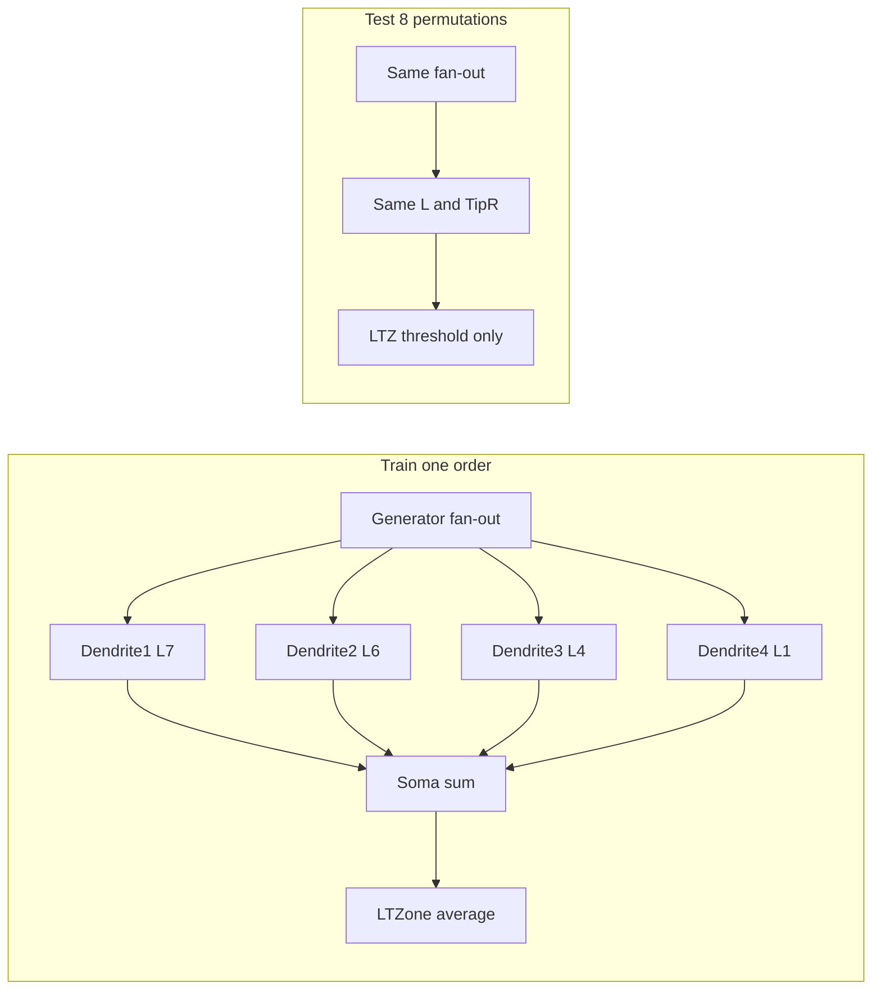
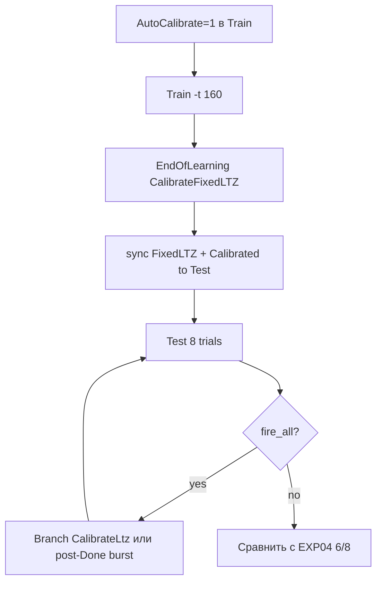
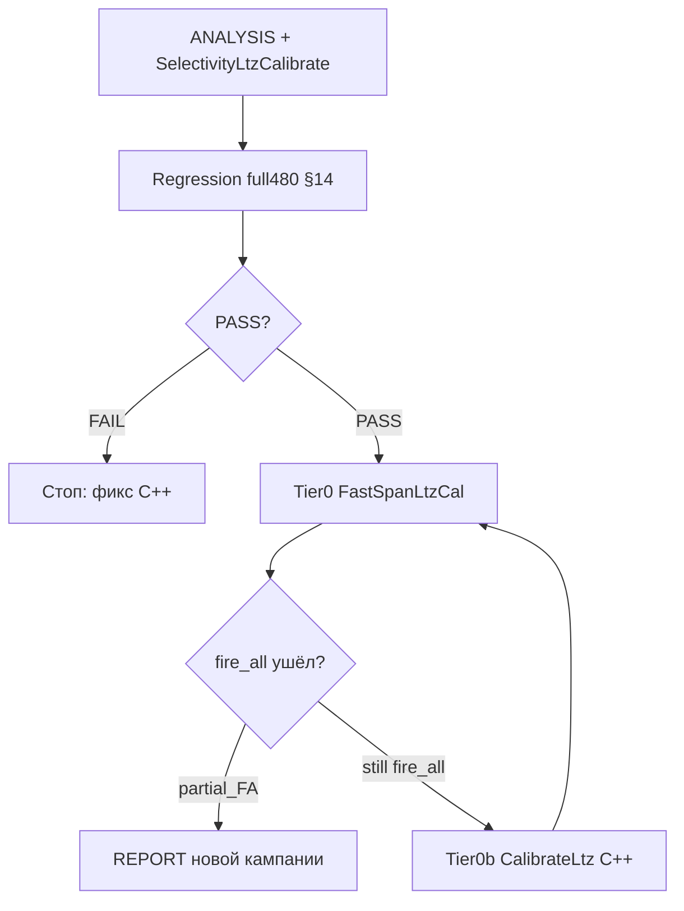

# Глубокий анализ структурного обучения на коротких временных интервалах

## 1. Краткий вердикт

После исправления масштабирования паттернов (16/16 verify PASS, span 25/50/100 мс совпадает с меткой) **селективность по-прежнему не достигается**: 6 EXP при TS=2000 — `fire_all` (acc=1/8, fp=7); 2 EXP ts10k — `silent` (acc=7/8, target_hit=0).

**Главный вывод:** уменьшение инерции синапса/мембраны (D=0.002, C=2.5e-10) решает задачу **быстрого EPSP и сходимости обучения длин**, но **не решает задачу различения перестановок ISI**, потому что:

1. Обучение (`NNeuronTimeLearner`) настраивает **один** целевой порядок импульсов, а тест содержит **8 перестановок** того же multiset ISI.
2. Инференс — **бинарный порог LTZ** (`FixedLTZThreshold=0.0115`), а не сравнение с `TrainingPattern` или профилем пиков.
3. `PatternRecognition()` — **заглушка** (`return true`) в [`NNeuronTimeLearner.cpp`](Libraries/Nmsdk-PulseLib/Core/NNeuronTimeLearner.cpp) и Branch-варианте.
4. При fast EPSP все 8 паттернов дают схожий `ltz_potential_max` (0.017–0.026), **выше** порога 0.0115 → перестрел; порог 0.04 (ts10k) — **выше** пиков target (~0.023) → промах.

Проблема **не только** в span/паттерне (это уже исправлено), а в **разрыве train ↔ test** и **недостаточной гибкости readout/алгоритма**.

---

## 2. Результаты valid-rerun (база для анализа)

Источник: [`grid_summary.csv`](Bin/Configs/SpikeSamples/StructTrain/SelectivityFastSpan/grid_summary.csv), [`REPORT.md`](Bin/Configs/SpikeSamples/StructTrain/SelectivityFastSpan/REPORT.md).

| Группа | Acc | mode | L (span25) | FixedLTZ | Интерпретация |
|--------|-----|------|------------|----------|---------------|
| 6× fast/preinh TS=2000 | 1/8 | fire_all | 7 6 4 1 | 0.0115 | target + 7 distractors стреляют |
| 2× ts10k | 7/8 | silent | 6 6 4 1 | 0.04 | никто не стреляет, target fn |

**Контроль:** [`SelectivityFastResponse`](Bin/Configs/SpikeSamples/StructTrain/SelectivityFastResponse/REPORT.md) — span 480 мс, паттерн OK, **тот же acc=1/8, fp=7** у всех train_ok ячеек. Значит узкий span — **усугубление**, но не **единственная** причина.

**Исторический контроль (другой протокол):** [`SelectivityPresynapticInhib`](Bin/Configs/SpikeSamples/StructTrain/SelectivityPresynapticInhib/REPORT_time_compress.md) — на несжатом 480 мс EXP04+Preinh давал **6/8**; на span 100 мс с Preinh — **5/8** (`partial_FA`). Текущий FastSpan с D=0.002 хуже по readout, хотя обучение (Done, L) сходится.

### Пример CSV (span25, TS=2000)

[`EXP_span25ms_fast/Test/SelectivityLog/results.csv`](Bin/Configs/SpikeSamples/StructTrain/SelectivityFastSpan/EXP_span25ms_fast/Test/SelectivityLog/results.csv):

- trial 0 (target): `ltz_max=0.0210`, soma `[0.021, 0.030, 0.027, 0.033]`
- trial 1 (distractor): `ltz_max=0.0224`, soma `[0.028, 0.038, 0.032, 0.027]`

**Разрыв target vs distractor по LTZ ≈ 0–15%** — **нет** порога, отделяющего классы. Distractor иногда **выше** target.

### ts10k (span25)

[`EXP_span25ms_fast_ts10k/.../results.csv`](Bin/Configs/SpikeSamples/StructTrain/SelectivityFastSpan/EXP_span25ms_fast_ts10k/Test/SelectivityLog/results.csv): target `ltz_max=0.0235`, distractors 0.021–0.029 — все **ниже** 0.04 → `silent`. Порог выбран без калибровки по фактическим пикам.

---

## 3. Матемодель и физика (что даёт и не даёт ускорение EPSP)

### 3.1 Элементная модель (Bio)

Из [`ANALYSIS_timing_mismatch.md`](Bin/Configs/SpikeSamples/NeuralElements/ANALYSIS_timing_mismatch.md):

- **Синапс:** `DissociationTC`, `SecretionTC` → экспоненциальный хвост; дискретно `PreOutput *= (1 - 1/VDissociationTC)`.
- **Мембрана:** RC ≈ R×C; при C=2.5e-10 и R~1e7 → τ_m ~ **2.5 мс**.
- **Fast pair D=0.002, C=2.5e-10:** t_peak ~30 мс на **несжатом** паттерне (cold L=1); FWHM существенно уже Bio-default.

Gate элементных бенчей: FWHM ≤ 0.5×min_ISI(T), separability dual-pulse ≥ 0.30 — для **одного** дендрита и **двух** импульсов.

### 3.2 Кабельная задержка (structural timing)

`EstDelayPerSeg = 0.005` с ([`NNeuronTimeLearner.h`](Libraries/Nmsdk-PulseLib/Core/NNeuronTimeLearner.h)). Обучение подбирает `L_i`, чтобы:

```
needed[k] = PrevPeakRel[ref] - Expected[k]
delay_len = (L_k - 1) × EstDelayPerSeg
```

Для span 25 мс: Expected ≈ `[0, 0.00417, 0.0125, 0.025]` с → L ≈ `[7, 6, 4, 1]`. Длины **масштабируются** с span (100 мс → `[23,19,13,1]`). **Обучение сходится** — это не баг паттерна.

`SettleMarginSec` использует `kDelayPerSegDefault×max(L)`, не адаптированный `EstDelayPerSeg` — при коротком span settle может быть **завышен** (лишние итерации, не корень fire_all).

### 3.3 Почему «узкий EPSP» не ⇒ селективность



- **Fan-out:** один Generator → все дендриты получают **все 4 импульса**. Обучение выравнивает пики для **training order**; при **перестановке** импульсы всё равно приходят, EPSP суммируются в LTZ.
- **Нормализация amp:** каждый дендрит → `InitialSomaPotential[i]` — **равный вклад** независимо от качества совпадения фаз.
- **LTZ:** `UseAverageLTZonePotential=true` — readout по **среднему/сумме** потенциала, **без** чувствительности к порядку ISI.
- **Узкий EPSP** сжимает t_peak, но при 4 импульсах за 25 мс **любая** перестановка даёт 4 вклада ≈ порог.

**Вывод:** ускорение элементов — **необходимое** условие для коротких ISI (иначе smear, см. старый REPORT_time_compress §блокеры), но **недостаточное** для order-selectivity при текущем readout.

---

## 4. Алгоритм обучения — глубокий разбор

Документация: [`TimeNeuronTimeLearner/ALGORITHM.md`](Bin/Configs/SpikeSamples/StructTrain/TimeNeuronTimeLearner/ALGORITHM.md), код: [`NNeuronTimeLearner.cpp`](Libraries/Nmsdk-PulseLib/Core/NNeuronTimeLearner.cpp).

### 4.1 Фазы и критерий Done

| Фаза | Цель | Критерий завершения |
|------|------|---------------------|
| 0 Joint train | ΔL + tip R | `AllDendritesSynced ∧ AllSynapsesNormalized` |
| 2 Done | Запись `TrainingPattern`, L, synapse counts | — |

**Не входит в Done:** различение distractors, калибровка порога под тест, `PatternRecognition`.

### 4.2 Итерация обучения

1. `BeginTrainingIteration`: cumsum ISI → `ExpectedPulseRelTimes` (row 0 InputPattern **не** входит в cumsum — только rows 1..N-1).
2. `MeasureMaxPotentialAndTime`: окно ±`PeakMeasureMargin` вокруг ожидаемого пика; ref dendrite (N−1) — якорь.
3. `ChangeDendriteStatus` (active dendrite): `dt = needed - delay_use`; ΔL с anti-overshoot, `EstDelayPerSeg` уточняется online.
4. `ChangeSynapseResistanceStatus`: parametric damped-P на tip R после sync длины.
5. `EndOfLearning`: `Neuron->TrainingPattern = InputPattern`; опционально `CalibrateFixedLTZThresholdFromTraining()` — **сейчас выключено** в FastSpan (`AutoCalibrateFixedLTZThreshold=0`).

### 4.3 Что алгоритм **реально** оптимизирует

- **Temporal alignment** одного фиксированного ISI-вектора (training order).
- **Amplitude equalization** на soma per dendrite.
- **Не оптимизирует:** подавление других перестановок, различимость LTZ(target) vs LTZ(distractor), timing vector на readout.

### 4.4 Известные ограничения (из ALGORITHM.md + код)

- Fan-out → **cross-peaks** на «чужих» ISI; критерий H1 — отсутствие L0≈L1, не полное отсутствие вторичных пиков.
- `PatternRecognition`, `LearningAdditionalPattern_1_4`, `IncrementalLearning` — **stub**.
- `CalibrateFixedLTZThresholdFromTraining` использует min/max LTZ **последней synced-итерации training burst**, без прогона 8 test patterns.

### 4.5 Альтернатива: Branch learner

[`TimeNeuronTimeLearnerBranch/ALGORITHM.md`](Bin/Configs/SpikeSamples/StructTrain/TimeNeuronTimeLearnerBranch/ALGORITHM.md):

- Один физический дендрит, N импульсов на **разных сегментах** (mute → reverse sync).
- После Done: **parallel activation** (scale tip R × N), фаза **CalibrateLtz** с `CalibrateFixedLTZFromParallelPeak`.
- Архитектурно лучше подходит для **coincidence detection** одного паттерна; `PatternRecognition` всё равно stub, но LTZ-калибровка **встроена**.

---

## 5. Конвейер тестирования (readout)

[`NPatternResponseAnalyzer.cpp`](Libraries/Nmsdk-PulseLib/Core/NPatternResponseAnalyzer.cpp):

- `neuron_fired` = rising edge на **NeuronOutputs** (LTZone) в окне `[t_last_stim, t_last_stim + PostPatternWindow]`.
- `match` = (target→fired) / (nontarget→!fired).
- CSV логирует `ltz_potential_max`, `soma_amp_0..3`, **но gate их не использует**.

Порог LTZ на Test: [`SetIsNeedToTrain(false)`](Libraries/Nmsdk-PulseLib/Core/NNeuronTimeLearner.cpp) → `SetLTZThreshold(FixedLTZThreshold)` независимо от `UseFixedLTZThreshold` в XML.

**FixedLTZ=0.0115** — legacy от PhaseA/EXP04 ([`SelectivityFastResponse/REPORT.md`](Bin/Configs/SpikeSamples/StructTrain/SelectivityFastResponse/REPORT.md)), **не** перекалиброван под D=0.002 / сжатые span.

---

## 6. Таксономия причин (ошибка vs ограничение)

| Категория | Проявление | Статус после fix паттернов |
|-----------|------------|----------------------------|
| **Конфиг паттерна** | span ~5 мс вместо 25–100 мс | **Исправлено** (verify PASS) |
| **Конфиг порога LTZ** | 0.0115 слишком низкий → fire_all; 0.04 слишком высокий → silent | **Актуально** |
| **Конфиг AutoCalibrate** | `AutoCalibrateFixedLTZThreshold=0`; setup hardcode 0.0115 | **Tier 0:** включить + sync (C++ уже есть) |
| **Задача train** | один order, без negative examples | **Ограничение алгоритма** |
| **Readout** | бинарный LTZ, игнор soma profile / ISI | **Ограничение протокола** |
| **Stub API** | `PatternRecognition()` | **Недореализация** |
| **Физика fan-out** | любая перестановка → 4 EPSP → LTZ↑ | **Архитектурное** |
| **Элементная инерция** | smear при D=5 мс, ISI&lt;5 мс | **Снято** D=0.002; не главный блокер сейчас |
| **Preinh (fast)** | не улучшает fire_all на FastSpan | **Гипотеза не подтвердилась** в этом протоколе |

---

## 7. Почему интуиция «меньше инерции ⇒ узкие паттерны» не срабатывает

**Инерция элементов** задаёт **ширину одного EPSP** и минимальный разрешимый ISI на **одном** канале.

**Структурное обучение + тест** требуют:

1. Совместить 4 EPSP в **заданном порядке** (обучение делает через L).
2. **Отвергнуть** другие порядки с теми же ISI (обучение **не** делает).
3. **Readout** должен быть order-sensitive (LTZ threshold **не** order-sensitive).

Аналогия: настроить задержки в PA-системе для **одной** мелодии ≠ распознавать **перестановки нот** по общей громкости.

---

## 7.1 Политика: не трогать старые конфиги и отчёты

**Запрещено изменять** (read-only эталоны):

| Каталог | Что сохраняем |
|---------|----------------|
| [`SelectivityFastSpan/`](Bin/Configs/SpikeSamples/StructTrain/SelectivityFastSpan/) | 8 EXP, `REPORT.md`, `JOURNAL.md`, `grid_summary.csv`, valid-rerun 2026-08-23 |
| [`SelectivityFastResponse/`](Bin/Configs/SpikeSamples/StructTrain/SelectivityFastResponse/) | 9 EXP, `REPORT.md`, `grid_summary.csv` |
| [`SelectivityPresynapticInhib/`](Bin/Configs/SpikeSamples/StructTrain/SelectivityPresynapticInhib/) | EXP00/04 margprops, time_compress — golden regression |
| [`TimeNeuronTimeLearner/`](Bin/Configs/SpikeSamples/StructTrain/TimeNeuronTimeLearner/) | шаблон Train (только чтение через `copy_config.sh`) |
| [`TimeNeuronTimeLearnerTest/`](Bin/Configs/SpikeSamples/StructTrain/TimeNeuronTimeLearnerTest/) | шаблон Test |

**Все новые эксперименты** — только в новой кампании (§12). Новые `REPORT.md` / `JOURNAL.md` / `grid_summary.csv` — только там.

---

## 8. Пути решения (приоритетный roadmap)

### Tier 0 — калибровка порога LTZ у учителя (ПЕРВЫЙ ШАГ)

**Ожидание:** не решит order-selectivity в общем случае, но может **вернуть acc к уровню широкого паттерна** (EXP04 Preinh **6/8**, span100 Preinh **5/8** в legacy-протоколе), убрав артеfact `fire_all` от legacy `FixedLTZ=0.0115` при fast EPSP (пики ~0.02–0.03).

#### 8.0.1 Что уже реализовано в C++

| Компонент | Статус | Где |
|-----------|--------|-----|
| `CalibrateFixedLTZThresholdFromTraining()` | **Реализовано** | [`NNeuronTimeLearner.cpp`](Libraries/Nmsdk-PulseLib/Core/NNeuronTimeLearner.cpp) — вызывается в `EndOfLearning()` при `AutoCalibrateFixedLTZThreshold=1` |
| Сбор min/max LTZ в train | **Реализовано** | `UpdateIterLTZPotential()` → `LastSyncedMinLTZ` / `LastSyncedMaxLTZ` на synced-итерации |
| Параметры калибровки | **Реализовано** | `CalibrateLTZThresholdMode` (0=gap_fraction, 1=peak_fraction), `Fraction`, `Min`, `Max`; default classic: gap **0.85**, min **0.0115**, max **0.05** |
| `CalibratedFixedLTZThreshold` | **State output** | Записывается при калибровке; default `AutoCalibrate=false` |
| Фаза `CalibrateLtz` + parallel peak | **Только Branch** | [`NNeuronTimeLearnerBranch.cpp`](Libraries/Nmsdk-PulseLib/Core/NNeuronTimeLearnerBranch.cpp) — `kPhaseCalibrateLtz`, `CalibrateFixedLTZFromParallelPeak()` после `ScaleTipResistancesForParallelActivation()` |

**Вывод:** базовая калибровка для classic TimeLearner **есть**, но **не используется**; Branch-варiant **точнее** (измеряет peak в recognition-режиме, fraction default **0.99**).

#### 8.0.2 Почему сейчас не работает (конфиг, не C++)

1. [`setup_fastspan.sh`](Bin/Configs/SpikeSamples/StructTrain/SelectivityFastSpan/scripts/setup_fastspan.sh) — `set_fixed_ltz(..., 0.0115)` / `0.04` **перезаписывает** порог до и после Train.
2. Train/Test XML: `AutoCalibrateFixedLTZThreshold=0` ([`EXP_span25ms_fast/Train/Parameters_00.xml`](Bin/Configs/SpikeSamples/StructTrain/SelectivityFastSpan/EXP_span25ms_fast/Train/Parameters_00.xml)).
3. [`run_fastspan.sh`](Bin/Configs/SpikeSamples/StructTrain/SelectivityFastSpan/scripts/run_fastspan.sh) sync копирует только `FixedLTZThreshold`, **не** `AutoCalibrateFixedLTZThreshold` / `CalibratedFixedLTZThreshold` / `CalibrateLTZThreshold*`.
4. Classic learner калибрует по LTZ **во время muted sync-train**, а не по финальному recognition-burst (Branch делает отдельную фазу).

#### 8.0.3 План реализации Tier 0 (только новые конфиги §12)

**Не править** [`setup_fastspan.sh`](Bin/Configs/SpikeSamples/StructTrain/SelectivityFastSpan/scripts/setup_fastspan.sh) / [`run_fastspan.sh`](Bin/Configs/SpikeSamples/StructTrain/SelectivityFastSpan/scripts/run_fastspan.sh). Логику перенести в `SelectivityLtzCalibrate/scripts/`.

**Фаза A — конфиг + протокол (после regression §14 PASS)**

1. **`patch_ltz_calibrate.py`** — патч Train `Parameters_00.xml`:
   - `AutoCalibrateFixedLTZThreshold=1`
   - `UseFixedLTZThreshold=1`
   - `CalibrateLTZThresholdMode=1` (peak_fraction; fallback 0 gap_fraction)
   - `CalibrateLTZThresholdFraction=0.99`
   - `CalibrateLTZThresholdMin=0.001` (не блокировать подъём порога)
   - `CalibrateLTZThresholdMax=0.10` (Preinh peaks ~0.031)
   - **Не** вызывать `set_fixed_ltz(0.0115)`
2. **`run_ltz_grid.sh` sync:** использовать [`merge_train_weights.py`](Bin/Configs/SpikeSamples/StructTrain/SelectivityFastSpan/scripts/merge_train_weights.py) (уже мержит `FixedLTZThreshold`, `CalibratedFixedLTZThreshold`, все `CalibrateLTZThreshold*`, `UseFixedLTZThreshold`) через [`copy_config.sh sync`](Bin/Configs/SpikeSamples/StructTrain/SelectivityFastSpan/scripts/copy_config.sh) + `inject_analyzer.py` на Test Model.
3. **Verify post-Train:** в `Train/Parameters_00.xml` — `TrainingPhase=2`, `CalibratedFixedLTZThreshold>0`, `FixedLTZThreshold` ≠ 0.0115 для fast/preinh.

**Фаза B — доработка C++ (если Фаза A + regression OK, но grid fire_all)**

Classic learner измеряет LTZ на **training** wiring (fan-out, TrainingLTZ=100), Branch — на **parallel recognition** burst. Если `LastSyncedMaxLTZ` занижен/не совпадает с Test:

1. **Вариант B1 (минимальный diff):** в `NNeuronTimeLearner::EndOfLearning()` перед `CalibrateFixedLTZThresholdFromTraining()` — один post-sync measurement burst с `TrainingLTZThreshold` (без ΔL), track `IterMaxLTZPotential` → calibrate (упрощённый аналог Branch `CalibrateLtz`).
2. **Вариант B2 (reuse):** экспериментальная ветка на `TimeNeuronTimeLearnerBranch` + fast neuron (`NSPNeuronGenD002C25e11`) на span 100 мс — встроенная калибровка уже есть.
3. **Документация:** обновить [`TimeNeuronTimeLearner/ALGORITHM.md`](Bin/Configs/SpikeSamples/StructTrain/TimeNeuronTimeLearner/ALGORITHM.md) и [`NNeuronTimeLearner.md`](Libraries/Nmsdk-PulseLib/Docs/Components/NNeuronTimeLearner.md) — когда вызывается calibrate, что пишется в XML.

**Критерий успеха Tier 0**

- TS=2000: уйти из `fire_all` → `partial_FA` или лучше; target span100 preinh ≥ **5/8** (как legacy EXP21).
- Не ожидать acc=8/8 без order-sensitive readout (см. §2: overlap LTZ target/distractor на span25).



---

### Tier A — быстрые эксперименты (конфиг, без изменения C++)

**A1. Fallback: sweep FixedLTZ по CSV** (если auto-calibrate не даёт окна separability)

- Offline sweep по `ltz_potential_max` из results.csv: max thr при target_hit=1.
- Для ts10k: калибровать от measured peak, не 0.04 «с потолка».

**A2. Анализ soma-вектора (offline)**

- Из существующих CSV: классификатор по `[soma_amp_0..3]` или `[soma_amp_sum, peak timing]`.
- Если offline acc >> 1/8 → проблема **только readout**; если ≈1/8 → нужна смена архитектуры/обучения.

**A3. Воспроизвести margprops / Preinh протокол на valid patterns**

- EXP04-like: Preinh k=2.5, **legacy margins** (SyncTol=0.01, Peak=0.06) на span 100 мс с **valid** scale — эталон давал 5/8.
- Сравнить с FastSpan D=0.002 при том же span.

### Tier B — доработка readout (умеренный C++ / конфиг)

**B1. Расширить `NPatternResponseAnalyzer`**

- Режим `match_mode=template`: сравнение ISI trial с `Neuron.TrainingPattern` (L1 distance / exact order).
- Или: `match` по `soma_amp` vector vs stored training profile (записывать при Done).

**B2. Включить Branch + CalibrateLtz**

- Конфиг `TimeNeuronTimeLearnerBranch` + fast neuron class на span 25–100 мс.
- Использовать [`CalibrateFixedLTZFromParallelPeak`](Libraries/Nmsdk-PulseLib/Core/NNeuronTimeLearnerBranch.cpp) после parallel phase.

**B3. Двухпороговая LTZ-калибровка**

- Train burst → `peak_target`; прогон 7 distractors (offline или в learner) → `max_distractor`; `thr = (peak_target + max_distractor) / 2` или ROC-optimal.

### Tier C — доработка алгоритма обучения (существенный C++)

**C1. Реализовать `PatternRecognition()`**

- Загрузка test matrix; для каждого sample — simulate или measure LTZ/soma; выбор порога / весов, минимизирующих FP при target_hit.

**C2. Negative training / contrastive**

- Добавить фазу после sync: подавлять ответ на 1–2 distractor orders (tip R / preinh / LTZ-aware loss).
- Или: `LearningAdditionalPattern_1_4` — реальная доработка структуры под второй паттерн.

**C3. Per-dendrite или Branch-only wiring**

- Отказ от fan-out: импульс k → только dendrite k (как Branch mute-phase), чтобы перестановка **меняла** какие задержки engaged.

**C4. Order-sensitive readout на soma**

- Coincidence: fire только если `|t_peak_i - t_expected_i| < ε` для всех i (требует peak tracking per dendrite, не только LTZ sum).

### Tier D — физика / параметры модели

**D1. Раздельные Exc/Inh C и Dissoc** (см. FastResponse §сноска).

**D2. PeakMeasureMargin / SettleMargin** — привязать к `PatternSpanSec` и **адаптированному** `EstDelayPerSeg`, не только `kDelayPerSegDefault×max(L)` (старый блокер tune на 10/25 мс).

**D3. GlobalTimeStep** — ts10k (dt=0.1 мс) меняет динамику; любой sweep порога **отдельно** для TS.

---

## 9. Рекомендуемая последовательность работ



1. **Документ + кампания:** §10, §12 — `SelectivityLtzCalibrate/`.
2. **Regression (блокер):** §14 — до span/fast grid.
3. **Tier 0:** `FastSpanLtzCal/` с AutoCalibrate.
4. **Tier 0b / B / C** — только после regression PASS.

---

## 10. Документ анализа (обязательный deliverable)

**Первый шаг при выполнении плана:** сохранить **полный текст плана** (§1–§14) в новой кампании — без YAML-frontmatter Cursor.

### Целевой файл

[`Bin/Configs/SpikeSamples/StructTrain/SelectivityLtzCalibrate/ANALYSIS_structural_learning.md`](Bin/Configs/SpikeSamples/StructTrain/SelectivityLtzCalibrate/ANALYSIS_structural_learning.md)

### Содержание документа

- **§1–§14** — полный план (диагноз, roadmap, код, конфиги, regression)
- Таблицы из **read-only** [`SelectivityFastSpan/grid_summary.csv`](Bin/Configs/SpikeSamples/StructTrain/SelectivityFastSpan/grid_summary.csv)

### Обновления после сохранения (только новые/внешние файлы)

1. [`NeuralElements/JOURNAL_timing_elements.md`](Bin/Configs/SpikeSamples/NeuralElements/JOURNAL_timing_elements.md) — одна ссылка на `SelectivityLtzCalibrate/ANALYSIS_structural_learning.md`
2. **Не менять** [`SelectivityFastSpan/JOURNAL.md`](Bin/Configs/SpikeSamples/StructTrain/SelectivityFastSpan/JOURNAL.md) / `REPORT.md`
3. По итогам Tier 0 — append «Tier 0 results» в ANALYSIS новой кампании

### Дополнительно

- [`SelectivityLtzCalibrate/scripts/analyze_separability.py`](Bin/Configs/SpikeSamples/StructTrain/SelectivityLtzCalibrate/scripts/analyze_separability.py)

---

## 11. Ключевые файлы

| Роль | Путь |
|------|------|
| **Новая кампания** | [`SelectivityLtzCalibrate/`](Bin/Configs/SpikeSamples/StructTrain/SelectivityLtzCalibrate/) |
| Golden regression | [`EXP00_baseline_margprops`](Bin/Configs/SpikeSamples/StructTrain/SelectivityPresynapticInhib/EXP00_baseline_margprops/), [`EXP04_preinh_250_margprops`](Bin/Configs/SpikeSamples/StructTrain/SelectivityPresynapticInhib/EXP04_preinh_250_margprops/) |
| Алгоритм train | [`NNeuronTimeLearner.cpp`](Libraries/Nmsdk-PulseLib/Core/NNeuronTimeLearner.cpp), [`ALGORITHM.md`](Bin/Configs/SpikeSamples/StructTrain/TimeNeuronTimeLearner/ALGORITHM.md) |
| Branch + LTZ cal | [`NNeuronTimeLearnerBranch.cpp`](Libraries/Nmsdk-PulseLib/Core/NNeuronTimeLearnerBranch.cpp) |
| Sync LTZ tags | [`merge_train_weights.py`](Bin/Configs/SpikeSamples/StructTrain/SelectivityFastSpan/scripts/merge_train_weights.py) |
| Test analyzer | [`NPatternResponseAnalyzer.cpp`](Libraries/Nmsdk-PulseLib/Core/NPatternResponseAnalyzer.cpp) |
| Read-only rerun | [`SelectivityFastSpan/grid_summary.csv`](Bin/Configs/SpikeSamples/StructTrain/SelectivityFastSpan/grid_summary.csv) |
| Test matrix (8 orders) | `REF_TEST_MATRIX` in [`patch_pattern_scale.py`](Bin/Configs/SpikeSamples/StructTrain/SelectivityFastSpan/scripts/patch_pattern_scale.py) |
| Элементная физика | [`ANALYSIS_timing_mismatch.md`](Bin/Configs/SpikeSamples/NeuralElements/ANALYSIS_timing_mismatch.md) |

---

## 12. Новая кампания конфигов: `SelectivityLtzCalibrate`

Корень: [`Bin/Configs/SpikeSamples/StructTrain/SelectivityLtzCalibrate/`](Bin/Configs/SpikeSamples/StructTrain/SelectivityLtzCalibrate/)

```
SelectivityLtzCalibrate/
├── ANALYSIS_structural_learning.md
├── REPORT.md
├── JOURNAL.md
├── REGRESSION.md              # golden vs new baseline
├── grid_cells.tsv             # FastSpanLtzCal EXP
├── grid_regression.tsv        # RegressionFull480 EXP
├── grid_summary.csv           # после прогонов
├── scripts/
│   ├── copy_config.sh         # rsync из ../TimeNeuronTimeLearner(+Test)
│   ├── setup_regression.sh    # §14 baseline EXP
│   ├── setup_ltz_grid.sh      # FastSpanLtzCal + patch_pattern_scale
│   ├── patch_ltz_calibrate.py
│   ├── patch_pattern_scale.py # копия/ symlink из FastSpan (REF_TEST_MATRIX)
│   ├── patch_watch_pattern_legend.py
│   ├── verify_pattern_span.py
│   ├── merge_train_weights.py # копия из FastSpan (LTZ tags уже в TAGS)
│   ├── inject_analyzer.py
│   ├── run_regression.sh      # fail-hard gate
│   ├── run_ltz_grid.sh
│   ├── verify_regression.py   # acc/L/thr vs golden CSV
│   └── evaluate_selectivity_csv.py
├── RegressionFull480/         # §14 — ПЕРВЫЙ прогон
│   ├── EXP_baseline_gen/
│   │   ├── Train/  Test/
│   └── EXP_baseline_preinh25/
│       ├── Train/  Test/
└── FastSpanLtzCal/            # Tier 0 после regression PASS
    ├── EXP_span100ms_gen/
    ├── EXP_span100ms_preinh25/
    ├── EXP_span50ms_gen/
    ├── EXP_span50ms_preinh25/
    ├── EXP_span25ms_gen/
    └── EXP_span25ms_preinh25/
```

### 12.1 Шаблоны и copy

- **Источник Train:** [`../TimeNeuronTimeLearner/`](Bin/Configs/SpikeSamples/StructTrain/TimeNeuronTimeLearner/) через `copy_config.sh train`
- **Источник Test:** [`../TimeNeuronTimeLearnerTest/`](Bin/Configs/SpikeSamples/StructTrain/TimeNeuronTimeLearnerTest/) — `MatrixData` 32×1, 8 перестановок ([`patch_pattern_scale.py`](Bin/Configs/SpikeSamples/StructTrain/SelectivityFastSpan/scripts/patch_pattern_scale.py) `REF_TEST_MATRIX`)
- **Train pattern (full480):** `InputPattern = [0.01, 0.08, 0.16, 0.24]` — **без** `--span-ms`
- **FastSpanLtzCal:** `--span-ms {100|50|25}` как в FastSpan, floor 0.5 ms

### 12.2 `grid_regression.tsv`

| exp | neuron | pattern | golden_exp | golden_acc | golden_L | golden_FixedLTZ |
|-----|--------|---------|------------|------------|----------|-----------------|
| `EXP_baseline_gen` | `NSPNeuronGen` | full480 | `EXP00_baseline_margprops` | **5/8** | `49 41 25 1` | ~0.0128 |
| `EXP_baseline_preinh25` | `NSPNeuronGenPreinh2_5` | full480 | `EXP04_preinh_250_margprops` | **6/8** | ~`49 41 25 1` | ~0.0302 |

Golden CSV (read-only):

- [`SelectivityPresynapticInhib/EXP00_baseline_margprops/Test/SelectivityLog/results.csv`](Bin/Configs/SpikeSamples/StructTrain/SelectivityPresynapticInhib/EXP00_baseline_margprops/Test/SelectivityLog/results.csv)
- [`SelectivityPresynapticInhib/EXP04_preinh_250_margprops/Test/SelectivityLog/results.csv`](Bin/Configs/SpikeSamples/StructTrain/SelectivityPresynapticInhib/EXP04_preinh_250_margprops/Test/SelectivityLog/results.csv)

### 12.3 `grid_cells.tsv` (FastSpanLtzCal, после regression)

| exp | neuron | span_ms | kind |
|-----|--------|---------|------|
| `EXP_span100ms_gen` | `NSPNeuronGenD002C25e11` | 100 | fast_ltzcal |
| `EXP_span100ms_preinh25` | `NSPNeuronGenPreinh2_5D002C25e11` | 100 | preinh_ltzcal |
| … | … | 50, 25 | … |

Опционально позже: `Full480LtzCal/EXP_full480_preinh25_fast/` — full480 + D002C25e11 + AutoCalibrate.

---

## 13. Детализация по кодовой базе (C++ / PulseLib)

### 13.1 NNeuronTimeLearner — свойства калибровки LTZ

Файлы: [`NNeuronTimeLearner.h`](Libraries/Nmsdk-PulseLib/Core/NNeuronTimeLearner.h), [`NNeuronTimeLearner.cpp`](Libraries/Nmsdk-PulseLib/Core/NNeuronTimeLearner.cpp)

| Свойство | Default (`ADefault`) | Роль |
|----------|----------------------|------|
| `AutoCalibrateFixedLTZThreshold` | `false` | Gate вызова в `EndOfLearning()` |
| `CalibrateLTZThresholdMode` | `0` (gap_fraction) | `1` = peak_fraction (`max * fraction`) |
| `CalibrateLTZThresholdFraction` | `0.85` | Branch default **0.99** |
| `CalibrateLTZThresholdMin` | `0.0115` | Clamp min — **опустить** в новых конфигах |
| `CalibrateLTZThresholdMax` | `0.05` | Clamp max — **поднять** до 0.10 для Preinh |
| `CalibratedFixedLTZThreshold` | `0` | State: результат калибровки |
| `TrainingLTZThreshold` | `100` | Порог во время train (`SetIsNeedToTrain(true)`) |
| `FixedLTZThreshold` | `0.0115` | Порог inference (`SetIsNeedToTrain(false)`) |

### 13.2 Цепочка вызовов (classic learner)

```
ACalculate() [train]
  → BeginTrainingIteration / FinishTrainingIteration
  → UpdateIterLTZPotential()        // IterMin/Max LTZ per burst
  → if AllDendritesSynced: LastSyncedMin/MaxLTZ = Iter*

EndOfLearning()
  → Neuron->TrainingPattern = InputPattern
  → CalibrateFixedLTZThresholdFromTraining()  // if AutoCalibrate
  → TrainingPhase = Done; IsNeedToTrain = false
  → SetIsNeedToTrain(false) → SetLTZThreshold(FixedLTZThreshold)

Test: NPatternResponseAnalyzer
  → DetectRisingEdge(NeuronOutputs)  // LTZone Output
  → match = target ? fired : !fired
```

Ключевые строки: `CalibrateFixedLTZThresholdFromTraining` ~302–341; snapshot ~3486–3490; `EndOfLearning` ~3161–3192.

### 13.3 NNeuronTimeLearnerBranch — эталон для Tier 0b

Файл: [`NNeuronTimeLearnerBranch.cpp`](Libraries/Nmsdk-PulseLib/Core/NNeuronTimeLearnerBranch.cpp)

- `kPhaseCalibrateLtz` после sync+amp
- `ScaleTipResistancesForParallelActivation()` — выравнивание tip R под parallel fan-in
- `CalibrateFixedLTZThresholdFromParallelPeak()` — peak × fraction
- **Порт в classic:** минимально — post-Done один burst + `IterMaxLTZPotential` без ΔL

### 13.4 Sync Train → Test (исправление протокола)

[`merge_train_weights.py`](Bin/Configs/SpikeSamples/StructTrain/SelectivityFastSpan/scripts/merge_train_weights.py) уже мержит:

`FixedLTZThreshold`, `UseFixedLTZThreshold`, `CalibratedFixedLTZThreshold`, `AutoCalibrateFixedLTZThreshold`, `CalibrateLTZThresholdMode/Fraction/Min/Max`, `TrainingPattern`, `DendriteLength`, `TipSynapseResistance`, …

**Новый** `run_ltz_grid.sh` должен вызывать:

```bash
copy_config.sh sync "$TRAIN" "$TEST"
# merge_train_weights уже внутри sync copy_config.sh
python3 inject_analyzer.py "$TRAIN/Model_00.xml" "$TEST/Model_00.xml"
```

Не дублировать урезанный python-sync из [`run_fastspan.sh`](Bin/Configs/SpikeSamples/StructTrain/SelectivityFastSpan/scripts/run_fastspan.sh) (только FixedLTZ).

### 13.5 NPatternResponseAnalyzer (без изменений в Tier 0)

[`NPatternResponseAnalyzer.cpp`](Libraries/Nmsdk-PulseLib/Core/NPatternResponseAnalyzer.cpp): `PostPatternWindow=0.5`, rising edge LTZ, CSV `ltz_potential_max` — Tier B1 добавит template mode.

### 13.6 Изменения C++ (Tier 0b, только если warm/smoke PASS + train Done на grid + fire_all)

| Файл | Изменение |
|------|-----------|
| `NNeuronTimeLearner.h` | опционально `kPhaseCalibrateLtz`, `CalibrateFixedLTZFromRecognitionPeak()` |
| `NNeuronTimeLearner.cpp` | фаза между sync-Done и `CalibrateFixedLTZThresholdFromTraining`; persist `CalibratedFixedLTZThreshold` в Parameters при save |
| `TimeNeuronTimeLearner/ALGORITHM.md` | документировать фазу |
| `NNeuronTimeLearner.md` | defaults vs Branch |

**Gate перед C++:** `smoke_sync_regression.sh` + `run_regression_warm.sh` PASS (acc/target_hit golden). Cold Bio retrain **не** требуется. Дополнительно: train на FastSpan grid должен быть Done (`verify_train_done.py`).

---

## 14. Regression gate (warm/smoke; cold optional)

### 14.1 Цель

Убедиться, что **sync Train→Test не ломает golden checkpoint** EXP00/EXP04 (acc 5/8 и 6/8). Это проверка pipeline (`merge_train_weights` / `merge_train_model` / inject), а не cold retrain Bio full480.

С новыми параметрами синапса/дендрита (D002, fast span) cold baseline на Bio full480 **может не сходиться** — это ожидаемо и **не является gate**.

### 14.2 Warm path (gate) — два EXP в RegressionFull480 Test dirs

| EXP | Golden source | Neuron | Expect acc | Expect fires |
|-----|---------------|--------|------------|--------------|
| `EXP_baseline_gen` | `EXP00_baseline_margprops` | `NSPNeuronGen` | **5/8** | `10101010` |
| `EXP_baseline_preinh25` | `EXP04_preinh_250_margprops` | `NSPNeuronGenPreinh2_5` | **6/8** | `10001010` |

Протокол: восстановить golden `Train/Parameters_00.xml` → sync → Test `-t 20` (`run_regression_warm.sh`). Альтернатива без Regression dirs: `smoke_sync_regression.sh` (копия в `_smoke_sync/`).

### 14.3 Cold path (optional experiment)

`setup_regression.sh` + `run_regression.sh` — cold `L=1`, `-t 160`, AutoCalibrate. Может не воспроизвести golden `L=49` / Done. Результаты → `REGRESSION_COLD.md` (`verify_regression.py --mode cold`). **Не блокирует** FastSpanLtzCal / Branch grids.

Параметры cold (справочно): SyncTol=0.02, PeakMargin=0.06, Delay=1.5, Gain=0.4, AutoCalibrate=1, gap_fraction 0.85.

### 14.4 Критерии PASS / FAIL (`verify_regression.py`)

**`--mode warm` (default)** → пишет `REGRESSION.md`:

1. Test: `acc` == 5/8 и == 6/8
2. `target_hit=1`
3. `fp <= fp_max`
4. `fires` == expected pattern

Train Done / L±2 / Calibrated **не** требуются в warm mode.

**`--mode cold`** → пишет `REGRESSION_COLD.md`: дополнительно TrainingPhase=2, L±2 от golden, FixedLTZ ±20%, Calibrated при AutoCalibrate.

**Warm FAIL** → запрет grid / C++ diff. Cold FAIL → только research note.

### 14.5 Команды gate

```bash
cd Bin/Configs/SpikeSamples/StructTrain/SelectivityLtzCalibrate
./scripts/smoke_sync_regression.sh
./scripts/run_regression_warm.sh          # verify --mode warm → REGRESSION.md
# optional:
# ./scripts/setup_regression.sh && ./scripts/run_regression.sh
# python3 scripts/verify_regression.py --mode cold
```

### 14.6 Связь с Tier 0

Warm/smoke доказывает целостность sync. Tier 0 проверяет **сжатые** span + fast neuron (D002C25e11) — отдельная гипотеза. Кодовые изменения без **warm/smoke** PASS запрещены. Cold Bio Done не требуется.

---

## Tier 0 results (2026-08-23, debt-fix run) — historical

**Gate:** warm sync PASS — см. [REGRESSION.md](REGRESSION.md). Cold Bio retrain **не** был целью (см. JOURNAL 2026-08-23).

**Grid (historical):** train `-t 160`; 5/6 EXP `fire_all` при FixedLTZ=0.0115 (train не Done). span25 gen — 7/8 silent (FixedLTZ≈0.043).

**Вывод historical:** корень — batch train stall / AutoCalibrate не вызван; sync pipeline после fix валиден.

**Sync fix:** `merge_train_model.py` + inject in-place + `--test` merge + `StructureBuildMode=1` на test D002.
