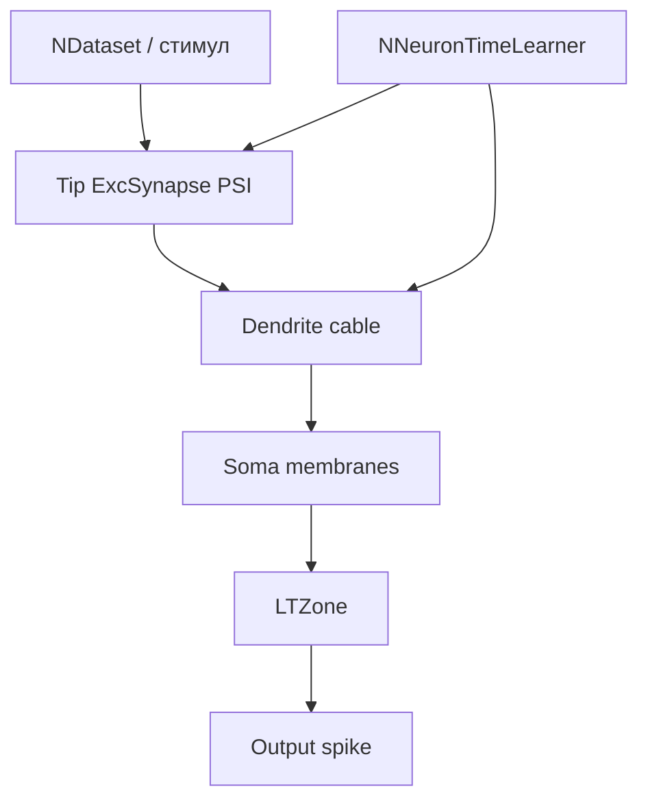

## EXP04_preinh_250 — Train (обучение структуры + autothr)

**Путь:** `Bin/Configs/SpikeSamples/StructTrain/SelectivityPresynapticInhib/EXP04_preinh_250/Train`  
**Статус:** экспериментальный конфиг StructTrain / SelectivityPresynapticInhib

### Назначение

Обучает длины дендритов и нормализацию tip-синапсов на целевом ISI-паттерне
при пресинаптическом торможении (PSI), затем калибрует `FixedLTZThreshold`.

### Параметры нейрона

- **NeuronClassName:** `NSPNeuronGenPreinh2_5`
- **k (PSI):** `2.5`
- **Autothr:** `AutoCalibrateFixedLTZThreshold=1`, mode=`gap_fraction`, fraction=`0.85`, clamp ≈`[0.0115, 0.05]`
- **Cold train (типично):** `IsNeedToTrain=1`, `ResetToUntrainedState=1`, `StructureBuildMode=1`, стартовые L=`[1,1,1,1]`

### Структура модели



### Эксперимент

1. Обучение структуры на целевом паттерне (sync длин + нормализация амплитуд).
2. `EndOfLearning` → `CalibrateFixedLTZThresholdFromTraining` (`thr = min + 0.85·(max−min)` по last synced LTZ).
3. Тест: 8 trials, метрика `match` в `SelectivityLog/results.csv`.

### Watch-метрики

| Chart | Свойство | Смысл |
|---|---|---|
| Dendrite Amplitudes | `DendriteNeuronAmplitude[i]` | `DendriteN_1.SumPotential` |
| Neuron Sums | `DendriticSumPotential` | avg `SumChannelInput` каналов сомы (`≈/4`) |
| Neuron Sums | `SomaSumPotential` | avg `Output` каналов сомы |

`DendriticSumPotential ≈ mean(DendriteNeuronAmplitude[1..4]) = DendriteNeuronAmplitude[0]/4`.  
Подробнее: [корневой README серии](../../README.md).

### Использование

```bash
NeuroModelerConsole -c Bin/Configs/SpikeSamples/StructTrain/SelectivityPresynapticInhib/EXP04_preinh_250/Train/Project.ini -s -t 90 -x -S
# или GUI: Open → Project.ini → Start
```

Родительский обзор: [`../README.md`](../README.md).

### Связанные материалы

- [`REPORT_k_sweep.md`](../../REPORT_k_sweep.md) — сводка k-sweep
- [`REPORT_gui_autothr.md`](../../REPORT_gui_autothr.md) — GUI/autothr
- Компоненты: `Libraries/Nmsdk-PulseLib/Docs/Components/NNeuronTimeLearner.md`
