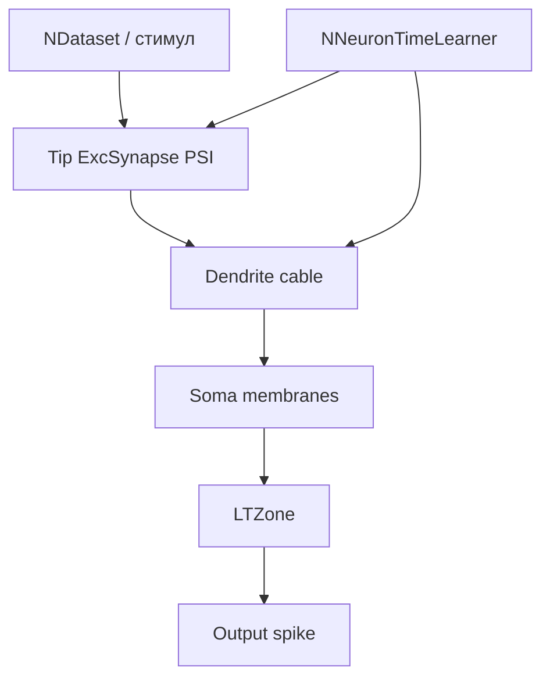

## EXP02_preinh_100 — PSI k-sweep / selectivity

**Путь:** `Bin/Configs/SpikeSamples/StructTrain/SelectivityPresynapticInhib/EXP02_preinh_100`  
**Статус:** экспериментальный конфиг StructTrain / SelectivityPresynapticInhib

### Назначение

Пара Train/Test для исследования влияния коэффициента пресинаптического
торможения `k` на точность детекции паттерна (8 trials).

### Параметры нейрона

- **NeuronClassName:** `NSPNeuronGenPreinh`
- **k (PSI):** `1.0`
- **Autothr:** `AutoCalibrateFixedLTZThreshold=1`, mode=`gap_fraction`, fraction=`0.85`, clamp ≈`[0.0115, 0.05]`
- **Cold train (типично):** `IsNeedToTrain=1`, `ResetToUntrainedState=1`, `StructureBuildMode=1`, стартовые L=`[1,1,1,1]`

### Структура модели



### Эксперимент

1. Обучение структуры на целевом паттерне (sync длин + нормализация амплитуд).
2. `EndOfLearning` → `CalibrateFixedLTZThresholdFromTraining` (`thr = min + 0.85·(max−min)` по last synced LTZ).
3. Тест: 8 trials, метрика `match` в `SelectivityLog/results.csv`.

### Watch-метрики

`DendriticSumPotential` = avg `SumChannelInput` сомы (`/4`). Сравнивать со средним `DendriteNeuronAmplitude[1..4]`.  
См. [корневой README](../README.md).

### Использование

```bash
# Train
NeuroModelerConsole -c Bin/Configs/SpikeSamples/StructTrain/SelectivityPresynapticInhib/EXP02_preinh_100/Train/Project.ini -s -t 90 -x -S
# sync + Test — см. scripts/copy_config.sh
NeuroModelerConsole -c Bin/Configs/SpikeSamples/StructTrain/SelectivityPresynapticInhib/EXP02_preinh_100/Test/Project.ini -s -t 20 -x
```

Серия: [`../README.md`](../README.md) · отчёт: [`../REPORT_k_sweep.md`](../REPORT_k_sweep.md).

### Связанные материалы

- [`REPORT_k_sweep.md`](../REPORT_k_sweep.md) — сводка k-sweep
- [`REPORT_gui_autothr.md`](../REPORT_gui_autothr.md) — GUI/autothr
- Компоненты: `Libraries/Nmsdk-PulseLib/Docs/Components/NNeuronTimeLearner.md`
