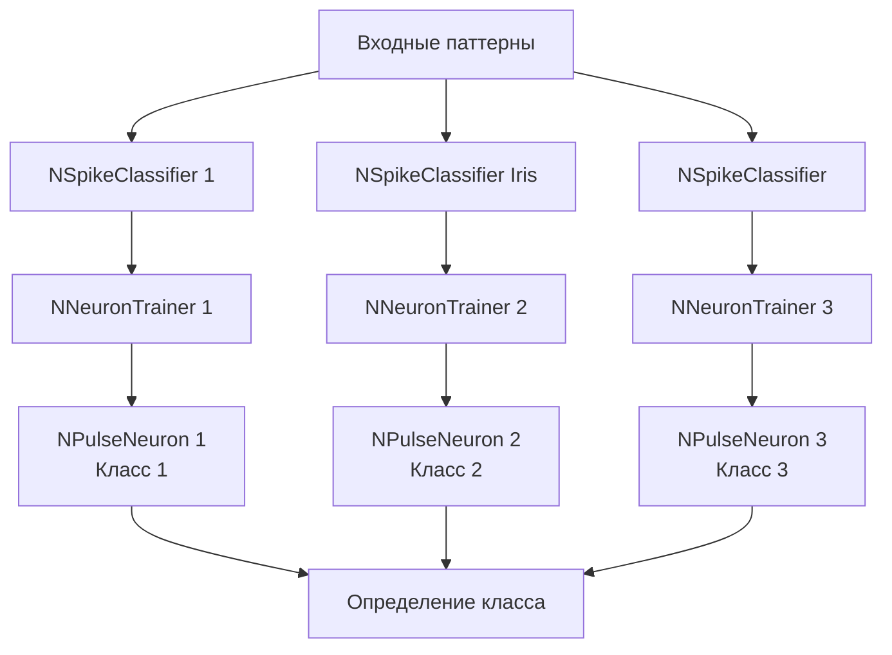

## SpikeAnsTrainer — структурное обучение с ответами

**Путь:** `Bin/Configs/SpikeSamples/StructTrain/SpikeAnsTrainer`
**Статус валидации:** VALID (см. `Reports/SpikeSamples-Validation-Report.md`)

### Назначение конфигурации

Эта конфигурация демонстрирует **расширенное структурное обучение с возможностью обучения на нескольких паттернах** и формирования ответов на различные входные паттерны. Конфигурация использует несколько компонентов `NNeuronTrainer` и `NSpikeClassifier` для демонстрации обучения нейронов распознавать различные классы паттернов с использованием структурной адаптации [1], [4].

### Структура модели

Конфигурация содержит несколько компонентов для обучения на различных паттернах:

#### Компоненты системы

- **NSpikeClassifier** (несколько экземпляров) — классификаторы для различных задач
  - Управляют процессом обучения и классификации
  - Создают и координируют работу нейронов-классификаторов
  - Используют структурную адаптацию для обучения

- **NNeuronTrainer** (несколько экземпляров) — компоненты структурного обучения
  - Каждый обучает один нейрон распознавать свой класс паттернов
  - Используют структурную адаптацию для подстройки под паттерны своего класса
  - Работают независимо друг от друга

- **NPulseNeuron** (по одному на каждый тренер) — сегментные спайковые нейроны
  - Структура каждого нейрона адаптируется под паттерны своего класса
  - Генерируют спайк при распознавании своего класса

### Эксперимент и моделируемые реакции

#### Цель эксперимента

Демонстрация структурного обучения на нескольких классах:
- Обучение нейронов распознавать различные классы паттернов
- Использование структурной адаптации для каждого класса
- Формирование ответов на различные входные паттерны
- Демонстрация возможности инкрементального обучения

#### Процесс обучения

1. **Обучение на первом классе:**
   - Создание первого нейрона-классификатора
   - Обучение на паттернах первого класса
   - Структурная адаптация под паттерны первого класса

2. **Обучение на втором классе:**
   - Создание второго нейрона-классификатора
   - Обучение на паттернах второго класса
   - **Без переобучения на первом классе** (инкрементальное обучение)
   - Структурная адаптация под паттерны второго класса

3. **Обучение на последующих классах:**
   - Последовательное обучение на новых классах
   - Каждый новый нейрон обучается независимо
   - Сохранение способности предыдущих нейронов распознавать свои классы

#### Классификация

После обучения:
- Предъявление входного паттерна всем нейронам одновременно
- Каждый нейрон анализирует паттерн
- Нейрон, обученный на соответствующем классе, генерирует спайк
- Класс определяется нейроном, который генерирует спайк

#### Ожидаемое поведение

- **Независимое обучение:** каждый нейрон обучается независимо на своём классе
- **Структурная адаптация:** структура каждого нейрона адаптируется под паттерны своего класса
- **Инкрементальное обучение:** возможность добавления новых классов без переобучения на всех данных
- **Формирование ответов:** нейроны формируют ответы (спайки) на соответствующие паттерны

### Параметры модели

Основные параметры аналогичны конфигурации `SpikeTrainer`, но применяются к нескольким нейронам:

#### Параметры NSpikeClassifier

- `NumNeurons` — количество нейронов (равно количеству классов)
- `NumInputDendrite` — количество входных дендритов (равно размерности паттерна)
- `IsNeedToTrain` — признак необходимости обучения
- `TrainingPatterns` — матрица паттернов обучения (размерность: NumNeurons × NumInputDendrite)
- `StructureBuildMode` = 1 — режим сборки структуры (структурная адаптация)

#### Параметры NNeuronTrainer

Для каждого тренера:
- `InputPattern` — паттерн для обучения данного нейрона
- `MaxDendriteLength` — максимальная длина дендритов
- `LTZThreshold` — порог активации
- `IsNeedToTrain` = true — признак необходимости обучения

### Результаты экспериментов

Согласно публикациям [1], [4]:

#### Структурная адаптация на нескольких классах

- Метод структурной адаптации успешно применяется для обучения нескольких нейронов на различных классах
- Каждый нейрон автоматически подбирает оптимальную структуру для своего класса
- Независимое обучение позволяет добавлять новые классы без переобучения

#### Инкрементальное обучение

- Демонстрация возможности инкрементального обучения
- Нейроны способны обучаться на новых классах без потери способности распознавать старые классы
- Эффективное использование вычислительных ресурсов

#### Формирование ответов

- Нейроны успешно формируют ответы (спайки) на соответствующие паттерны
- Время генерации спайка зависит от степени соответствия паттерну
- Возможность различения различных классов паттернов

### Использование конфигурации

#### Запуск обучения

1. Загрузите конфигурацию в Neuro Modeler
2. Установите параметры обучения в `Parameters_00.xml`:
   - `IsNeedToTrain = true` для всех классификаторов
   - Задайте паттерны обучения в `TrainingPatterns`
3. Запустите расчёт и дождитесь завершения обучения всех нейронов
4. Проверьте структуру каждого обученного нейрона

#### Запуск классификации

1. После завершения обучения установите `IsNeedToTrain = false`
2. Задайте входной паттерн
3. Запустите расчёт
4. Определите класс по активности нейронов (нейрон, генерирующий спайк, определяет класс)

### Связанные материалы

- Теория и функциональное описание:
  - [`Bin/Docs/SpikeSamples/StructuralAdaptation.md`](../../Docs/SpikeSamples/StructuralAdaptation.md) — метод структурной адаптации
  - [`Bin/Docs/SpikeSamples/IncrementalLearning.md`](../../Docs/SpikeSamples/IncrementalLearning.md) — стратегия инкрементального обучения
  - [`Bin/Docs/SpikeSamples/Classification.md`](../../Docs/SpikeSamples/Classification.md) — применение для задач классификации
- Компонентная документация:
  - `Libraries/Nmsdk-PulseLib/Docs/Components/NNeuronTrainer.md` — документация компонента NNeuronTrainer
  - `Libraries/Nmsdk-PulseLib/Docs/Components/NSpikeClassifier.md` — документация компонента NSpikeClassifier
- Связанные конфигурации:
  - [`SpikeTrainer/README.md`](../SpikeTrainer/README.md) — базовое структурное обучение
  - [`Classifier/SpikeIrisClassifier/README.md`](../../Classifier/SpikeIrisClassifier/README.md) — классификация на Iris
- Описание конфигурации:
  - `Description.rtf` — подробное описание конфигурации (в формате RTF)

## Литература

1. Korsakov, A. M., Astapova, L. A., Bakhshiev, A. V. Application of a compartmental spiking neuron model with structural adaptation for solving classification problems // Informatics and Automation, 2022, 21(3), 493-520. [DOI](https://doi.org/10.15622/ia.21.3.2)

2. Korsakov, A., Astapova, L., Bakhshiev, A. The Method of Structural Adaptation of the Compartmental Spiking Neuron Model // Cyber-Physical Systems and Control II. CPS&C 2021. Lecture Notes in Networks and Systems, vol 460. Springer, Cham, 2023. [DOI](https://doi.org/10.1007/978-3-031-20875-1_51)
