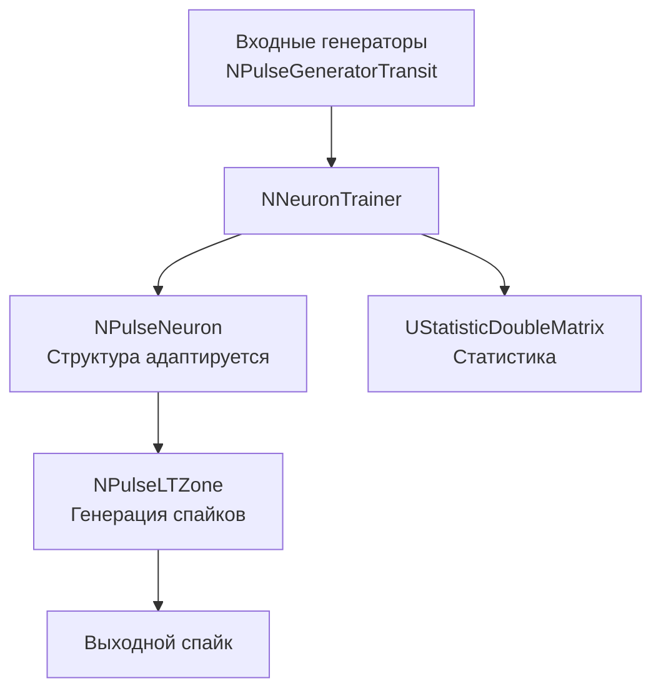

## SpikeTrainer — базовое структурное обучение

**Путь:** `Bin/Configs/SpikeSamples/StructTrain/SpikeTrainer`
**Статус валидации:** VALID (см. `Reports/SpikeSamples-Validation-Report.md`)

### Назначение конфигурации

Эта конфигурация демонстрирует **базовый процесс структурного обучения** нейрона с использованием компонента `NNeuronTrainer`. Конфигурация показывает, как нейрон автоматически адаптирует свою структуру (размер сомы, длину дендритов, количество синапсов) для распознавания заданного входного паттерна спайков с временным кодированием [4].

### Структура модели

#### Компоненты системы

- **NNeuronTrainer** — компонент структурного обучения
  - Управляет процессом структурной адаптации
  - Создаёт и модифицирует структуру нейрона
  - Обучает нейрон распознавать входной паттерн

- **NPulseNeuron** — сегментный спайковый нейрон
  - Структура адаптируется в процессе обучения
  - Количество соматических участков, длина дендритов и количество синапсов изменяются автоматически

- **NPulseGeneratorTransit** — генераторы входных спайков
  - По одному генератору на каждый компонент входного паттерна
  - Генерируют спайки с временным кодированием

- **UStatisticDoubleMatrix** — компонент для сбора статистики
  - Записывает статистику процесса обучения
  - Отслеживает изменения структуры нейрона

### Эксперимент и моделируемые реакции

#### Цель эксперимента

Демонстрация процесса структурной адаптации:
- Автоматический подбор размера сомы
- Автоматический подбор длины дендритов
- Автоматический подбор количества синапсов
- Обучение нейрона распознавать заданный паттерн

#### Процесс обучения

1. **Инициализация:**
   - Создание нейрона с начальной структурой
   - Настройка генераторов входных спайков
   - Задание входного паттерна (временные задержки)

2. **Итеративное обучение:**
   - Предъявление входного паттерна нейрону
   - Измерение амплитуды мембранного потенциала
   - Корректировка структуры (увеличение/уменьшение длины дендритов)
   - Проверка генерации выходного спайка

3. **Завершение обучения:**
   - Обучение завершается, когда нейрон генерирует спайк при предъявлении паттерна
   - Структура нейрона фиксируется

#### Ожидаемое поведение

- **Адаптация структуры:** структура нейрона автоматически подстраивается под входной паттерн
- **Генерация спайка:** после обучения нейрон генерирует спайк при предъявлении соответствующего паттерна
- **Универсальный порог:** используется универсальное значение порога активации, не зависящее от размера входного паттерна

### Параметры модели

Основные параметры задаются в `Parameters_00.xml` и через свойства компонента `NNeuronTrainer`:

#### Параметры NNeuronTrainer

- `NumInputDendrite` — количество входных дендритов (равно размерности входного паттерна)
- `MaxDendriteLength` — максимальная длина дендритов
- `InputPattern` — матрица входного паттерна (временное кодирование)
- `LTZThreshold` — порог активации низкопороговой зоны
- `FixedLTZThreshold` — фиксированный порог активации
- `TrainingLTZThreshold` — порог активации во время обучения
- `SpikesFrequency` — частота генерации спайков
- `Delay` — задержка начала обучения
- `StructureBuildMode` = 1 — режим сборки структуры (структурная адаптация)
- `IsNeedToTrain` = true — признак необходимости обучения

#### Параметры временного кодирования

- Значения входного паттерна определяют временные задержки спайков
- Каждый компонент вектора паттерна соответствует отдельному дендриту
- Время появления спайка кодирует значение компонента паттерна

### Результаты экспериментов

Согласно публикации [4]:

#### Структурная адаптация

- Метод структурной адаптации успешно применяется для обучения компартментной спайковой модели нейрона
- Нейрон автоматически подбирает оптимальную структуру для распознавания заданного паттерна
- Универсальное значение порога активации позволяет использовать один и тот же порог для различных размеров входных паттернов

#### Влияние параметров

- Максимальная длина дендритов влияет на максимальную задержку обработки сигнала
- Частота генерации спайков влияет на скорость обучения
- Порог активации критически важен для правильного распознавания паттернов

### Использование конфигурации

#### Запуск обучения

1. Загрузите конфигурацию в Neuro Modeler
2. Установите параметры обучения в `Parameters_00.xml`:
   - `IsNeedToTrain = true`
   - Задайте входной паттерн в `InputPattern`
3. Запустите расчёт и дождитесь завершения обучения
4. Проверьте структуру обученного нейрона

#### Анализ результатов

- Просмотрите статистику обучения через компонент `UStatisticDoubleMatrix`
- Проверьте финальную структуру нейрона (количество соматических участков, длина дендритов, количество синапсов)
- Убедитесь, что нейрон генерирует спайк при предъявлении паттерна

### Связанные материалы

- Теория и функциональное описание:
  - [`Bin/Docs/SpikeSamples/StructuralAdaptation.md`](../../../../Docs/SpikeSamples/StructuralAdaptation.md) — метод структурной адаптации
  - [`Bin/Docs/SpikeSamples/IncrementalLearning.md`](../../../../Docs/SpikeSamples/IncrementalLearning.md) — стратегия инкрементального обучения
  - [`Bin/Docs/SpikeSamples/Classification.md`](../../../../Docs/SpikeSamples/Classification.md) — применение для задач классификации
- Компонентная документация:
  - `Libraries/Nmsdk-PulseLib/Docs/Components/NNeuronTrainer.md` — документация компонента NNeuronTrainer
- Связанные конфигурации:
  - [`SpikeAnsTrainer/README.md`](../SpikeAnsTrainer/README.md) — структурное обучение с ответами
- Описание конфигурации:
  - `Description.rtf` — подробное описание конфигурации (в формате RTF)

## Литература

1. Korsakov, A., Astapova, L., Bakhshiev, A. The Method of Structural Adaptation of the Compartmental Spiking Neuron Model // Cyber-Physical Systems and Control II. CPS&C 2021. Lecture Notes in Networks and Systems, vol 460. Springer, Cham, 2023. [DOI](https://doi.org/10.1007/978-3-031-20875-1_51)
