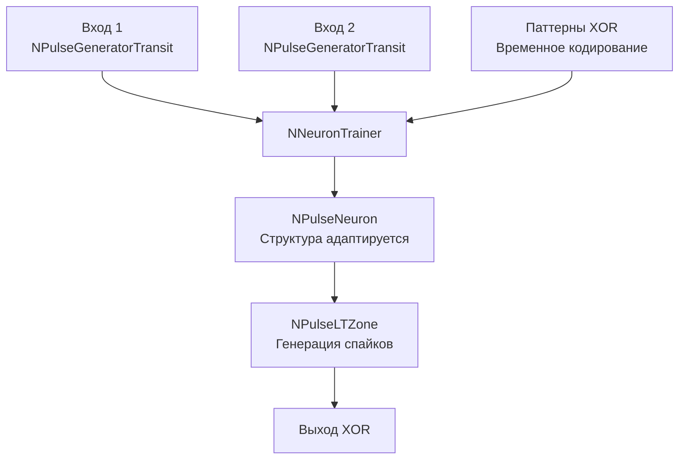

## XOR — применение структурного обучения для задачи XOR

**Путь:** `Bin/Configs/SpikeSamples/StructTrain/XOR`
**Статус валидации:** VALID (см. `Reports/SpikeSamples-Validation-Report.md`)

### Назначение конфигурации

Эта конфигурация демонстрирует применение **структурного обучения** для решения классической задачи **XOR** (исключающее ИЛИ). Задача XOR является классическим примером нелинейно разделимой задачи, которая требует нелинейной модели для решения. Конфигурация показывает, как структурная адаптация позволяет нейрону обучаться распознавать паттерны XOR с помощью изменения своей структуры.

### Описание задачи XOR

#### Логическая функция XOR

Таблица истинности для функции XOR (исключающее ИЛИ):

| Вход 1 | Вход 2 | Выход |
|--------|--------|-------|
| 0      | 0      | 0     |
| 0      | 1      | 1     |
| 1      | 0      | 1     |
| 1      | 1      | 0     |

#### Особенности задачи

- **Нелинейная разделимость:** задача XOR не может быть решена одним линейным нейроном
- **Требуется нелинейная модель:** необходимо использование нелинейной модели или сети нейронов
- **Классический тест:** часто используется как тест для проверки способности модели решать нелинейные задачи

### Структура модели

Конфигурация использует структурное обучение для решения задачи XOR:

#### Компоненты системы

- **NNeuronTrainer** — компонент структурного обучения
  - Управляет процессом структурной адаптации
  - Обучает нейрон распознавать паттерны XOR
  - Использует временное кодирование для представления входных значений

- **NPulseNeuron** — сегментный спайковый нейрон
  - Структура адаптируется в процессе обучения
  - Количество соматических участков, длина дендритов и количество синапсов изменяются автоматически
  - Обучается распознавать паттерны XOR

- **NPulseGeneratorTransit** — генераторы входных спайков
  - Два генератора для двух входов задачи XOR
  - Генерируют спайки с временным кодированием
  - Временные задержки кодируют значения входов (0 или 1)

### Эксперимент и моделируемые реакции

#### Цель эксперимента

Демонстрация решения нелинейно разделимой задачи XOR с помощью структурной адаптации:
- Преобразование логических значений в паттерны спайков с временным кодированием
- Обучение нейрона распознавать паттерны XOR
- Автоматическая адаптация структуры для решения нелинейной задачи

#### Преобразование входных данных

Входные значения (0 или 1) преобразуются в паттерны спайков с временным кодированием:
- **Значение 0:** спайк с большей временной задержкой (или отсутствие спайка)
- **Значение 1:** спайк с меньшей временной задержкой (или более ранний спайк)

#### Процесс обучения

1. **Обучение на паттернах XOR:**
   - Предъявление всех четырёх паттернов XOR нейрону
   - Структурная адаптация для распознавания паттернов с выходом 1
   - Игнорирование паттернов с выходом 0

2. **Адаптация структуры:**
   - Автоматический подбор размера сомы
   - Автоматический подбор длины дендритов
   - Автоматический подбор количества синапсов
   - Оптимизация для распознавания паттернов XOR

3. **Проверка обучения:**
   - Тестирование на всех четырёх паттернах XOR
   - Проверка генерации спайка для паттернов с выходом 1
   - Проверка отсутствия спайка для паттернов с выходом 0

#### Ожидаемое поведение

- **Распознавание паттернов:** нейрон генерирует спайк для паттернов (0,1) и (1,0), но не для (0,0) и (1,1)
- **Структурная адаптация:** структура нейрона адаптируется для решения нелинейной задачи
- **Временное кодирование:** эффективное использование временной информации для различения паттернов

### Параметры модели

Основные параметры задаются в `Parameters_00.xml`:

#### Параметры NNeuronTrainer

- `NumInputDendrite` = 2 — количество входных дендритов (равно количеству входов XOR)
- `MaxDendriteLength` — максимальная длина дендритов
- `InputPattern` — матрица входных паттернов (4 паттерна для всех комбинаций XOR)
- `LTZThreshold` — порог активации низкопороговой зоны
- `SpikesFrequency` — частота генерации спайков
- `StructureBuildMode` = 1 — режим сборки структуры (структурная адаптация)
- `IsNeedToTrain` = true — признак необходимости обучения

#### Параметры временного кодирования

- Входные значения преобразуются во временные задержки спайков
- Схема кодирования определяется параметрами генераторов
- Типичные значения задержек: от 0 до 1 секунды

### Результаты экспериментов

#### Решение задачи XOR

- Структурная адаптация позволяет нейрону обучаться распознавать паттерны XOR
- Нейрон успешно различает паттерны с выходом 1 от паттернов с выходом 0
- Автоматическая адаптация структуры обеспечивает решение нелинейной задачи

#### Влияние структурной адаптации

- Изменение структуры нейрона позволяет решать нелинейно разделимые задачи
- Временное кодирование обеспечивает эффективное представление входных данных
- Комбинация структурной адаптации и временного кодирования расширяет возможности модели

### Использование конфигурации

#### Запуск обучения

1. Загрузите конфигурацию в Neuro Modeler
2. Установите параметры обучения в `Parameters_00.xml`:
   - `IsNeedToTrain = true`
   - Задайте паттерны XOR в `InputPattern`
3. Запустите расчёт и дождитесь завершения обучения
4. Проверьте структуру обученного нейрона

#### Тестирование

1. После завершения обучения установите `IsNeedToTrain = false`
2. Предъявите все четыре паттерна XOR
3. Проверьте генерацию спайка для паттернов (0,1) и (1,0)
4. Убедитесь в отсутствии спайка для паттернов (0,0) и (1,1)

### Связанные материалы

- Теория и функциональное описание:
  - [`Bin/Docs/SpikeSamples/StructuralAdaptation.md`](../../Docs/SpikeSamples/StructuralAdaptation.md) — метод структурной адаптации
  - [`Bin/Docs/SpikeSamples/Classification.md`](../../Docs/SpikeSamples/Classification.md) — применение для задач классификации
- Компонентная документация:
  - `Libraries/Nmsdk-PulseLib/Docs/Components/NNeuronTrainer.md` — документация компонента NNeuronTrainer
- Связанные конфигурации:
  - [`SpikeTrainer/README.md`](../SpikeTrainer/README.md) — базовое структурное обучение
  - [`SpikeAnsTrainer/README.md`](../SpikeAnsTrainer/README.md) — структурное обучение с ответами
- Описание конфигурации:
  - `Description.rtf` — подробное описание конфигурации (в формате RTF)
