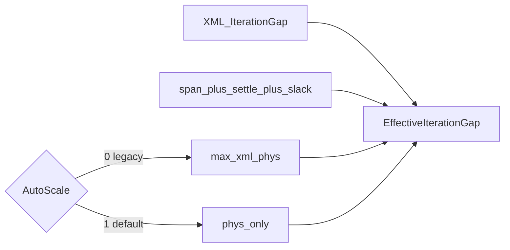

# Тайминг IterationGap / Settle (канон)

**Связано:** [`POST_TRAIN_TUNING.ru.md`](../POST_TRAIN_TUNING.ru.md) · PulseLib `NNeuronTimeLearner` / `NNeuronTimeLearnerBranch`

## Свойства

| Свойство | Default (`ADefault`) | Смысл |
|----------|----------------------|--------|
| `IterationGap` | часто `1.5` в XML | Ручной пол (sec) между итерациями Train / mid free-run |
| `Delay` | часто `1.5` | Пауза Dataset между bursts |
| `AutoScaleIterationGap` | **`true`** | Игнорировать XML-пол: gap/delay = физика span+settle+slack |
| `EstDelayPerSeg` | online | Если &gt;0 — используется в `SettleMarginSec` |

Константы (`.h`): `kGapSlack=0.05`, `kMinSettle=0.20`, `kDelayPerSegDefault=0.005`.

## Формулы

```
dps      = EstDelayPerSeg > 0 ? EstDelayPerSeg : kDelayPerSegDefault
settle   = max(kMinSettle, dps × max(L))
gapPhys  = PatternSpanSec() + settle + kGapSlack
delayPhys= settle + kGapSlack

AutoScale=1 → EffectiveIterationGap = gapPhys
              EffectiveDatasetDelay = delayPhys
AutoScale=0 → Effective* = max(configured, phys)   # legacy
```

XML `IterationGap=1.5` **не** менять массово: при `AutoScale=0` это manual override.

## Ожидаемый gapEff (типичный Lmax)

| span | Lmax≈ | settle≈ | gapEff (Auto) | vs XML 1.5 |
|------|-------|---------|---------------|------------|
| 25 мс | 15 | 0.20 | **~0.275** | ~5× |
| 50 мс | 20 | 0.20 | **~0.30** | ~5× |
| 100 мс | 25 | 0.20–0.125→0.20 | **~0.35** | ~4× |
| 480 мс | 30 | 0.20 | **~0.73** | ~2× |

## Замер wall (br25 Test mid, 2026-09-22)

| AutoScale | gapEff | delay | wall `-t 5` (нагруженный хост) |
|-----------|--------|-------|--------------------------------|
| 1 | **0.25** | 0.25 | ~85 s (sim mid ≪ `-t`; wall ≈ console overhead + slog) |
| 0 (legacy) | **1.5** | 1.5 | ~90 s |

Sim-gap отношение **1.5/0.25 = 6×**. Полный Search br100 @12 iters ранее ~5010 s wall при `gapEff≈0.35` (vs многочасовой при gap=1.5).

В EventsLog (`EnableDebug=1`): `InferenceMid: … delay=… gapEff=… auto_gap=1` (INFO).  
Train DEBUG: `BeginTrainingIteration: … gapEff=… gapPhys=… auto_gap=…`.

На Test mid free-run `gapEff` может совпасть с `delayPhys` (`settle+slack`), если `PatternSpanSec` ещё не проставлен — всё равно ≪ XML 1.5.



## PostTune / mid

Free-run mid budget и Train iteration pacing используют `EffectiveIterationGapSec` / `EffectiveDatasetDelaySec`.  
Verify и phase8/9 Test overlay **ensure** `AutoScaleIterationGap=1`.

## Аварийный откат AutoScale

Оставить `ADefault AutoScaleIterationGap=true`, пока smoke/V5b зелёные.

1. XML: `<AutoScaleIterationGap Type="b" …>0</AutoScaleIterationGap>` → legacy `max(XML 1.5, phys)`.
2. Или в PulseLib `ADefault=false` + pin `=1` только на posttune-клонах: asym25/50, br25 on/off, br100 keep/search, phase6 `EXP_480_gen_posttune`.
3. Триггер: smoke fires≠`10000000` / mid вне ±5% / peak bleed после укорочения settle.
4. `kMinSettle=0.20` откатывать **отдельно** от AutoScale.
