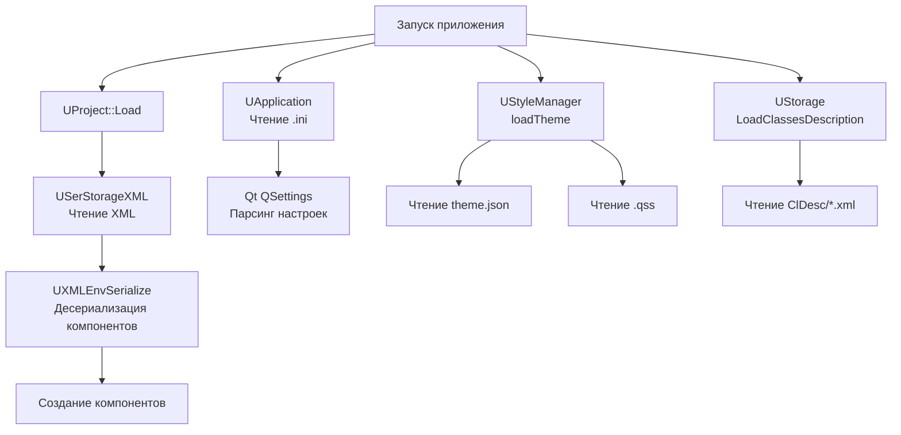

# Структура конфигурационных файлов (Configs Structure)

## RU

### Обзор

Конфигурационные файлы в `Bin/Configs/` используются для настройки проектов, компонентов и приложения.

### Типы файлов

- **XML** - основной формат для проектов и компонентов
- **INI** - конфигурационные файлы приложения
- **JPEG/PNG** - изображения для конфигураций

### Структура конфигураций проектов

Конфигурации проектов содержат:
- Описание компонентов и их параметров
- Соединения между компонентами
- Настройки выполнения
- Метаданные проекта

### Использование конфигураций в коде

**Модули, читающие конфигурации:**

- **UProject** (`Rdk/Core/Application/UProject.*`) - загрузка и сохранение проектов из XML конфигураций
- **UXMLEnvSerialize** (`Rdk/Core/Engine/UXMLEnvSerialize.*`) - десериализация компонентов из XML
- **UApplication** (`Rdk/Core/Application/UApplication.*`) - чтение настроек приложения из INI файлов
- **UStyleManager** (`Rdk/GUI/Qt/UStyleManager.*`) - загрузка стилей из JSON файлов в `Bin/Styles/`

**Типы конфигурационных файлов:**

- **Проекты** (`.xml`) - читаются через `UProject::Load()` и `UXMLEnvSerialize`
- **Настройки приложения** (`.ini`) - читаются через системные утилиты Qt
- **Стили** (`theme.json`, `*.qss`) - читаются через `UStyleManager`
- **Описания классов** (`ClDesc/*.xml`) - читаются через `UStorage` при загрузке библиотек

### Процесс чтения конфигураций

**Поток чтения конфигураций:**

### Артефакты сборки vs исходные ресурсы

**Исходные ресурсы** (хранятся в репозитории):
- `Bin/Configs/` - шаблоны и примеры конфигураций
- `Bin/Help/` - исходные HTML файлы справки
- `Bin/Styles/` - исходные файлы стилей (копируются из `Rdk/GUI/Qt/Styles/`)

**Артефакты сборки** (генерируются при сборке):
- `Bin/Platform/<OS>/` - скомпилированные исполняемые файлы и библиотеки
- `Bin/Platform/<OS>/Lib.CMake/` - скомпилированные библиотеки
- `Bin/ClDesc/` - может содержать автогенерируемые описания классов (если используется автогенерация)

### Процесс деплоя конфигураций

`UProjectDeployer` используется для развертывания проектов на удалённые системы. Процесс включает:

1. **Загрузку данных** (`StartProjectDeployment`): загрузка шаблонов, скриптов, весов моделей и данных с FTP сервера
2. **Распаковку** (`DeployTemplate`, `DeployScript`, `DeployWeights`, `DeployData`): распаковка ZIP архивов во временные каталоги
3. **Подготовку проекта** (`PrepareProject`): копирование во временное хранилище, открытие в mock режиме, настройка путей и связей

**Процесс деплоя:**

### См. также

- [Docs/Components-And-Configuration/Configuration-Files-Overview.md](../../Docs/Components-And-Configuration/Configuration-Files-Overview.md) - обзор конфигураций
- [Docs/Components-And-Configuration/Component-System.md](../../Docs/Components-And-Configuration/Component-System.md) - компонентная система

---

## EN

### Overview

Configuration files in `Bin/Configs/` are used to configure projects, components, and the application.

### File Types

- **XML** - main format for projects and components
- **INI** - application configuration files
- **JPEG/PNG** - images for configurations

### Project Configuration Structure

Project configurations contain:
- Component descriptions and parameters
- Connections between components
- Execution settings
- Project metadata

### Configuration Usage in Code

**Modules reading configurations:**

- **UProject** (`Rdk/Core/Application/UProject.*`) - loading and saving projects from XML configurations
- **UXMLEnvSerialize** (`Rdk/Core/Engine/UXMLEnvSerialize.*`) - deserializing components from XML
- **UApplication** (`Rdk/Core/Application/UApplication.*`) - reading application settings from INI files
- **UStyleManager** (`Rdk/GUI/Qt/UStyleManager.*`) - loading styles from JSON files in `Bin/Styles/`

**Configuration file types:**

- **Projects** (`.xml`) - read via `UProject::Load()` and `UXMLEnvSerialize`
- **Application settings** (`.ini`) - read via Qt system utilities
- **Styles** (`theme.json`, `*.qss`) - read via `UStyleManager`
- **Class descriptions** (`ClDesc/*.xml`) - read via `UStorage` when loading libraries

### Build Artifacts vs Source Resources

**Source resources** (stored in repository):
- `Bin/Configs/` - configuration templates and examples
- `Bin/Help/` - source HTML help files
- `Bin/Styles/` - source style files (copied from `Rdk/GUI/Qt/Styles/`)

**Build artifacts** (generated during build):
- `Bin/Platform/<OS>/` - compiled executables and libraries
- `Bin/Platform/<OS>/Lib.CMake/` - compiled libraries
- `Bin/ClDesc/` - may contain auto-generated class descriptions (if autogeneration is used)

### See Also

- [Docs/Components-And-Configuration/Configuration-Files-Overview.md](../../Docs/Components-And-Configuration/Configuration-Files-Overview.md) - configuration overview
- [Docs/Components-And-Configuration/Component-System.md](../../Docs/Components-And-Configuration/Component-System.md) - component system
