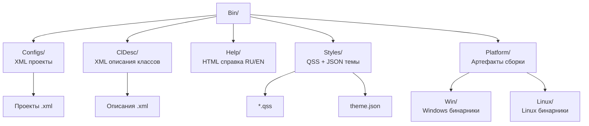

# Документация Bin

## RU

### Назначение

Каталог `Bin/` содержит ресурсы и конфигурации, необходимые для работы приложения Nmsdk.

### Структура

- **Configs/** - конфигурационные файлы проектов и компонентов
- **ClDesc/** - описания классов компонентов (XML)
- **Help/** - справочная документация пользователя (RU/EN)
- **Styles/** - стили и темы для GUI
- **Platform/** - платформенные артефакты (Win/Linux)

**Архитектура каталога Bin:**

Каталог `Bin/` содержит как исходные ресурсы (конфигурации, справка, стили), так и артефакты сборки (скомпилированные библиотеки и исполняемые файлы в `Platform/`). Исходные ресурсы копируются в `Bin/` при сборке из соответствующих каталогов в репозитории.

### Документация

- [Help-Structure.md](Help-Structure.md) - структура справочной системы
- [Configs-Structure.md](Configs-Structure.md) - структура конфигурационных файлов

### Связь с корневой документацией

- [Docs/Components-And-Configuration/Configuration-Files-Overview.md](../../Docs/Components-And-Configuration/Configuration-Files-Overview.md) - обзор конфигураций
- [Docs/GUI/Style-System.md](../../Docs/GUI/Style-System.md) - система стилей

---

## EN

### Purpose

The `Bin/` directory contains resources and configurations necessary for the Nmsdk application to work.

### Structure

- **Configs/** - project and component configuration files
- **ClDesc/** - component class descriptions (XML)
- **Help/** - user help documentation (RU/EN)
- **Styles/** - GUI styles and themes
- **Platform/** - platform artifacts (Win/Linux)

### Documentation

- [Help-Structure.md](Help-Structure.md) - help system structure
- [Configs-Structure.md](Configs-Structure.md) - configuration file structure

### Link to Root Documentation

- [Docs/Components-And-Configuration/Configuration-Files-Overview.md](../../Docs/Components-And-Configuration/Configuration-Files-Overview.md) - configuration overview
- [Docs/GUI/Style-System.md](../../Docs/GUI/Style-System.md) - style system
