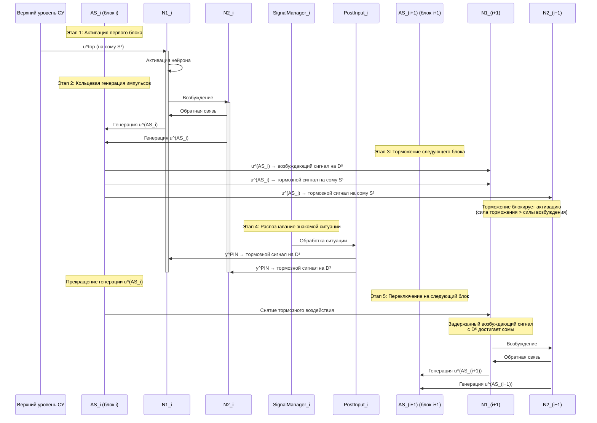
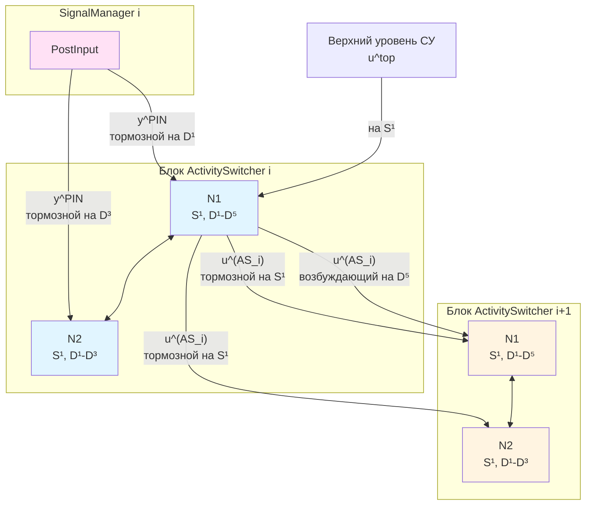

## Блок ActivitySwitcher: алгоритм последовательного переключения активности

Блок ActivitySwitcher (AS) позволяет реализовать последовательное переключение активности между узлами графа — это необходимо для запоминания и воспроизведения последовательности ситуаций. Принцип работы блока был изначально описан в работе [12] (см. нейронная сеть управления движением по траектории); для использования в данной работе конфигурация блока была обновлена с учетом актуальной версии нейрона CSNM.

### Описание компонентов

Блок ActivitySwitcher состоит из двух нейронов (N1 и N2), образующих кольцевую структуру с обратной связью. Структурные элементы блока:

- **N1** — первый нейрон блока AS
  - Сома: S¹
  - Дендриты: D¹, D², D³, D⁴, D⁵ (5 сегментов)
- **N2** — второй нейрон блока AS
  - Сома: S¹
  - Дендриты: D¹, D², D³ (3 сегмента)

#### Входные сигналы

- **u^top** — входной сигнал с высшего уровня системы управления (для первого блока AS)
- **u^(AS_(i-1))** — сигнал с предыдущего блока AS (для блоков начиная со второго)
- **y^PIN** — выходной сигнал нейрона PostInput i-го блока SignalManager

#### Выходные сигналы

- **u^(AS_i)** — выходной сигнал i-го блока AS (подается на следующий блок и на тормозные входы следующего блока)
- **Y** — выход второго нейрона (N2) блока AS

### Принцип работы

Способ подключения связей обеспечивает необходимые временные задержки сигналов и силу их воздействия, благодаря чему возбуждение и торможение нейронов происходит в нужной последовательности.

#### Временные задержки

Величина задержки зависит от количества сегментов дендрита, которое преодолевает сигнал от синапса до сомы нейрона — чем больше длина дендрита (т.е. чем из большего числа сегментов он состоит), тем больше задержка и наоборот.

#### Сила воздействия сигналов

Сила воздействия сигнала тем больше, чем ближе к соме нейрона подводится сигнал. Возможность задавать конфигурацию нейрона является отличительной чертой модели CSNM [10].

### Диаграмма последовательности алгоритма

### Описание алгоритма по этапам

#### Этап 1: Активация первого блока AS

Первый AS в последовательности (т.е. блок, соответствующий начальной ситуации) активируется по приходу одиночного импульса с верхних слоев СУ (u^top) — так как он поступает непосредственно на сому (S¹), его достаточно для активации N1.

**Ключевые особенности:**
- Сигнал u^top поступает напрямую на сому первого нейрона N1
- Отсутствие задержки позволяет немедленно активировать нейрон
- Это единственный способ активации первого блока в последовательности

#### Этап 2: Генерация непрерывных импульсов

Нейроны N1 и N2 образуют кольцевую структуру с обратной связью, запускающую непрерывную генерацию импульсов на выходе элемента (u^(AS_i)).

**Механизм работы:**
- Активированный N1 возбуждает N2
- N2 через обратную связь поддерживает активность N1
- Образуется самоподдерживающийся цикл генерации импульсов
- Выходной сигнал u^(AS_i) генерируется непрерывно

#### Этап 3: Торможение следующего блока

Сигнал u^(AS_i) подается на вход нейрона N1 следующего блока AS: на возбуждающий синапс дендрита D⁵ и тормозные синапсы на сомах нейронов N1 и N2.

**Механизм торможения:**
- **Возбуждающий сигнал**: поступает на синапс пятого сегмента дендрита D⁵ нейрона N1 следующего блока
- **Тормозные сигналы**: поступают непосредственно на сомы нейронов N1 и N2 следующего блока
- Тормозное воздействие сигнала u^(AS_i), поступающее на сомы, имеет значительно больший вес, чем возбуждающее воздействие того же сигнала, подводимое к синапсу пятого сегмента дендрита
- Следовательно, торможение не позволяет активировать следующий блок AS, пока это тормозное воздействие не будет снято

#### Этап 4: Распознавание знакомой ситуации

Как только робот попадает в уже знакомую ситуацию, соответствующую текущему блоку AS, от нейрона PostInput соответствующего блока SignalManager поступает тормозное воздействие на D¹ и D³ нейронов N1 и N2.

**Процесс торможения текущего блока:**
- Сигнал y^PIN от PostInput блока SignalManager поступает на:
  - D¹ нейрона N1 (тормозной синапс)
  - D³ нейрона N2 (тормозной синапс)
- Торможение нейронов N1 и N2 прекращает активность текущего блока AS
- Генерация сигнала u^(AS_i) прекращается
- Снимается тормозное (а вместе с ним и возбуждающее) воздействие на следующий блок AS

#### Этап 5: Переключение на следующий блок

После прекращения генерации u^(AS_i) тормозное воздействие на следующий блок AS снимается. Однако возбуждающее воздействие подводилось к окончанию дендрита (D⁵), поэтому оно поступает на нейрон N1 следующего элемента со значительно большей временной задержкой — уже после того, как тормозное воздействие было снято, и поэтому активирует следующий блок AS.

**Временная последовательность переключения:**
1. **Момент t₀**: Прекращение генерации u^(AS_i) → снятие тормозного воздействия с AS_(i+1)
2. **Момент t₀ + Δt**: Задержанный возбуждающий сигнал с D⁵ достигает сомы N1_(i+1)
3. **Момент t₀ + Δt**: Активация N1_(i+1) запускает кольцевую генерацию в AS_(i+1)
4. **Результат**: Переключение активности с блока AS_i на блок AS_(i+1)

**Ключевой момент алгоритма:**
Временная задержка возбуждающего сигнала (обусловленная прохождением через 5 сегментов дендрита D⁵) обеспечивает, что активация следующего блока происходит только после полного снятия торможения. Это гарантирует корректное последовательное переключение активности между блоками.

### Схема подключения связей

### Примечания

- Конфигурация блока ActivitySwitcher была обновлена с учетом актуальной версии нейрона CSNM
- Алгоритм обеспечивает надежное последовательное переключение активности благодаря использованию временных задержек и различий в силе воздействия сигналов
- Механизм работает только при правильной настройке параметров нейронов и синапсов, обеспечивающих необходимые соотношения между тормозными и возбуждающими воздействиями

## Литература

12. **Korsakov, A., Bakhshiev, A., Astapova, L., Stankevich, L.** Behavioral functions implementation on spiking neural networks // Informatics and Automation, 2021, 20:3, 591–622.

    [DOI](https://doi.org/10.15622/ia.2021.3.4) | [Literature-References.md](../Literature-References.md)

10. **Bakhshiev A. V., Demcheva A. A.** Compartmental spiking neuron model CSNM // Izvestiya VUZ. Applied Nonlinear Dynamics, 2022, vol. 30, iss. 3, pp. 299-310.

    [DOI](https://doi.org/10.18500/0869-6632-2022-30-3-299-310) | [Literature-References.md](../Literature-References.md)
