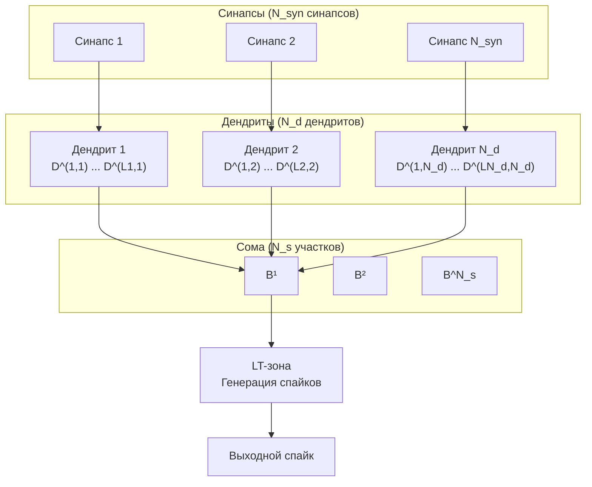
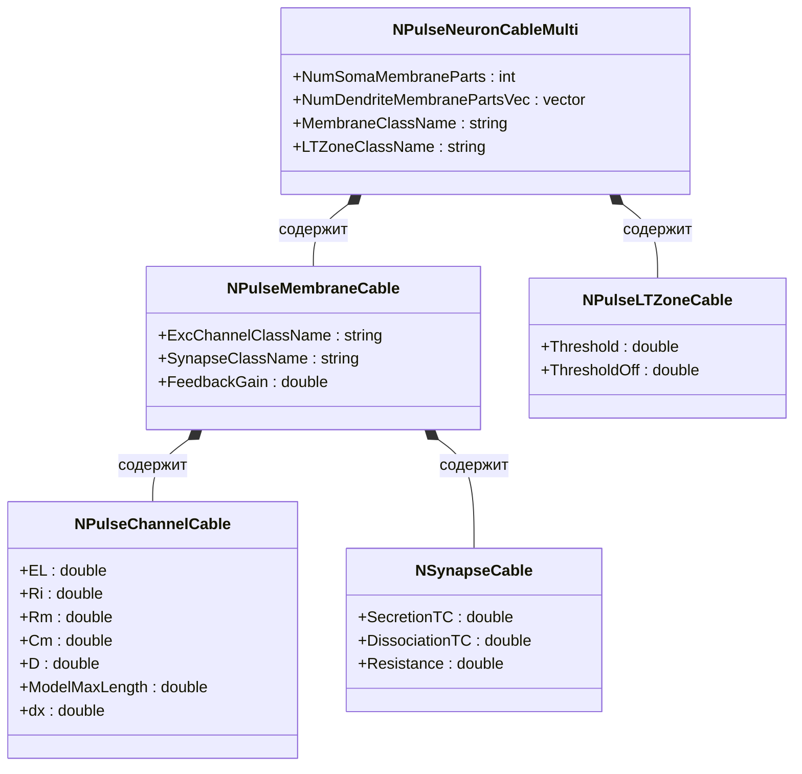

## Компартментная спайковая модель нейрона (CSNM)

### Назначение модели

Компартментная спайковая модель нейрона (CSNM, Compartmental Spiking Neuron Model) представляет собой детализированную модель нейрона, которая учитывает пространственное распределение мембранного потенциала по дендритам и соме. В отличие от точечных моделей (например, Integrate-and-Fire), CSNM позволяет моделировать пространственное распространение сигналов и влияние геометрических параметров нейрона на его поведение.

### Архитектура CSNM модели

#### Структурные параметры

CSNM модель характеризуется следующими структурными параметрами:

- **N_s** — количество соматических участков мембраны (количество участков сомы)
- **N_d** — количество дендритов
- **N_syn** — количество синапсов, подключённых к дендритам

Эти параметры определяют топологию нейрона и влияют на его способность обрабатывать входные сигналы.

#### Компартменты (сегменты) нейрона

Нейрон в CSNM модели представлен как набор компартментов (сегментов):

- **Соматические компартменты** (B¹, B², ..., B^N_s) — участки мембраны сомы
- **Дендритные компартменты** (D^(1,1), D^(1,2), ..., D^(L, N_d(L))) — участки дендритов, где L — длина дендрита, N_d — количество дендритов

Каждый компартмент моделирует участок мембраны с определёнными электрическими свойствами.

#### Схема архитектуры CSNM модели



**Описание схемы:**
- **Сома** состоит из N_s соматических участков (B¹, B², ..., B^N_s)
- **Дендриты** — N_d дендритов, каждый состоит из сегментов (D^(i,j), где i — номер сегмента, j — номер дендрита)
- **Синапсы** — N_syn синапсов подключены к дендритам
- Сигналы распространяются от синапсов через дендриты к соме
- LT-зона генерирует выходной спайк при достижении порога активации

### Кабельная теория и интеграция кабельного уравнения

#### Кабельная теория

Кабельная теория описывает распространение электрического потенциала вдоль цилиндрического проводника (дендрита или аксона) с учётом:
- Сопротивления аксоплазмы (внутреннего сопротивления)
- Сопротивления и ёмкости мембраны
- Токов через мембрану

#### Уравнение кабеля

Основное уравнение кабеля имеет вид:

```
λ²(∂²V/∂x²) = τ_m(∂V/∂t) + V
```

где:
- **V(x,t)** — мембранный потенциал в точке x в момент времени t
- **λ = √(r_m/r_i)** — постоянная длины (длина, на которой потенциал затухает в e раз)
- **r_m = R_m/(πD)** — сопротивление мембраны на единицу длины
- **r_i = (4R_i)/(πD²)** — сопротивление аксоплазмы на единицу длины
- **τ_m = r_m C_m** — мембранная постоянная времени
- **R_m** — удельное сопротивление мембраны (Ом·м²)
- **R_i** — удельное сопротивление аксоплазмы (Ом·м)
- **C_m** — удельная ёмкость мембраны (Ф/м²)
- **D** — диаметр кабеля (м)

#### Интеграция кабельного уравнения в архитектуру CSNM

В работе Демчевой А.А. (2023) предложен метод интеграции кабельного уравнения в архитектуру CSNM. Основная идея заключается в том, что каждый компартмент моделируется как участок кабеля, и распространение потенциала между компартментами описывается кабельным уравнением.

#### Дискретизация кабельного уравнения

Для численного решения кабельное уравнение дискретизируется по пространству и времени:

- **Пространственная дискретизация**: x_i = i·Δx, i = 0, 1, ..., N-1, где N = x_max/Δx
- **Временная дискретизация**: t_j = j·Δt, j = 0, 1, ..., M-1, где M = t_max/Δt

Шаг по времени определяется из условия устойчивости численной схемы:

```
Δt = (Δx²·τ_m)/(4·λ²)
```

#### Численная схема решения

Дискретизированное уравнение кабеля решается по явной схеме:

```
V_(i,j+1) = (λ²·Δt)/(τ_m·Δx²) · V_(i+1,j) + [1 - Δt/τ_m - (2·λ²·Δt)/(τ_m·Δx²)] · V_(i,j) + (λ²·Δt)/(τ_m·Δx²) · V_(i-1,j)
```

где:
- **V_(i,j)** — потенциал в точке x_i в момент времени t_j
- **V_(i,j+1)** — потенциал в точке x_i в момент времени t_(j+1)

#### Граничные условия

- **На входе** (x = 0): V_(0,j) = V_inp^j, где V_inp^j — входной потенциал в момент времени t_j
- **На остальных точках**: V_(i,j) = E_L (потенциал покоя) для начальных условий

#### Схема распространения потенциала по кабелю

```mermaid
flowchart LR
    subgraph Cable["Кабельная модель дендрита"]
        direction LR
        Syn[Синапс<br/>x=0] --> Seg1[Сегмент 1<br/>x=Δx]
        Seg1 --> Seg2[Сегмент 2<br/>x=2Δx]
        Seg2 --> Seg3[Сегмент 3<br/>x=3Δx]
        Seg3 --> SegN[Сегмент N<br/>x=NΔx]
        SegN --> Soma[Сома]
    end

    Syn -->|V_inp(t)| Seg1
    Seg1 -->|V(x,t)| Seg2
    Seg2 -->|V(x,t)| Seg3
    Seg3 -->|V(x,t)| SegN
    SegN -->|V(x,t)| Soma

    style Syn fill:#e1f5ff
    style Soma fill:#ffe1f5
```

**Описание схемы:**
- Потенциал распространяется от синапса (x=0) к соме вдоль кабеля
- Каждый сегмент решает кабельное уравнение для своего участка
- Потенциал затухает с расстоянием из-за сопротивления аксоплазмы и мембраны
- Задержка распространения зависит от длины кабеля и параметров модели

### Пространственные параметры CSNM

#### Идентификация пространственных параметров

В работе Демчевой А.А. (2023) проведена идентификация пространственных параметров CSNM через сравнение с кабельной моделью. Для точечной конфигурации разработанной модели и CSNM достигнуто качественно сходное поведение.

#### Определённые параметры

- **Длина сегмента**: ~200 мкм (2·10⁻⁴ м) для точечной конфигурации
- **Диаметр сегмента**: ~20 мкм (2·10⁻⁵ м) для точечной конфигурации

Эти значения сопоставимы с биологическими данными:
- Длина дендритов: от 100-200 мкм до 1-2 мм
- Диаметр дендритов: от 0,2 мкм до 8 мкм

#### Влияние длины и диаметра дендритов

- **Длина дендритов** влияет на:
  - Задержку распространения сигнала от синапса к соме
  - Затухание амплитуды сигнала
  - Временную обработку паттернов

- **Диаметр дендритов** влияет на:
  - Сопротивление аксоплазмы (r_i ∝ 1/D²)
  - Сопротивление мембраны (r_m ∝ 1/D)
  - Постоянную длины (λ = √(r_m/r_i) ∝ √D)
  - Скорость распространения сигнала

### Компоненты кабельной модели в Neuro Modeler

В NMSDK кабельная модель реализована через следующие компоненты библиотеки `Nmsdk-PulseLib`:

#### NSynapseCable

**Назначение:** Синапс для кабельной модели

**Параметры:**
- `SecretionTC` = 1·10⁻³ с — постоянная времени выделения медиатора
- `DissociationTC` = 5·10⁻³ с — постоянная времени распада медиатора
- `UsePresynapticInhibition` = false — использование пресинаптического торможения
- `Resistance` = 86·10⁶ Ом — сопротивление синапса

**Особенности:** Аналогичен обычному синапсу (`NPSynapseBio`), но используется в кабельной модели для подключения к кабельным каналам.

#### NPulseChannelCable

**Назначение:** Канал для кабельной модели, реализующий кабельное уравнение

**Основные параметры:**

- `EL` = -70·10⁻³ В — потенциал покоя
- `Ri` = 1·10⁵ Ом·м — удельное сопротивление аксоплазмы
- `Rm` = 1·10³ Ом·м² — удельное сопротивление мембраны
- `Cm` = 2,5·10⁻¹⁰ Ф — ёмкость мембраны
- `D` = 2·10⁻⁵ м — диаметр кабеля
- `ModelMaxLength` = 2·10⁻⁴ м — максимальная длина модели (x_max)
- `dx` = 1·10⁻⁵ м — шаг пространственной дискретизации
- `dt` — шаг временной дискретизации (вычисляется автоматически)
- `CalcMode` = true — режим расчёта:
  - `true` — расчёт `CableMembraneResistance` из `D`
  - `false` — расчёт `D` из `CableMembraneResistance`

**Внутренние состояния:**
- `Vm` — матрица потенциалов V(x,t)
- `TauM` — мембранная постоянная времени (τ_m = r_m·C_m)

**Особенности:**
- Реализует численное решение кабельного уравнения
- Поддерживает пространственную дискретизацию с шагом `dx`
- Автоматически вычисляет шаг по времени из условия устойчивости
- Моделирует распространение потенциала вдоль кабеля

#### NPulseMembraneCable

**Назначение:** Мембрана для кабельной модели

**Параметры:**
- `ExcChannelClassName` = "NPulseChannelCable" — класс возбуждающего канала
- `InhChannelClassName` = "" — класс тормозного канала (не используется в кабельной модели)
- `SynapseClassName` = "NSynapseCable" — класс синапса
- `NumExcitatorySynapses` = 1 — количество возбуждающих синапсов
- `NumInhibitorySynapses` = 0 — количество тормозных синапсов
- `FeedbackGain` = 0.7 — коэффициент обратной связи

**Особенности:**
- Использует кабельные каналы вместо точечных
- Поддерживает пространственное распространение потенциала
- Агрегирует сигналы от кабельных каналов

#### NPulseLTZoneCable

**Назначение:** Низкопороговая зона для кабельной модели

**Параметры:**
- `Threshold` = -55·10⁻³ В — порог активации
- `ThresholdOff` = -70·10⁻³ В — порог деактивации
- `NumChannelsInGroup` = 1 — количество каналов в группе

**Особенности:**
- Аналогична обычной LT-зоне (`NPulseLTZoneThresholdBio`)
- Используется в кабельной модели для генерации спайков

#### NPulseNeuronCable

**Назначение:** Нейрон на основе кабельной модели

**Параметры:**
- `MembraneClassName` = "NPulseMembraneCable" — класс мембраны
- `LTZoneClassName` = "NPulseLTZoneCable" — класс LT-зоны
- `InhGeneratorClassName` = "NPNeuronPosCGeneratorCable" — класс генератора тормозного потенциала
- `NumSomaMembraneParts` — количество соматических участков мембраны (N_s)
- `NumDendriteMembraneParts` — длина дендритов (для всех дендритов одинаково)
- `NumDendriteMembranePartsVec` — вектор длин дендритов (для разных дендритов)

**Особенности:**
- Использует кабельные компоненты вместо точечных
- Поддерживает пространственное моделирование распространения потенциала
- Может иметь различное количество соматических участков и дендритов

#### NPulseNeuronCableMulti

**Назначение:** Многокомпартментный нейрон с кабельной моделью

**Параметры:**
- Аналогичны `NPulseNeuronCable`, но поддерживают более сложные структуры
- `ModelMaxLength` = 3·10⁻⁵ м — максимальная длина модели (для многокомпартментных конфигураций)

**Особенности:**
- Использует `NPulseChannelCableMulti` для многоканальной обработки
- Поддерживает сложные дендритные структуры
- Позволяет моделировать нейроны с множественными дендритами различной длины

#### Схема компонентов кабельной модели



**Описание схемы:**
- `NPulseNeuronCableMulti` — основной компонент многокомпартментного нейрона
- `NPulseMembraneCable` — мембрана с кабельными каналами и синапсами
- `NPulseChannelCable` — канал, реализующий кабельное уравнение
- `NSynapseCable` — синапс для кабельной модели
- `NPulseLTZoneCable` — низкопороговая зона для генерации спайков

### Сравнение параметров Cable и CSNM моделей

Согласно [2], параметры компонентов кабельной модели отличаются от параметров классической CSNM модели:

#### Параметры синапса

| Параметр | Cable | CSNM | Единицы |
|----------|-------|-----|---------|
| `SecretionTC` | 1·10⁻³ | 1·10⁻³ | с |
| `DissociationTC` | 5·10⁻³ | 5·10⁻³ | с |
| `UsePresynapticInhibition` | false | false | - |
| `Resistance` | 86·10⁶ | 86·10⁶ | Ом |

#### Параметры канала

| Параметр | Cable | CSNM | Единицы |
|----------|-------|-----|---------|
| `Cm` | 2,5·10⁻¹⁰ | - | Ф |
| `D` | 2·10⁻⁵ | - | м |
| `EL` | -70·10⁻³ | -70·10⁻³ | В |
| `ModelMaxLength` | 2·10⁻⁴ | - | м |
| `Ri` | 1·10⁵ | - | Ом·м |
| `Rm` | 1·10³ | - | Ом·м² |
| `dx` | 1·10⁻⁵ | - | м |

Для CSNM модели используются параметры точечного канала:
- `RestingResistance` = 3·10⁶ Ом — сопротивление в покое
- `Resistance` = 1,6·10⁷ Ом — сопротивление в активном состоянии
- `FBResistance` = 3·10⁶ Ом — сопротивление обратной связи
- `Capacity` = 2,5·10⁻¹⁰ Ф — ёмкость

#### Параметры мембраны

| Параметр | Cable | CSNM | Единицы |
|----------|-------|-----|---------|
| `ExcChannelClassName` | NPulseChannelCable | NPExcChannelBio | - |
| `InhChannelClassName` | Empty | NPInhChannelBio | - |
| `SynapseClassName` | NSynapseCable | NPSynapseBio | - |
| `NumExcitatorySynapses` | 1 | 1 | - |
| `NumInhibitorySynapses` | 0 | 1 | - |
| `FeedbackGain` | 0.7 | 0.02 | - |

#### Параметры LT-зоны

| Параметр | Cable | CSNM | Единицы |
|----------|-------|-----|---------|
| `Threshold` | -55·10⁻³ | -55·10⁻³ | В |
| `ThresholdOff` | -70·10⁻³ | -70·10⁻³ | В |
| `NumChannelsInGroup` | 1 | 2 | - |

### Соответствующие конфигурации SpikeSamples

Следующие конфигурации демонстрируют CSNM модели и кабельную модель:

- **`SpikeSamples/NM-Neurons/CableModel/CableNeuronMulti_CSNM`** — базовая CSNM модель с кабельным уравнением
- **`SpikeSamples/NM-Neurons/CableModel/CableNeuronMulti_CSNM_Nd`** — CSNM с различным количеством дендритов
- **`SpikeSamples/NM-Neurons/CableModel/CableNeuronMulti_CSNM_Nsyn`** — CSNM с различным количеством синапсов
- **`SpikeSamples/NM-Neurons/CableModel/CableNeuronMulti_Lengths`** — влияние длины дендритов на распространение сигнала
- **`SpikeSamples/NM-Neurons/CableModel/CableNeuronMulti_Diameters`** — влияние диаметра дендритов на распространение сигнала
- **`SpikeSamples/NM-Neurons/CableModel/CableNeuron`** — базовая кабельная модель
- **`SpikeSamples/NM-Neurons/CableModel/CableNeuronClassic`** — классическая кабельная модель
- **`SpikeSamples/NM-Neurons/CableModel/CableNeuronParametersTest`** — тестирование параметров кабельной модели

### Сравнение с другими моделями

#### LIF (Leaky Integrate-and-Fire)

**Отличия CSNM от LIF:**
- LIF — точечная модель (нет пространственного распределения)
- CSNM — пространственная модель (учёт распространения по дендритам)
- LIF не учитывает задержки распространения сигнала
- CSNM учитывает влияние длины и диаметра дендритов

**Преимущества CSNM:**
- Более биологически реалистичная модель
- Возможность моделирования пространственных эффектов
- Учёт временных задержек распространения сигнала

#### Полная PulseLib модель (точечный нейрон)

**Отличия:**
- Точечная модель использует компартменты без пространственного распространения
- CSNM использует кабельное уравнение для моделирования распространения
- Точечная модель быстрее в вычислениях
- CSNM более точна для моделирования длинных дендритов

**Связь:**
- Для точечной конфигурации (N_s=1, N_d=0, N_syn=1) CSNM и точечная модель дают качественно сходное поведение
- Это позволяет идентифицировать пространственные параметры CSNM через сравнение с точечной моделью

#### Классическая CSNM модель (без кабельного уравнения)

**Отличия:**
- Классическая CSNM использует компартменты без явного решения кабельного уравнения
- Кабельная CSNM решает кабельное уравнение для каждого сегмента
- Кабельная модель более точно описывает распространение потенциала
- Классическая модель быстрее в вычислениях

### Математические основы

#### Уравнение кабеля в безразмерном виде

После введения безразмерных переменных уравнение кабеля принимает вид:

```
∂²V/∂x² = ∂V/∂t + V
```

где пространственная координата измеряется в единицах постоянной длины λ, а время — в единицах мембранной постоянной времени τ_m.

#### Решение уравнения кабеля

Для стационарного случая (∂V/∂t = 0) решение имеет вид:

```
V(x) = V₀·exp(-x/λ)
```

где V₀ — потенциал в точке x=0.

Для нестационарного случая решение находится численными методами.

#### Граничные условия

1. **Граничное условие на входе (x=0):**
   ```
   V(0,t) = V_inp(t)
   ```
   где V_inp(t) — входной потенциал, определяемый входными сигналами и обратной связью

2. **Граничное условие на конце (x=x_max):**
   ```
   V(x_max,t) = E_L
   ```
   или условие отсутствия тока (для открытого конца)

#### Условие устойчивости численной схемы

Для устойчивости явной схемы необходимо выполнение условия:

```
Δt ≤ (Δx²·τ_m)/(2·λ²)
```

На практике используется более консервативное условие:

```
Δt = (Δx²·τ_m)/(4·λ²)
```

### Экспериментальные результаты

Согласно [2]:

#### Воспроизведение основных закономерностей

- Реализованная модель воспроизводит основные закономерности распространения сигнала при различных размерах сомы и длинах дендритов
- Результаты сравнения модели с классической моделью Integrate-and-Fire подтверждают работоспособность реализованной модели

#### Идентификация пространственных параметров

- Для точечной конфигурации разработанной модели и CSNM достигнуто качественно сходное поведение
- Это позволило приблизительно идентифицировать пространственные параметры CSNM:
  - Длина сегмента: **200 мкм** (2·10⁻⁴ м)
  - Диаметр сегмента: **20 мкм** (2·10⁻⁵ м)
- Этот результат сопоставим с биологическими данными

#### Влияние структуры на поведение

- Увеличение количества соматических участков (N_s) влияет на порог активации и стабильность нейрона
- Увеличение количества дендритов (N_d) влияет на способность обрабатывать множественные входные сигналы
- Увеличение количества синапсов (N_syn) влияет на интеграцию входных сигналов

#### Сравнение производительности

- Вычислительная сложность кабельной модели: O(N²), где N — количество пространственных точек
- Для CSNM с кабельным уравнением сложность: O(2N²)
- Точечная модель имеет сложность O(N), но не учитывает пространственные эффекты

### Использование кабельной модели в конфигурациях

#### Типичные значения параметров

Для кабельной модели в MATLAB (из ВКР):

| Параметр | Значение | Единицы |
|----------|----------|---------|
| `E_L` | -70·10⁻³ | В |
| `R_i` | 40·10⁻⁴ | Ом·м |
| `r_m` | 1·10⁷ | Ом·м |
| `R_m` | 1·10⁻² | Ом·м² |
| `C_m` | 1·10⁻⁹ | Ф |
| `model_max_length` | 1·10⁻⁵ | м |
| `model_max_time` | 1·10⁻³ | с |
| `Δx` | 1·10⁻⁶ | м |
| `Δt` | 1·10⁻⁶ | с |
| `T` | 1·10⁻⁴ | с |

#### Примеры экспериментов

1. **Распространение потенциала по кабелю:**
   - Входной импульс прикладывается в точке x=0
   - Наблюдается распространение потенциала вдоль кабеля
   - Анализируется затухание амплитуды с расстоянием

2. **Влияние длины дендритов:**
   - Сравнение нейронов с различной длиной дендритов
   - Анализ задержки распространения сигнала
   - Изучение влияния на порог активации

3. **Влияние диаметра дендритов:**
   - Сравнение нейронов с различным диаметром дендритов
   - Анализ влияния на постоянную длины
   - Изучение влияния на скорость распространения

### Связь между кабельной моделью и CSNM

#### Точечная конфигурация

Для точечной конфигурации (N_s=1, N_d=0, N_syn=1) достигнуто качественно сходное поведение между:
- Разработанной кабельной моделью
- Классической CSNM моделью
- Моделью Integrate-and-Fire

Это позволяет идентифицировать пространственные параметры CSNM через сравнение с кабельной моделью.

#### Пространственная конфигурация

Для пространственных конфигураций (N_s>1, N_d>0) кабельная модель обеспечивает более точное моделирование распространения потенциала по дендритам и соме.

### Связанные материалы

- [`StructuralAdaptation.md`](StructuralAdaptation.md) — метод структурной адаптации для CSNM моделей
- [`NeuronReactions.md`](NeuronReactions.md) — реакции одиночных нейронов
- [`ImpulseProcessingModel.md`](ImpulseProcessingModel.md) — модель преобразования импульсных потоков
- `Libraries/Nmsdk-PulseLib/Docs/Components/NPulseNeuronCable.md` — документация компонента NPulseNeuronCable
- `Libraries/Nmsdk-PulseLib/Docs/Components/NPulseChannelCable.md` — документация компонента NPulseChannelCable
- `Libraries/Nmsdk-PulseLib/Docs/Components/NPulseMembraneCable.md` — документация компонента NPulseMembraneCable

## Литература

1. Bakhshiev A. V., Demcheva A. A. Compartmental spiking neuron model CSNM // Izvestiya VUZ. Applied Nonlinear Dynamics, 2022, vol. 30, iss. 3, pp. 299-310. [DOI](https://doi.org/10.18500/0869-6632-2022-30-3-299-310)

2. Демчева А.А. Разработка сегментной спайковой модели нейрона на основе кабельной теории для нейроморфных систем: выпускная квалификационная работа магистра. 2023. [онлайн](https://doi.org/10.18720/SPBPU/3/2023/vr/vr23-5657)
