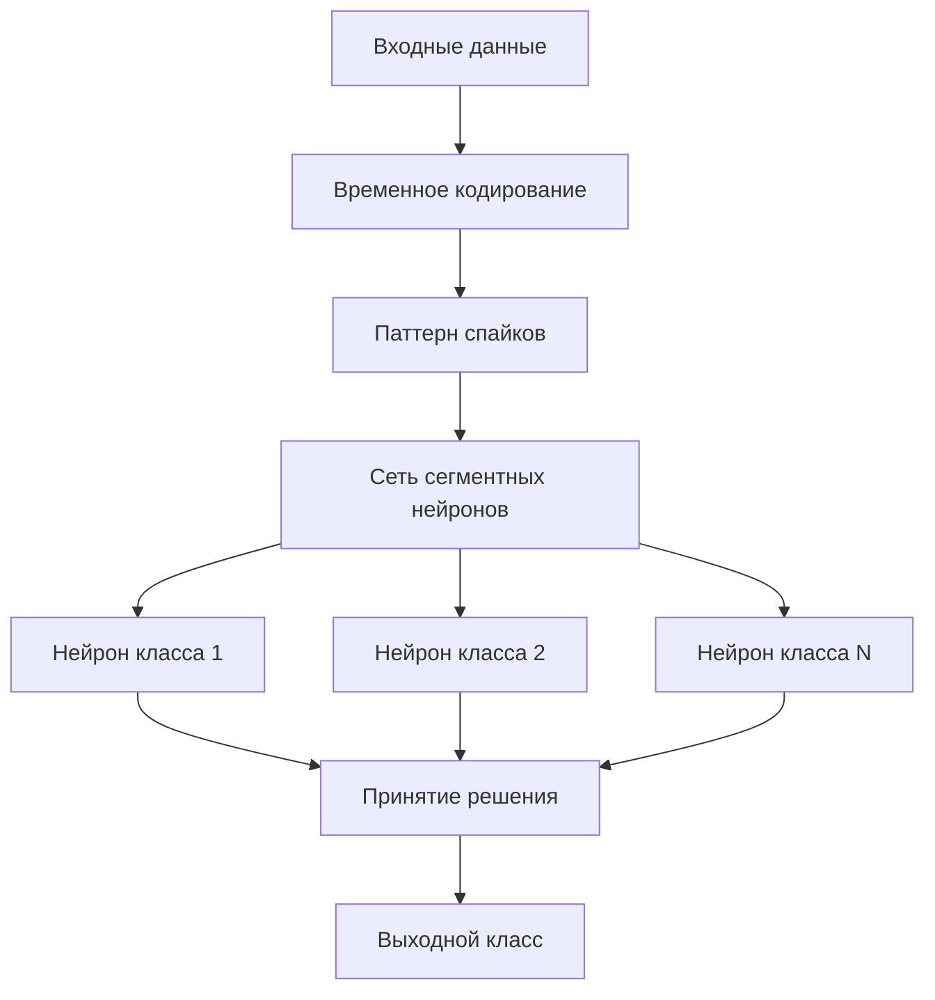
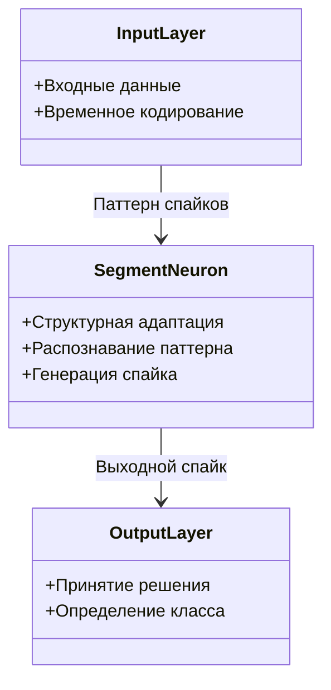

## Применение сегментной спайковой модели нейрона со структурной адаптацией для решения задач классификации

### Назначение метода

Сегментная спайковая модель нейрона со структурной адаптацией применяется для решения задач классификации, где требуется:
- Распознавание различных классов объектов
- Адаптация к новым классам без полного переобучения
- Эффективная обработка временных паттернов
- Работа в условиях ограниченных вычислительных ресурсов

### Анализ современного состояния спайковых нейронных сетей

#### Выводы из публикации

Согласно анализу, проведённому в работе [1]:
- Существует **крайне низкое количество работ** по исследованию сегментных моделей нейрона
- Большинство исследований фокусируется на точечных моделях (LIF, Izhikevich и др.)
- Сегментные модели открывают новые возможности для решения задач классификации

#### Обоснование выбора модели

В качестве модели нейрона для данной работы обоснован выбор **сегментной спайковой модели** по следующим причинам:
- Возможность структурного реконфигурирования
- Учёт пространственного распространения сигналов
- Способность обрабатывать сложные временные паттерны
- Биологическая реалистичность

### Основные концепции

#### Сегментная спайковая модель нейрона

Сегментная спайковая модель нейрона представляет собой модель, где:
- Нейрон разделён на сегменты (компартменты): сома и дендриты
- Каждый сегмент имеет свои параметры мембраны
- Сигналы распространяются между сегментами с учётом пространственных задержек
- Структура нейрона может изменяться в процессе обучения

#### Возможность структурного реконфигурирования

Основные особенности, позволяющие производить структурное реконфигурирование:
- **Динамическое изменение структуры:** размер сомы, длина дендритов, количество синапсов могут изменяться
- **Автоматический подбор параметров:** алгоритм автоматически выбирает оптимальную структуру для каждого паттерна
- **Сохранение функциональности:** изменения структуры не нарушают способность распознавать ранее обученные паттерны

#### Временное кодирование

В качестве кодирования числовой информации в паттерны импульсов выбирается **временное кодирование**:

- **Принцип:** числовое значение преобразуется в момент времени появления спайка
- **Преимущества:**
  - Эффективное использование временной информации
  - Естественное представление для спайковых нейронных сетей
  - Возможность обработки временных последовательностей

**Пример временного кодирования:**
- Большее значение → более ранний спайк
- Меньшее значение → более поздний спайк
- Нулевое значение → отсутствие спайка

#### Структурная адаптация модели ко входному паттерну импульсов

Способ структурной адаптации модели ко входному паттерну импульсов включает:

1. **Анализ входного паттерна:**
   - Определение размерности вектора паттерна
   - Анализ временного кодирования
   - Определение требуемой структуры нейрона

2. **Автоматический подбор параметров:**
   - **Размер сомы:** количество соматических участков мембраны
   - **Длина дендритов:** количество сегментов в каждом дендрите
   - **Количество синапсов:** число синапсов на каждом дендрите

3. **Обучение на паттерне:**
   - Предъявление паттерна нейрону
   - Мониторинг активности нейрона
   - Корректировка структуры при необходимости

#### Общая схема организации сегментных спайковых нейронов в сеть

Для решения задачи классификации сегментные спайковые нейроны организуются в сеть следующим образом:

**Архитектура сети:**
- Каждый нейрон обучается распознавать один класс
- Входной паттерн подаётся на все нейроны одновременно
- Нейрон, генерирующий спайк, определяет класс образца
- При обучении используется структурная адаптация для каждого нейрона

### Результаты экспериментов

#### Классификация на общедоступных наборах данных

##### Iris (UCI Machine Learning Repository)

**Описание набора данных:**
- 150 образцов цветков ириса
- 3 класса: Iris-setosa, Iris-versicolor, Iris-virginica
- 4 признака: длина и ширина чашелистика, длина и ширина лепестка

**Результаты:**
- Сопоставимость результатов с классическими методами машинного обучения
- Успешное применение сегментной спайковой модели со структурной адаптацией
- Возможность инкрементального обучения на новых классах

##### MNIST (handwritten digit database)

**Описание набора данных:**
- 70,000 изображений рукописных цифр (0-9)
- 60,000 образцов для обучения, 10,000 для тестирования
- Размер изображения: 28×28 пикселей

**Результаты:**
- Применение временного кодирования для преобразования изображений в паттерны спайков
- Использование структурной адаптации для обучения нейронов на различных классах
- Сопоставимость результатов с классическими методами

**Особенности:**
- Преобразование пространственной информации изображения во временные паттерны
- Использование сегментной структуры для обработки сложных паттернов
- Возможность обработки больших объёмов данных

#### Применение для определения состояния телеуправляемого необитаемого подводного аппарата

##### Задача определения расстояния до дна

**Описание эксперимента:**
- Определение расстояния телеуправляемого необитаемого подводного аппарата (АНПА) до дна
- Использование данных с датчиков давления
- Классификация различных расстояний до дна

**Методика:**
1. Сбор данных с датчиков давления при различных расстояниях до дна
2. Преобразование данных в паттерны спайков с временным кодированием
3. Обучение сети сегментных нейронов на различных классах расстояний
4. Тестирование на новых данных

**Результаты:**
- Показано соответствие полученных результатов реальному состоянию АНПА
- Успешная классификация различных расстояний до дна
- Возможность применения в реальных условиях

##### Задача определения характера движения

**Описание эксперимента:**
- Определение характера движения АНПА (подъём, спуск, горизонтальное движение и т.д.)
- Использование данных с различных датчиков
- Классификация различных режимов движения

**Методика:**
1. Сбор данных о движении АНПА в различных режимах
2. Преобразование данных в паттерны спайков
3. Обучение сети для распознавания различных режимов движения
4. Валидация на реальных данных

**Результаты:**
- Показано соответствие полученных результатов реальному состоянию АНПА
- Успешная классификация различных режимов движения
- Демонстрация применимости метода для практических задач

### Схемы организации сегментных спайковых нейронов в сеть

#### Архитектура сети для классификации

**Диаграмма классов архитектуры сети:**

#### Взаимодействие нейронов в сети

- **Параллельная обработка:** все нейроны получают входной паттерн одновременно
- **Конкуренция:** нейрон, генерирующий спайк первым или с наибольшей амплитудой, определяет класс
- **Независимое обучение:** каждый нейрон обучается независимо на своём классе
- **Структурная адаптация:** каждый нейрон адаптирует свою структуру под свой класс

#### Процесс принятия решения о классе

1. **Предъявление входного паттерна:**
   - Входные данные преобразуются в паттерн спайков с временным кодированием
   - Паттерн подаётся на все нейроны сети одновременно

2. **Генерация спайков:**
   - Каждый нейрон анализирует входной паттерн
   - Нейроны, обученные на похожих паттернах, генерируют спайки
   - Время генерации спайка зависит от степени соответствия паттерну

3. **Определение класса:**
   - Класс определяется нейроном, который генерирует спайк
   - При генерации спайков несколькими нейронами выбирается нейрон с наибольшей амплитудой или наименьшим временем генерации

### Описание экспериментов и результатов

#### Методика проведения экспериментов

**Общая схема эксперимента:**

1. **Подготовка данных:**
   - Нормализация признаков
   - Преобразование в паттерны спайков с временным кодированием
   - Разделение на обучающую и тестовую выборки

2. **Обучение сети:**
   - Создание нейронов для каждого класса
   - Обучение каждого нейрона на своём классе с использованием структурной адаптации
   - Проверка способности распознавать свой класс

3. **Тестирование:**
   - Предъявление тестовых образцов сети
   - Определение класса каждым нейроном
   - Вычисление метрик качества классификации

#### Метрики качества классификации

**Основные метрики:**
- **Точность (Accuracy):** доля правильно классифицированных образцов
- **Точность по классам (Precision):** для каждого класса отдельно
- **Полнота (Recall):** способность находить все образцы класса
- **F-мера (F1-score):** гармоническое среднее точности и полноты

**Результаты на Iris:**
- Сопоставимость с классическими методами (k-NN, SVM, нейронные сети)
- Высокая точность классификации всех трёх классов
- Успешное применение инкрементального обучения

**Результаты на MNIST:**
- Сопоставимость с классическими методами для небольших подмножеств данных
- Демонстрация возможности обработки изображений
- Потенциал для масштабирования на полный набор данных

#### Сравнение с другими методами

**Преимущества сегментной модели:**
- Возможность структурной адаптации
- Эффективная обработка временных паттернов
- Инкрементальное обучение без переобучения
- Биологическая реалистичность

**Ограничения:**
- Вычислительная сложность выше, чем у простых моделей
- Требуется больше времени на обучение
- Необходимость настройки параметров структурной адаптации

### Соответствующие конфигурации SpikeSamples

Следующие конфигурации демонстрируют применение для задач классификации:

- **`SpikeSamples/Classifier/SpikeIrisClassifier`** — классификация на Iris
  - Демонстрирует применение сегментной модели для классификации цветков ириса
  - Использует временное кодирование и структурную адаптацию
  - Показывает результаты инкрементального обучения

- **Конфигурации, демонстрирующие временное кодирование:**
  - Конфигурации, преобразующие числовые данные в паттерны спайков
  - Примеры различных способов временного кодирования

- **Конфигурации со структурной адаптацией:**
  - `SpikeSamples/StructTrain/SpikeTrainer` — базовое структурное обучение
  - `SpikeSamples/StructTrain/SpikeAnsTrainer` — структурное обучение с ответами
  - Демонстрируют процесс структурной адаптации для распознавания паттернов

### Перспективы применения

Согласно публикации [1], применение спайковых сегментных моделей нейрона с возможностью структурной адаптации перспективно для:

1. **Задач классификации:**
   - Распознавание образов
   - Классификация временных рядов
   - Обработка сенсорных данных

2. **Робототехники:**
   - Определение состояния роботов
   - Классификация режимов работы
   - Адаптация к изменяющимся условиям

3. **Нейроморфных систем:**
   - Энергоэффективная обработка информации
   - Реализация на специализированном оборудовании
   - Онлайн-обучение в реальном времени

4. **Биомедицинских приложений:**
   - Анализ биосигналов
   - Классификация состояний организма
   - Адаптивные системы мониторинга

### Дальнейшие перспективные продолжения исследований

Рассмотрены следующие направления для дальнейших исследований:

1. **Масштабирование на большие наборы данных:**
   - Применение к полным наборам данных (например, полный MNIST)
   - Оптимизация вычислительной сложности
   - Параллельная обработка

2. **Улучшение алгоритмов структурной адаптации:**
   - Более эффективные алгоритмы подбора структуры
   - Автоматическое определение оптимальных параметров
   - Ускорение процесса обучения

3. **Расширение на другие типы задач:**
   - Регрессия
   - Кластеризация
   - Обучение с подкреплением

4. **Интеграция с другими методами:**
   - Комбинация с STDP
   - Использование ансамблей нейронов
   - Гибридные архитектуры

### Связанные материалы

- [`StructuralAdaptation.md`](StructuralAdaptation.md) — метод структурной адаптации, используемый для классификации
- [`IncrementalLearning.md`](IncrementalLearning.md) — стратегия инкрементального обучения для классификации
- [`CSNM-Models.md`](CSNM-Models.md) — описание компартментной спайковой модели нейрона
- [`ImpulseProcessingModel.md`](ImpulseProcessingModel.md) — модель преобразования импульсных потоков
- `Libraries/Nmsdk-PulseLib/Docs/Components/NSpikeClassifier.md` — документация компонента NSpikeClassifier
- `Libraries/Nmsdk-PulseLib/Docs/Components/NNeuronTrainer.md` — документация компонента NNeuronTrainer

## Литература

1. Korsakov, A. M., Astapova, L. A., Bakhshiev, A. V. Application of a compartmental spiking neuron model with structural adaptation for solving classification problems // Informatics and Automation, 2022, 21(3), 493-520. [DOI](https://doi.org/10.15622/ia.21.3.2)

2. UCI Machine Learning Repository: Iris Data Set. [онлайн](https://archive.ics.uci.edu/ml/datasets/iris)

3. MNIST handwritten digit database. [онлайн](http://yann.lecun.com/exdb/mnist/)

4. Astapova, L. A., Korsakov, A. M., Bakhshiev, A. V. [et al.] Compartmental spiking neuron model for pattern classification // Journal of Physics: Conference Series, Krasnoyarsk, Russia, 24 сентября – 03 2021 года. Vol. Volume 2094. – Krasnoyarsk, Russia: IOP Publishing Ltd, 2021. – P. 32032. [DOI](https://iopscience.iop.org/article/10.1088/1742-6596/2094/3/032032)
