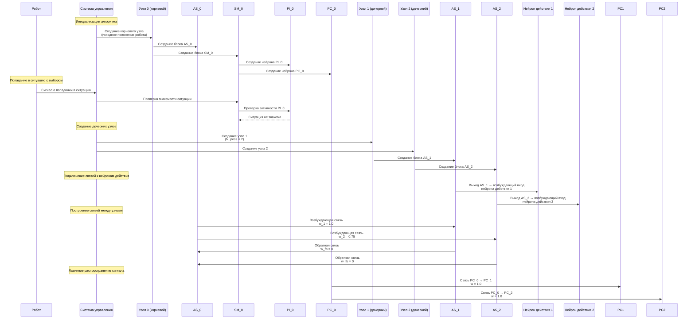
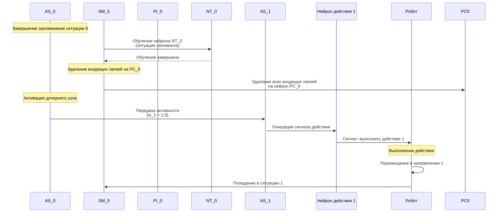
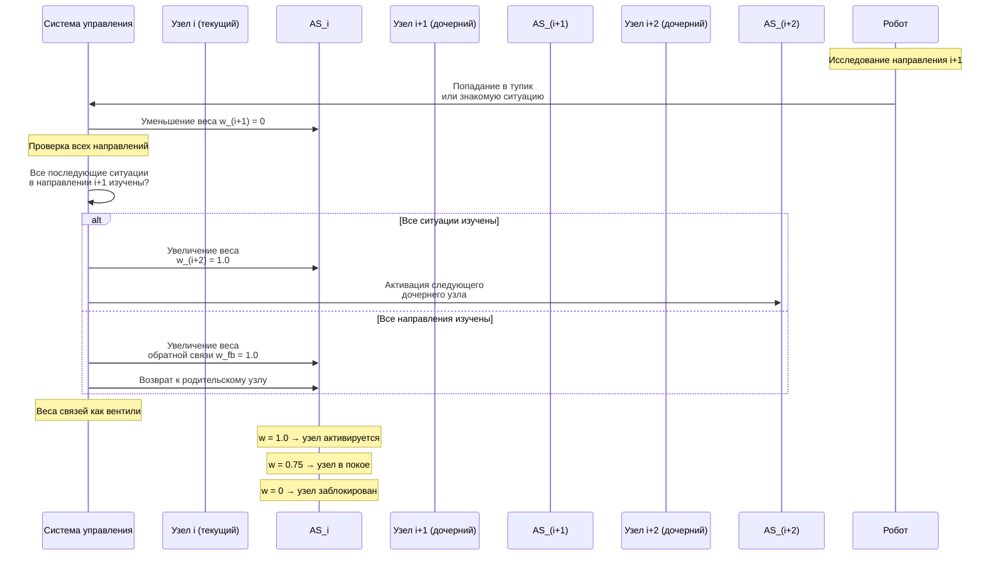
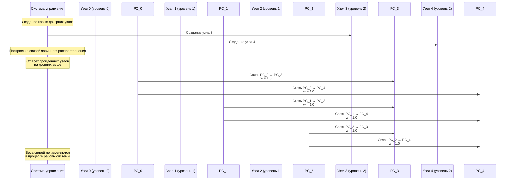
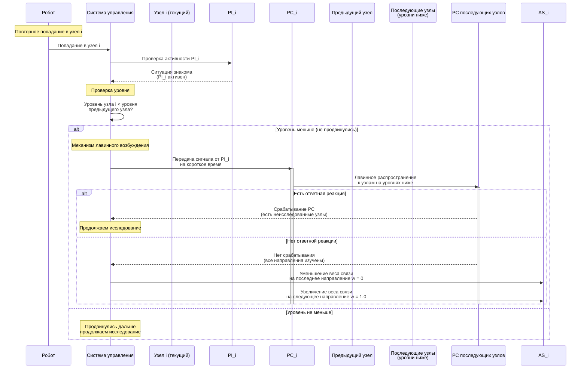
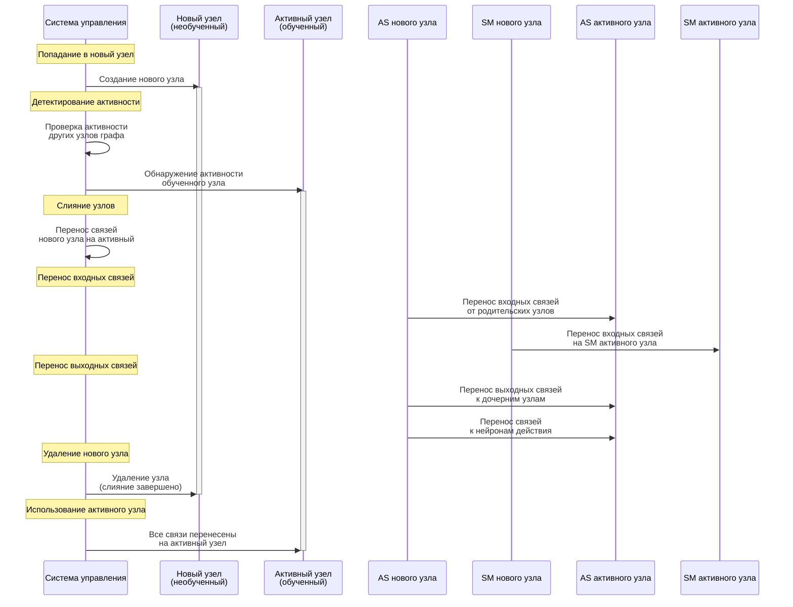
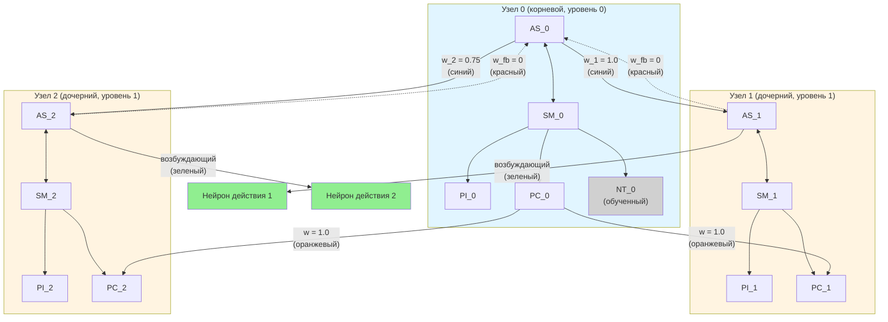

## Алгоритм формирования когнитивной карты

Алгоритм формирования когнитивной карты предназначен для построения графа ситуаций, в которых робот оказывается в процессе исследования среды. Каждый узел графа соответствует ситуации с необходимостью выбора направления движения. Алгоритм обеспечивает последовательное исследование среды, запоминание пройденных путей и оптимизацию маршрутов.

### Компоненты узла графа

Каждый узел графа когнитивной карты содержит следующие компоненты:

- **AS** (ActivitySwitcher) — блок последовательного переключения активности
- **SM** (SignalManager) — блок управления сигналами, содержащий:
  - **PI** (PostInput) — нейрон слоя PostInput для распознавания знакомых ситуаций
  - **PC** (PreControl) — нейрон слоя PreControl для лавинного распространения сигнала
- **NT** (NeuronTrainer) — обучаемые нейроны для запоминания ситуаций
- **Нейроны действия** — нейроны, соответствующие возможным направлениям движения

### Структура графа

Узлы графа организованы по уровням:
- **Уровень 0** — корневой узел (исходное положение робота)
- **Уровень 1, 2, ...** — дочерние узлы, создаваемые при попадании в новые ситуации

Узлы на одной глубине от корневого узла принадлежат к одному уровню.

### Диаграмма последовательности: создание корневого узла и дочерних узлов

### Диаграмма последовательности: активация дочернего узла и запоминание ситуации

### Диаграмма последовательности: изменение весов связей при исследовании

### Диаграмма последовательности: лавинное распространение сигнала через PreControl

### Диаграмма последовательности: проверка целесообразности движения при повторном попадании

### Диаграмма последовательности: слияние совпадающих узлов

### Описание алгоритма по этапам

#### Этап 1: Инициализация — создание корневого узла

В начале работы алгоритма строится первый (корневой) узел, соответствующий исходному положению робота.

**Компоненты корневого узла:**
- Блок ActivitySwitcher (AS_0)
- Блок SignalManager (SM_0) с нейронами PI_0 и PC_0
- Обучаемые нейроны (NT_0) для запоминания ситуации

#### Этап 2: Создание дочерних узлов при попадании в новую ситуацию

Каждый раз при получении сигнала о попадании в ситуацию с необходимостью выбора проверяется, является ли данная ситуация уже знакомой.

**Если ситуация не знакома:**
1. Создается N_poss новых узлов — по одному для каждого из возможных направлений движения
2. Выход каждого из только что созданных элементов подключается к возбуждающему входу соответствующего нейрона действия
3. От блока ActivitySwitcher текущего узла на каждый из только что созданных (дочерних) узлов строятся возбуждающие связи

**Начальные веса связей:**
- w_1 = 1.0 (вес связи на первый дочерний нейрон)
- w_i = 0.75 (веса остальных связей, i > 1)
- w_fb = 0 (вес обратных связей от дочерних узлов к родительскому)

#### Этап 3: Лавинное распространение сигнала через PreControl

При создании новых узлов помимо связей между родительским и дочерним узлами дополнительно строится отдельная система связей между нейронами PreControl (PC) различных узлов графа.

**Механизм работы:**
- От нейронов PC каждого из пройденных узлов на уровнях выше к нейронам PC каждого из только что созданных дочерних узлов строятся связи
- Веса всех связей этой сети по умолчанию равны единице и не изменяются в процессе работы системы
- При запоминании ситуации все входящие связи на нейрон PC соответствующего ей узла удаляются
- «Откликнуться» на лавинное возбуждение могут только нейроны тех узлов, в которых робот еще не был

#### Этап 4: Изменение весов связей в ходе перемещения

Веса связей изменяются в ходе перемещения робота. Вес уменьшается до w_i = 0, если выполняется одно из следующих условий:

1. **Выбор этого направления приводит в тупик или в уже знакомую ситуацию**
   - Вес связи на это направление устанавливается w_i = 0
   - Увеличивается вес связи на следующий дочерний узел w_(i+1) = 1

2. **Все последующие ситуации в этом направлении уже были изучены**
   - Вес связи на это направление устанавливается w_i = 0
   - Увеличивается вес связи на следующий дочерний узел w_(i+1) = 1

3. **Все последующие ситуации по всем дочерним направлениям уже исследованы**
   - Вес связи на последнее направление устанавливается w_i = 0
   - Увеличивается вес обратной связи w_fb = 1

**Роль весов связей:**
Веса связей выполняют роль вентиля — выходной сигнал текущего AS активирует тот из дочерних AS, вес связи с которым равен единице, остальные узлы остаются в покое.

#### Этап 5: Проверка целесообразности движения при повторном попадании

Если робот попал в некоторый узел повторно, и номер уровня этого узла меньше, чем уровень предыдущего пройденного узла (то есть, робот не продвинулся дальше в исследовании среды), необходимо проверить целесообразность дальнейшего движения.

**Механизм лавинного возбуждения:**
1. На вход нейрона PC текущего узла на короткое время передается выходной сигнал нейрона PostInput (он активен, так как ситуация уже была запомнена)
2. От нейрона PC текущего узла распространяется лавинное возбуждение к нейронам PC всех последующих узлов на уровнях ниже
3. Если какой-то из них сработал, значит, в этом направлении остались еще не исследованные узлы
4. Если же ответной реакции на лавинное возбуждение не последовало, следует:
   - Уменьшить вес связи на последнем пройденном дочернем направлении текущего узла
   - Увеличить вес связи на следующее дочернее направление

#### Этап 6: Слияние совпадающих узлов

Если при попадании в новый узел детектируется активность на другом, уже «обученном», узле графа, то входные и выходные связи данного узла переносятся на активный узел.

**Процесс слияния:**
1. Обнаружение активности на обученном узле
2. Перенос всех входных связей нового узла на активный узел
3. Перенос всех выходных связей нового узла на активный узел
4. Удаление нового узла после переноса связей

### Схема графа для первой ситуации с двумя возможными действиями

**Обозначения на схеме:**
- **Синий** — связи от текущего узла к дочерним (возбуждающие)
- **Красный** — обратные связи от дочерних узлов к родительскому
- **Оранжевый** — связи для лавинного распространения сигнала через PreControl
- **Зеленый** — связи к нейронам действия
- **Серый** — обученный нейрон (NT_0)

### Примечания

- Алгоритм обеспечивает последовательное исследование среды с запоминанием пройденных путей
- Механизм изменения весов связей позволяет оптимизировать маршруты и избегать повторного исследования уже изученных областей
- Лавинное распространение сигнала через PreControl обеспечивает эффективную проверку наличия неисследованных направлений
- Слияние совпадающих узлов оптимизирует структуру графа и предотвращает избыточное дублирование информации

## Литература

12. **Korsakov, A., Bakhshiev, A., Astapova, L., Stankevich, L.** Behavioral functions implementation on spiking neural networks // Informatics and Automation, 2021, 20:3, 591–622.

    [DOI](https://doi.org/10.15622/ia.2021.3.4) | [Literature-References.md](../Literature-References.md)
