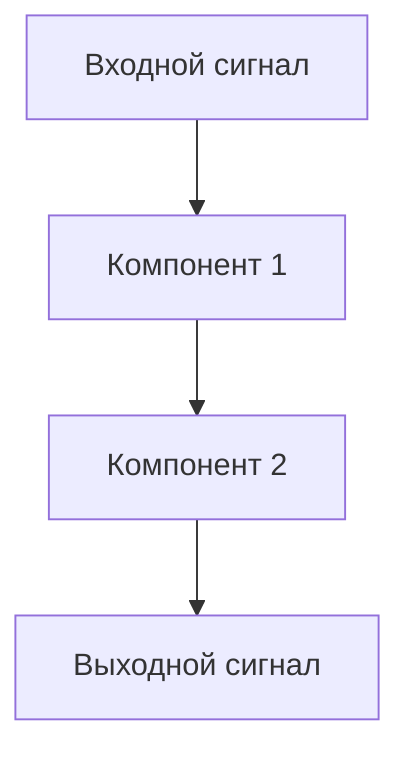
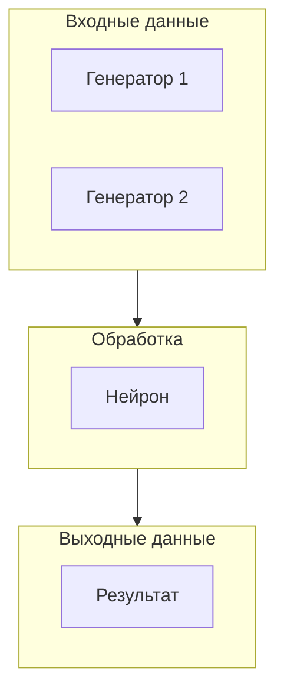
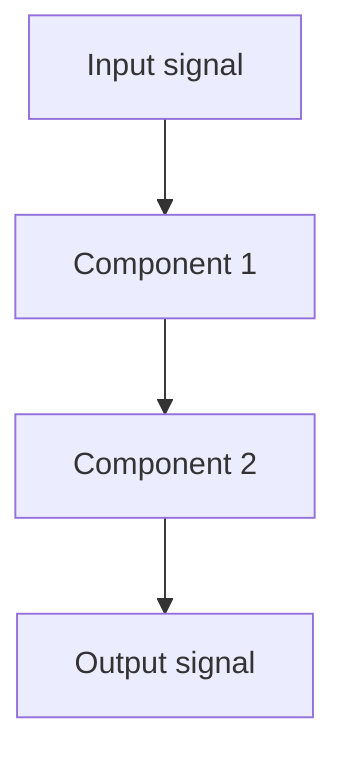
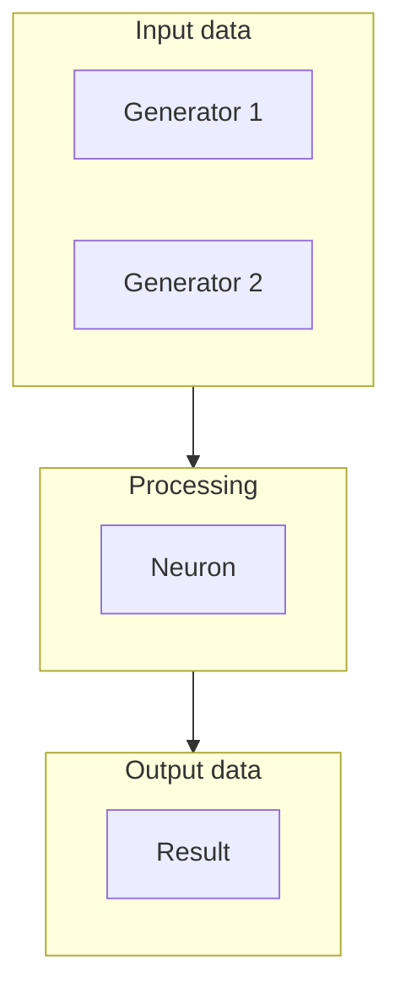

## RU

## Рекомендации по оформлению документации конфигураций SpikeSamples

### Назначение документа

Этот документ содержит рекомендации по созданию и оформлению `README.md` файлов для конфигураций в `Bin/Configs/SpikeSamples`. Следование этим рекомендациям обеспечивает единообразие документации и облегчает навигацию пользователей.

### Структура README.md

Каждый `README.md` должен содержать следующие разделы в указанном порядке:

#### 1. Заголовок и путь

```markdown
## Название конфигурации — краткое описание

**Путь:** `Bin/Configs/SpikeSamples/.../...`
**Статус валидации:** VALID/INVALID/TIMEOUT (см. `Reports/SpikeSamples-Validation-Report.md`)
```

- **Название конфигурации** должно совпадать с именем папки
- **Краткое описание** — одно предложение о назначении конфигурации
- **Путь** — полный путь к конфигурации относительно корня проекта
- **Статус валидации** — берётся из отчёта валидации

#### 2. Назначение конфигурации

Раздел должен содержать:
- Подробное описание того, что демонстрирует конфигурация
- Биологическую мотивацию (если применимо)
- Связь с научными публикациями
- Связь с другими конфигурациями

#### 3. Связанные публикации

```markdown
### Связанные публикации


  Авторы (год)
  Журнал/Конференция, том, страницы
  DOI: https://doi.org/...
```

- Указывайте все релевантные публикации
- Используйте формат с DOI, если доступен
- Ссылайтесь на публикации из списка работ Neuro Modeler, если применимо

#### 4. Структура модели

Раздел должен содержать:
- Описание компонентов системы
- Диаграмму структуры (mermaid)
- Описание связей между компонентами

**Пример диаграммы:**

```markdown

```

#### 5. Эксперимент и моделируемые реакции

Раздел должен содержать:
- Цель эксперимента
- Описание входных данных/сигналов
- Описание процесса моделирования
- Ожидаемое поведение системы
- Наблюдаемые величины

#### 6. Параметры модели

Раздел должен содержать:
- Основные параметры из `Parameters_00.xml`
- Параметры компонентов (если критичны для понимания)
- Типичные значения параметров
- Ссылки на документацию компонентов

**Формат:**

```markdown
#### Параметры Компонента

- `ParameterName` = значение — описание параметра
- `AnotherParameter` = значение — описание параметра
```

#### 7. Результаты экспериментов

Раздел должен содержать:
- Результаты из публикаций (если доступны)
- Ожидаемые результаты
- Сравнение с другими моделями (если применимо)

#### 8. Использование конфигурации

Раздел должен содержать:
- Инструкции по запуску конфигурации
- Описание необходимых настроек
- Примеры использования
- Типичные проблемы и их решение (если известны)

#### 9. Связанные материалы

Раздел должен содержать ссылки на:
- Тематические документы в `Bin/Docs/SpikeSamples/`
- Документацию компонентов в `Libraries/Nmsdk-PulseLib/Docs/Components/`
- Связанные конфигурации
- Описание конфигурации (если есть `Description.rtf`)

**Формат:**

```markdown
- Теория и функциональное описание:
  - `Topic-Overview.md` — пример тематического обзора (замените на имя вашего файла)
- Компонентная документация:
  - `Libraries/Nmsdk-PulseLib/Docs/Components/Component.md` — документация компонента
- Связанные конфигурации:
  - `../RelatedTopic/OtherConfig/README.md` — пример связанного конфига (подставьте реальный путь)
- Описание конфигурации:
  - `Description.rtf` — подробное описание (в формате RTF)
```

#### 10. Ссылки на публикации

Повторение списка публикаций с полными библиографическими данными и DOI.

### Правила создания mermaid диаграмм

#### Типы диаграмм

1. **Flowchart** — для описания потока данных и структуры системы
2. **Class Diagram** — для описания иерархии классов (если применимо)
3. **Sequence Diagram** — для описания последовательности взаимодействий (если применимо)

#### Рекомендации по оформлению

- Используйте понятные названия узлов
- Группируйте связанные компоненты
- Используйте цвета и стили для выделения важных элементов (если необходимо)
- Делайте диаграммы компактными, но информативными

**Пример:**

```markdown

```

### Связь с валидацией конфигураций

#### Статус валидации

Статус валидации берётся из отчёта `Reports/SpikeSamples-Validation-Report.md`:
- **VALID** — конфигурация валидна и работает корректно
- **INVALID** — конфигурация имеет ошибки
- **TIMEOUT** — конфигурация превысила время выполнения

#### Обновление статуса

При изменении статуса валидации необходимо обновить `README.md`:
1. Запустить скрипт валидации: `Scripts/generate_detailed_validation_report.py --subdir SpikeSamples`
2. Проверить статус в отчёте
3. Обновить статус в `README.md`

### Примеры хорошей документации

#### Пример 1: Простая конфигурация

См. [`Bin/Configs/SpikeSamples/NM-Neurons/NM-PN-01-Neuron-1M1St1In1/README.md`](../../Configs/SpikeSamples/NM-Neurons/NM-PN-01-Neuron-1M1St1In1/README.md)

#### Пример 2: Конфигурация с классификацией

См. [`Bin/Configs/SpikeSamples/Classifier/SpikeIrisClassifier/README.md`](../../Configs/SpikeSamples/Classifier/SpikeIrisClassifier/README.md)

#### Пример 3: Конфигурация с CSNM

См. [`Bin/Configs/SpikeSamples/NM-Neurons/CableModel/CableNeuronMulti_CSNM/README.md`](../../Configs/SpikeSamples/NM-Neurons/CableModel/CableNeuronMulti_CSNM/README.md)

### Шаблон README.md

```markdown
## Название конфигурации — краткое описание

**Путь:** `Bin/Configs/SpikeSamples/.../...`
**Статус валидации:** VALID (см. `Reports/SpikeSamples-Validation-Report.md`)

### Назначение конфигурации

[Подробное описание назначения конфигурации]

### Связанные публикации


  Авторы (год)
  Журнал/Конференция, том, страницы
  DOI: https://doi.org/...

### Структура модели

[Описание структуры с диаграммой mermaid]

### Эксперимент и моделируемые реакции

[Описание эксперимента]

### Параметры модели

[Описание параметров]

### Результаты экспериментов

[Описание результатов]

### Использование конфигурации

[Инструкции по использованию]

### Связанные материалы

- Теория и функциональное описание:
  - `Topic-Overview.md` — пример тематического обзора (замените на имя вашего файла)
- Компонентная документация:
  - `Libraries/Nmsdk-PulseLib/Docs/Components/Component.md` — документация компонента
- Связанные конфигурации:
  - `../RelatedTopic/OtherConfig/README.md` — пример связанного конфига (подставьте реальный путь)


### Дополнительные рекомендации

#### Использование русского языка

- Вся документация должна быть на русском языке
- Технические термины могут быть на английском, если это общепринято
- Названия компонентов и классов указываются на английском

#### Форматирование кода

- Используйте обратные кавычки для названий компонентов, параметров, путей
- Используйте блоки кода для примеров кода и конфигураций
- Используйте таблицы для сравнения параметров

#### Ссылки

- Используйте относительные пути для ссылок на файлы в проекте
- Проверяйте работоспособность всех ссылок
- Используйте markdown-ссылки с реальным относительным путём к README (например: имя файла `../SiblingConfig/README.md`)

#### Изображения

- Если используются изображения, размещайте их в папке конфигурации
- Используйте относительные пути для ссылок на изображения
- Добавляйте альтернативный текст для изображений

### Проверка качества документации

Перед завершением работы над `README.md` проверьте:

- [ ] Все обязательные разделы присутствуют
- [ ] Статус валидации актуален
- [ ] Все ссылки работают
- [ ] Диаграммы mermaid корректны
- [ ] Параметры описаны правильно
- [ ] Публикации указаны с полными данными
- [ ] Текст написан на русском языке
- [ ] Форматирование соответствует рекомендациям

### Связанные материалы

- [`Overview.md`](Overview.md) — обзор конфигураций SpikeSamples
- [`Index.md`](Index.md) — индекс тематических разделов
- `Reports/SpikeSamples-Validation-Report.md` — отчёт валидации конфигураций

---

## EN

## Guidelines for formatting SpikeSamples configuration documentation

### Document purpose

This document contains guidelines for creating and formatting `README.md` files for configurations in `Bin/Configs/SpikeSamples`. Following these guidelines ensures documentation uniformity and facilitates user navigation.

### README.md structure

Each `README.md` should contain the following sections in the specified order:

#### 1. Title and path

```markdown

## Configuration name — brief description

**Path:** `Bin/Configs/SpikeSamples/.../...`
**Validation status:** VALID/INVALID/TIMEOUT (see `Reports/SpikeSamples-Validation-Report.md`)
```

- **Configuration name** must match the folder name
- **Brief description** — one sentence about configuration purpose
- **Path** — full path to configuration relative to project root
- **Validation status** — taken from validation report

#### 2. Configuration purpose

Section should contain:
- Detailed description of what the configuration demonstrates
- Biological motivation (if applicable)
- Link to scientific publications
- Link to other configurations

#### 3. Related publications

```markdown
### Related publications


  Authors (year)
  Journal/Conference, volume, pages
  DOI: https://doi.org/...
```

- List all relevant publications
- Use DOI format when available
- Reference publications from the Neuro Modeler works list when applicable

#### 4. Model structure

Section should contain:
- System component description
- Structure diagram (mermaid)
- Description of connections between components

**Diagram example:**

```markdown

```

#### 5. Experiment and modeled responses

Section should contain:
- Experiment goal
- Input data/signal description
- Modeling process description
- Expected system behavior
- Observed quantities

#### 6. Model parameters

Section should contain:
- Main parameters from `Parameters_00.xml`
- Component parameters (if critical for understanding)
- Typical parameter values
- Links to component documentation

**Format:**

```markdown
#### Component parameters

- `ParameterName` = value — parameter description
- `AnotherParameter` = value — parameter description
```

#### 7. Experiment results

Section should contain:
- Results from publications (if available)
- Expected results
- Comparison with other models (if applicable)

#### 8. Using the configuration

Section should contain:
- Instructions for running the configuration
- Required settings description
- Usage examples
- Typical problems and solutions (if known)

#### 9. Related materials

Section should contain links to:
- Topical documents in `Bin/Docs/SpikeSamples/`
- Component documentation in `Libraries/Nmsdk-PulseLib/Docs/Components/`
- Related configurations
- Configuration description (if `Description.rtf` exists)

**Format:**

```markdown
- Theory and functional description:
  - `Topic-Overview.md` — example topical overview (replace with your file name)
- Component documentation:
  - `Libraries/Nmsdk-PulseLib/Docs/Components/Component.md` — component documentation
- Related configurations:
  - `../RelatedTopic/OtherConfig/README.md` — example related config (substitute real path)
- Configuration description:
  - `Description.rtf` — detailed description (RTF format)
```

#### 10. Publication references

Repeat publication list with full bibliographic data and DOI.

### Rules for creating mermaid diagrams

#### Diagram types

1. **Flowchart** — for describing data flow and system structure
2. **Class Diagram** — for describing class hierarchy (if applicable)
3. **Sequence Diagram** — for describing interaction sequences (if applicable)

#### Formatting recommendations

- Use clear node names
- Group related components
- Use colors and styles to highlight important elements (if necessary)
- Keep diagrams compact but informative

**Example:**

```markdown

```

### Link to configuration validation

#### Validation status

Validation status is taken from `Reports/SpikeSamples-Validation-Report.md`:
- **VALID** — configuration is valid and works correctly
- **INVALID** — configuration has errors
- **TIMEOUT** — configuration exceeded execution time

#### Status update

When validation status changes, update `README.md`:
1. Run validation script: `Scripts/generate_detailed_validation_report.py --subdir SpikeSamples`
2. Check status in report
3. Update status in `README.md`

### Good documentation examples

#### Example 1: Simple configuration

See [`Bin/Configs/SpikeSamples/NM-Neurons/NM-PN-01-Neuron-1M1St1In1/README.md`](../../Configs/SpikeSamples/NM-Neurons/NM-PN-01-Neuron-1M1St1In1/README.md)

#### Example 2: Classification configuration

See [`Bin/Configs/SpikeSamples/Classifier/SpikeIrisClassifier/README.md`](../../Configs/SpikeSamples/Classifier/SpikeIrisClassifier/README.md)

#### Example 3: CSNM configuration

See [`Bin/Configs/SpikeSamples/NM-Neurons/CableModel/CableNeuronMulti_CSNM/README.md`](../../Configs/SpikeSamples/NM-Neurons/CableModel/CableNeuronMulti_CSNM/README.md)

### README.md template

```markdown

## Configuration name — brief description

**Path:** `Bin/Configs/SpikeSamples/.../...`
**Validation status:** VALID (see `Reports/SpikeSamples-Validation-Report.md`)

### Configuration purpose

[Detailed description of configuration purpose]

### Related publications


  Authors (year)
  Journal/Conference, volume, pages
  DOI: https://doi.org/...

### Model structure

[Structure description with mermaid diagram]

### Experiment and modeled responses

[Experiment description]

### Model parameters

[Parameter description]

### Experiment results

[Results description]

### Using the configuration

[Usage instructions]

### Related materials

- Theory and functional description:
  - `Topic-Overview.md` — example topical overview (replace with your file name)
- Component documentation:
  - `Libraries/Nmsdk-PulseLib/Docs/Components/Component.md` — component documentation
- Related configurations:
  - `../RelatedTopic/OtherConfig/README.md` — example related config (substitute real path)


### Additional recommendations

#### Using Russian language

- All documentation should be in Russian
- Technical terms may be in English when commonly accepted
- Component and class names are given in English

#### Code formatting

- Use backticks for component names, parameters, paths
- Use code blocks for code examples and configurations
- Use tables for parameter comparison

#### Links

- Use relative paths for links to project files
- Verify all links work
- Use markdown links with real relative path to README (e.g.: file name `../SiblingConfig/README.md`)

#### Images

- If images are used, place them in the configuration folder
- Use relative paths for image links
- Add alt text for images

### Documentation quality checklist

Before completing work on `README.md`, verify:

- [ ] All required sections are present
- [ ] Validation status is current
- [ ] All links work
- [ ] Mermaid diagrams are correct
- [ ] Parameters are described correctly
- [ ] Publications are listed with full data
- [ ] Text is written in Russian
- [ ] Formatting follows guidelines

### Related materials

- [`Overview.md`](Overview.md) — SpikeSamples configurations overview
- [`Index.md`](Index.md) — topical sections index
- `Reports/SpikeSamples-Validation-Report.md` — configuration validation report
