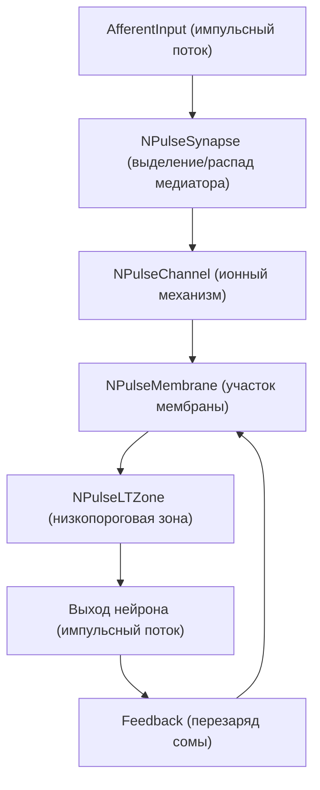
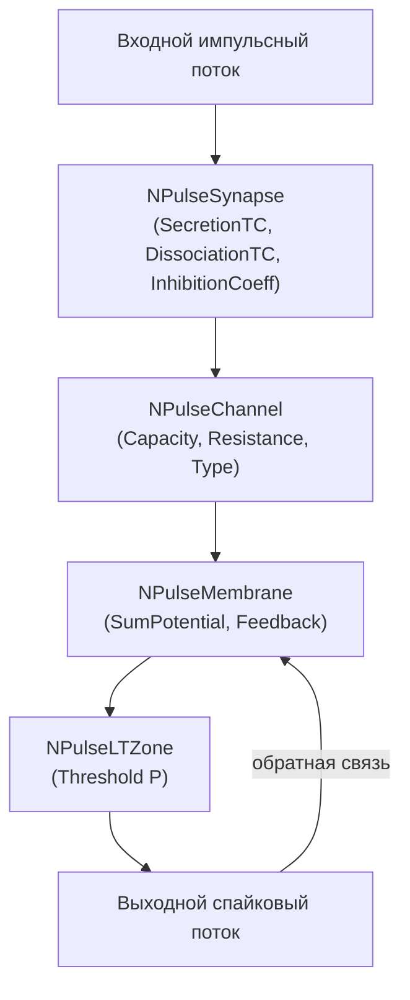

## Модель преобразования импульсных потоков в естественном нейроне

В работе [2] вводится детальная математическая модель:

- синапса (выделение и распад медиатора, пресинаптическое торможение);
- ионного механизма мембраны (апериодическое звено с переменной постоянной времени);
- генератора потенциала действия с обратной связью на соматические участки.

В NMSDK эта модель реализована через компоненты PulseLib (`NPulseSynapse`, `NPulseChannel`, `NPulseMembrane`, `NPulseNeuron`), а в SpikeSamples представлены конфигурации, демонстрирующие поведение такой модели в разных режимах.

### Соответствующие конфигурации SpikeSamples

Основные конфигурации, иллюстрирующие модель преобразования импульсных потоков:

- `SpikeSamples/NM-Neurons/NM-PN-01-Neuron-1M1St1In1`
- `SpikeSamples/NM-Neurons/NM-PN-02-Neuron-1M1St3In3`
- `SpikeSamples/NM-Neurons/NM-PN-03/04/05/06-Neuron-*`
- `SpikeSamples/NM-Neurons/NM-PN-07/08-LtmNeuron-*`
- `SpikeSamples/NM-Neurons/LIF-Neuron` (сравнительная упрощённая модель)
- `SpikeSamples/Memory/MEM-OneNeuron3`, `SpikeSamples/Memory/MEM-SimpleMemory2`
- `SpikeSamples/STDP/STDP-Simple-01`

Каждая из них использует один и тот же набор базовых компонент PulseLib, отличаясь:

- структурой сети (число участков мембраны, организация синапсов);
- параметрами синапсов и каналов (временные константы, сопротивления, веса);
- режимами стимуляции (частота входных импульсов, сложные паттерны).

### Функциональная схема потока сигналов

В терминах работы [2]:

- **входной импульсный поток** — последовательность дискретных импульсов на синапсах;
- **синапс** интегрирует импульсы через параметры `PulseAmplitude`, `SecretionTC`, `DissociationTC`, с возможным пресинаптическим торможением (`InhibitionCoeff`, `UsePresynapticInhibition`);
- **ионный механизм** реализует инерционное звено с постоянными `Rm`, `Cm`, `RF`, параметрами `Capacity`, `Resistance`, `FBResistance`;
- **генератор потенциала действия** формирует выходные импульсы при превышении порога `P` и запускает перезарядку мембраны.

### Типичные эффекты, демонстрируемые в SpikeSamples

- **Преобразование частоты**: зависимость частоты выходных разрядов от частоты входного потока (графики типа рис. 14 в работе [2]); реализуется в PN‑конфигурациях и памяти.
- **Пресинаптическое торможение**: снижение эффективности синапса при слишком высокой частоте входа (эффект «защиты от насыщения»), используемый, в частности, для стабилизации активности в кольцевых структурах и моторных контурах.
- **Зависимость от параметров мембраны**: конфигурации `CableModel/*` и `NM-PN-*` позволяют варьировать R, C, пороги и глубину ОС, меняя скорость и устойчивость реакций.

Подробное описание каждого конкретного эксперимента и соответствия параметров теоретической модели приведено в `README.md` в каждой папке `SpikeSamples/...`.

## Литература

1. [31] Математическое моделирование процессов преобразования импульсных потоков в естественном нейроне // Нейрокомпьютеры: разработка, применение, №3, 2009. – с.71-80. [онлайн](https://neuromodeler.ru/index.php?option=com_content&view=article&id=24:2012-11-07-16-42-21&catid=67&lang=ru&Itemid=676) | [elibrary](https://www.elibrary.ru/item.asp?id=13070281)

## SpikeSamples — модель преобразования импульсных потоков

Этот документ основан на работе [2] и описывает, как её идеи реализованы в конфигурациях `Bin/Configs/SpikeSamples`.

### Функциональные блоки модели

В статье выделяются три ключевых уровня:

1. **Синапс** — преобразует входной дискретный поток импульсов в аналоговую величину (концентрация медиатора, проводимость), учитывая:
   - различные постоянные времени выделения и распада медиатора;
   - эффект пресинаптического торможения при высоких частотах входа.
2. **Ионные механизмы мембраны** — пара деполяризующего и гиперполяризующего каналов:
   - описываются эквивалентной RC‑схемой с сопротивлениями R0, RF и ёмкостью Cm;
   - суммарный вклад ионных механизмов определяет локальный вклад участка мембраны в внутриклеточный потенциал.
3. **Генератор потенциала действия** — формирует спайк при превышении порога P и замыкает контур обратной связи, перезаряжая мембрану.

В PulseLib эти блоки реализованы как:

- `NPulseSynapse` / `NPulseSynapseCommon` — модель синапса, параметры:
  - `PulseAmplitude`, `SecretionTC`, `DissociationTC`, `InhibitionCoeff`, `Resistance`, `UsePresynapticInhibition` и др.;
- `NPulseChannel` / `NPulseChannelCommon` — ионный механизм:
  - `Capacity`, `Resistance`, `FBResistance`, `RestingResistance`, `Type` (возбуждающий/тормозный);
- `NPulseMembrane` / `NPulseMembraneCommon` — агрегирует каналы и синапсы, суммирует их вклад в `SumPotential` и реализует обратную связь через `Feedback`;
- `NPulseLTZone` — низкопороговая зона (генератор спайков).

### Конфигурации SpikeSamples, иллюстрирующие преобразование импульсных потоков

Ключевые конфигурации:

- одиночные нейроны с различной структурой мембраны:
  - `SpikeSamples/NM-Neurons/NM-PN-01-Neuron-1M1St1In1`
  - `SpikeSamples/NM-Neurons/NM-PN-02-Neuron-1M1St3In3`
  - `SpikeSamples/NM-Neurons/NM-PN-NeuronSizeActivity`
- примеры памяти и условных рефлексов:
  - `SpikeSamples/Memory/MEM-OneNeuron3`
  - `SpikeSamples/Memory/MEM-SimpleMemory2`
  - `SpikeSamples/Memory/SpikeAssociationPlus`
  - `SpikeSamples/Memory/SpikeConditionalReflex`
- тренировка и структурное обучение:
  - `SpikeSamples/StructTrain/SpikeTrainer`
  - `SpikeSamples/StructTrain/SpikeAnsTrainer`
- пластиность и STDP:
  - `SpikeSamples/STDP/STDP-Simple-01`

### Поток сигналов в типичной конфигурации

Обобщённо поток сигналов можно представить так:

Разные конфигурации `SpikeSamples` реализуют различные комбинации:

- числа синапсов и их пространственного расположения на мембране;
- частоты и паттернов входных воздействий;
- структурной организации (количество участков сомы и дендритов).

### Примеры экспериментов из SpikeSamples

1. **Частотные характеристики одиночного нейрона** (нейрон N1/N2 в статье):
   - Конфигурации `NM-PN-*` и `NM-PN-NeuronSizeActivity` используют одинаковые параметры моделей, но разное число участков сомы и дендритов.
   - В `README.md` для этих конфигураций должны быть:
     - зависимость частоты выходных спайков от частоты входа;
     - различия между малым и крупным нейронами.

2. **Эффект пресинаптического торможения**:
   - Конфигурации в группах `Memory` и `StructTrain` используют высокочастотную стимуляцию некоторых входов и демонстрируют:
     - снижение эффективности синаптического влияния при превышении критической частоты;
     - защиту сети от насыщения за счёт уменьшения вклада аномально активных входов.

3. **Формирование условного рефлекса**:
   - `SpikeSamples/Memory/SpikeConditionalReflex` и `SpikeSamples/Memory/SpikeAssociationPlus` иллюстрируют,
     как при одновременной или последовательной активации разных входов закрепляется ассоциация между паттернами,
     и как изменяется характер ответов нейрона/сети.

4. **Структурная адаптация и обучение**:
   - Конфигурации `SpikeSamples/StructTrain/*` демонстрируют:
     - изменение структуры сети (число и расположение синапсов, возможные изменения связей) под действием тренировочных паттернов;
     - переход от ручной настройки параметров к самоорганизующемуся описанию связей.

5. **STDP и пластичность**:
   - `SpikeSamples/STDP/STDP-Simple-01` показывает,
     как зависимость изменения веса синапса от относительного времени пресинаптического и постсинаптического спайка
     может быть реализована средствами PulseLib и использована для обучения сети.

### Рекомендации по README для соответствующих конфигураций

Для каждой конфигурации из перечисленных групп `README.md` содержит:

- чёткое текстовое описание:
  - какие входные стимулы используются (частота, длительность, паттерн);
  - какие выходные характеристики анализируются (частота, число спайков в пачке, наличие пресинаптического торможения и т.п.);
- отсылки к соответствующим разделам статьи (рисунки, графики);
- пояснение, какие параметры в `Parameters.xml` критичны для результата (τs, τd, R0, RF, Cm, порог P, глубина обратной связи и т.п.).

Этот документ служит «каркасом»; детализация по каждой конфигурации фиксируется в её локальном `README.md`.

