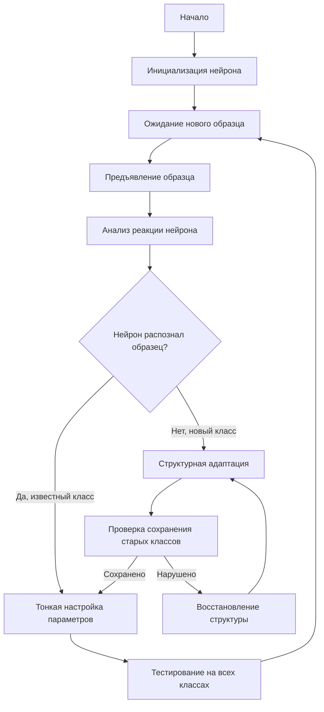

## Стратегия инкрементального обучения на компартментной спайковой модели нейрона

### Назначение метода

Инкрементальное обучение позволяет обучать нейрон на новых образцах без необходимости хранить и переобучаться на всех предыдущих обучающих образцах. Это особенно важно для задач, где данные поступают последовательно или когда требуется адаптация к новым классам без потери знаний о старых классах.

### Основные концепции

#### Сценарий инкрементального обучения

В работе [1] рассматривается сценарий инкрементального обучения, где:
- Обучение происходит на **одном нейроне** с возможностью формирования новых классов
- Во время обучения используется **только новый образец**, без знания всех предыдущих обучающих образцов
- Нейрон должен сохранять способность распознавать ранее обученные классы при обучении на новых

#### Ключевая особенность

Ключевая особенность инкрементального обучения заключается в том, что система не имеет доступа ко всем обучающим образцам одновременно. Вместо этого:
- Образцы поступают последовательно
- Каждый новый образец используется для обновления модели
- Предыдущие образцы не хранятся и не используются повторно
- Знания о предыдущих классах сохраняются в структуре и параметрах нейрона

### Алгоритм инкрементального обучения

#### Этап 1: Инициализация нейрона

- Создание нейрона с начальной структурой
- Установка начальных параметров
- Подготовка к обучению на первом классе

#### Этап 2: Последовательное предъявление новых образцов

Для каждого нового образца:

1. **Предъявление образца нейрону**
   - Преобразование образца в паттерн спайков с временным кодированием
   - Подача паттерна на входы нейрона

2. **Анализ реакции нейрона**
   - Проверка, генерирует ли нейрон спайк
   - Определение, к какому классу относится образец (известному или новому)

3. **Адаптация структуры и параметров**

   **Если образец относится к известному классу:**
   - Тонкая настройка параметров для улучшения распознавания
   - Возможна небольшая корректировка структуры

   **Если образец относится к новому классу:**
   - Формирование нового класса
   - Адаптация структуры нейрона для распознавания нового класса
   - Сохранение способности распознавать предыдущие классы

#### Этап 3: Формирование новых классов

При обнаружении нового класса:
- Анализ характеристик нового образца
- Определение необходимой структуры нейрона для распознавания нового класса
- Модификация структуры с сохранением способности распознавать предыдущие классы
- Настройка параметров для нового класса

#### Этап 4: Сохранение знаний о предыдущих классах

Критически важно сохранить способность нейрона распознавать ранее обученные классы:
- Структурная адаптация должна быть осторожной, чтобы не нарушить распознавание старых классов
- Параметры, критичные для старых классов, должны сохраняться
- Новые элементы структуры добавляются, а не заменяют старые

### Применение на наборе данных Iris

#### Описание набора данных

Набор данных Iris (UCI Machine Learning Repository) содержит:
- 150 образцов цветков ириса
- 3 класса: Iris-setosa, Iris-versicolor, Iris-virginica
- 4 признака: длина чашелистика, ширина чашелистика, длина лепестка, ширина лепестка

#### Экспериментальная установка

В работе [1]:
- Обучение одного нейрона на всех трёх классах
- Последовательное предъявление образцов из разных классов
- Использование только новых образцов без знания всех предыдущих
- Проверка способности нейрона распознавать все классы после обучения

#### Результаты экспериментов

Результаты экспериментов демонстрируют:
- **Применимость выбранной стратегии** для инкрементального обучения на компартментной спайковой модели нейрона
- Возможность обучения нейрона распознавать несколько классов последовательно
- Сохранение способности распознавать ранее обученные классы при обучении на новых

### Связь со структурной адаптацией

#### Использование структурной адаптации

Инкрементальное обучение использует структурную адаптацию для подстройки под новые образцы:

- **Анализ нового образца:** определение необходимой структуры нейрона
- **Адаптация структуры:** изменение размера сомы, длины дендритов, количества синапсов
- **Сохранение структуры для старых классов:** осторожная модификация, не нарушающая распознавание предыдущих классов

#### Комбинация методов

Комбинация структурной адаптации и инкрементального обучения позволяет:
- Эффективно обучаться на новых данных
- Формировать новые классы без переобучения
- Сохранять знания о предыдущих классах
- Адаптироваться к изменяющимся условиям

### Соответствующие конфигурации SpikeSamples

Следующие конфигурации демонстрируют инкрементальное обучение и связанные концепции:

- **`SpikeSamples/Classifier/SpikeIrisClassifier`** — классификация на Iris с инкрементальным обучением
  - Демонстрирует применение инкрементального обучения для задачи классификации
  - Использует структурную адаптацию для подстройки под новые классы

- **`SpikeSamples/StructTrain/SpikeTrainer`** — базовое структурное обучение
  - Демонстрирует процесс структурной адаптации
  - Может использоваться как основа для инкрементального обучения

- **`SpikeSamples/StructTrain/SpikeAnsTrainer`** — структурное обучение с ответами
  - Расширенная версия с возможностью обучения на нескольких паттернах
  - Демонстрирует формирование ответов на различные входные паттерны

### Алгоритм инкрементального обучения (детализация)

**Схема алгоритма инкрементального обучения:**



#### Детализация этапов

**1. Анализ реакции нейрона:**
- Проверка генерации спайка при предъявлении образца
- Определение класса на основе времени генерации спайка или паттерна активности
- Сравнение с известными классами

**2. Тонкая настройка параметров:**
- Небольшие изменения синаптических весов
- Корректировка порога активации (если необходимо)
- Сохранение структуры нейрона

**3. Структурная адаптация:**
- Анализ характеристик нового образца
- Определение необходимых изменений структуры:
  - Добавление новых дендритов (если необходимо)
  - Изменение длины существующих дендритов
  - Добавление синапсов
  - Изменение размера сомы (осторожно)
- Модификация структуры с сохранением элементов, критичных для старых классов

**4. Проверка сохранения старых классов:**
- Тестирование на образцах из предыдущих классов
- Проверка, что нейрон по-прежнему распознаёт старые классы
- При нарушении — откат изменений или дополнительная адаптация

### Примеры использования

#### Пример 1: Классификация цветков ириса

```cpp
// Создание классификатора с инкрементальным обучением
NSpikeClassifier* classifier = CreateComponent<NSpikeClassifier>("Classifier");

// Настройка для инкрементального обучения
classifier->StructureBuildMode = 1;  // Структурная адаптация
classifier->IsNeedToTrain = true;

// Обучение на первом классе (Iris-setosa)
MDMatrix<double> pattern_setosa;
// ... заполнение паттерна для первого класса
classifier->TrainingPatterns = pattern_setosa;
classifier->NumNeurons = 1;
classifier->Reset();

// Обучение на втором классе (Iris-versicolor)
// Без переобучения на первом классе
MDMatrix<double> pattern_versicolor;
// ... заполнение паттерна для второго класса
classifier->TrainingPatterns = pattern_versicolor;
classifier->NumNeurons = 2;  // Добавление нового нейрона для нового класса
classifier->Reset();

// Обучение на третьем классе (Iris-virginica)
// Без переобучения на предыдущих классах
MDMatrix<double> pattern_virginica;
// ... заполнение паттерна для третьего класса
classifier->TrainingPatterns = pattern_virginica;
classifier->NumNeurons = 3;  // Добавление нового нейрона для нового класса
classifier->Reset();
```

#### Пример 2: Расширение на другие задачи классификации

Инкрементальное обучение может быть применено к различным задачам классификации:
- Распознавание образов
- Классификация временных рядов
- Адаптация к новым условиям в робототехнике
- Онлайн-обучение в изменяющихся средах

### Преимущества инкрементального обучения

1. **Эффективность памяти:**
   - Не требуется хранить все предыдущие образцы
   - Знания сохраняются в структуре и параметрах нейрона

2. **Адаптивность:**
   - Возможность обучения на новых данных без полного переобучения
   - Адаптация к изменяющимся условиям

3. **Масштабируемость:**
   - Возможность добавления новых классов без переобучения на всех данных
   - Эффективное использование вычислительных ресурсов

4. **Биологическая реалистичность:**
   - Соответствует процессу обучения в биологических нейронных сетях
   - Обучение происходит последовательно, а не пакетно

### Ограничения и вызовы

1. **Катастрофическое забывание:**
   - Риск потери способности распознавать старые классы при обучении на новых
   - Необходимость осторожной адаптации структуры

2. **Баланс между старыми и новыми классами:**
   - Необходимость сохранения структуры для старых классов
   - Одновременная адаптация для новых классов

3. **Определение новых классов:**
   - Проблема определения, когда образец относится к новому классу
   - Необходимость пороговых значений для принятия решения

### Результаты экспериментов

Согласно публикации [1]:

- Стратегия инкрементального обучения успешно применяется на компартментной спайковой модели нейрона
- Нейрон способен обучаться на новых образцах без знания всех предыдущих обучающих образцов
- Результаты на наборе данных Iris демонстрируют применимость метода
- Комбинация структурной адаптации и инкрементального обучения обеспечивает эффективное обучение

### Связанные материалы

- [`StructuralAdaptation.md`](StructuralAdaptation.md) — метод структурной адаптации, используемый в инкрементальном обучении
- [`Classification.md`](Classification.md) — применение для задач классификации
- [`CSNM-Models.md`](CSNM-Models.md) — описание компартментной спайковой модели нейрона
- `Libraries/Nmsdk-PulseLib/Docs/Components/NNeuronTrainer.md` — документация компонента NNeuronTrainer
- `Libraries/Nmsdk-PulseLib/Docs/Components/NSpikeClassifier.md` — документация компонента NSpikeClassifier

## Литература

1. Korsakov, A. M., Isakov, T. T., Bakhshiev, A. V. Strategy of Incremental Learning on a Compartmental Spiking Neuron Model // Optical Memory and Neural Networks. – 2023. – Vol. 32, No. S2. – P. S237-S243. [DOI](https://doi.org/10.3103/s1060992x23060073)

2. UCI Machine Learning Repository: Iris Data Set. [онлайн](https://archive.ics.uci.edu/ml/datasets/iris)
