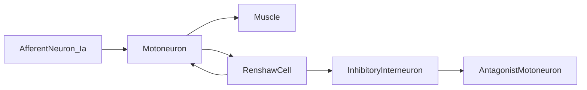
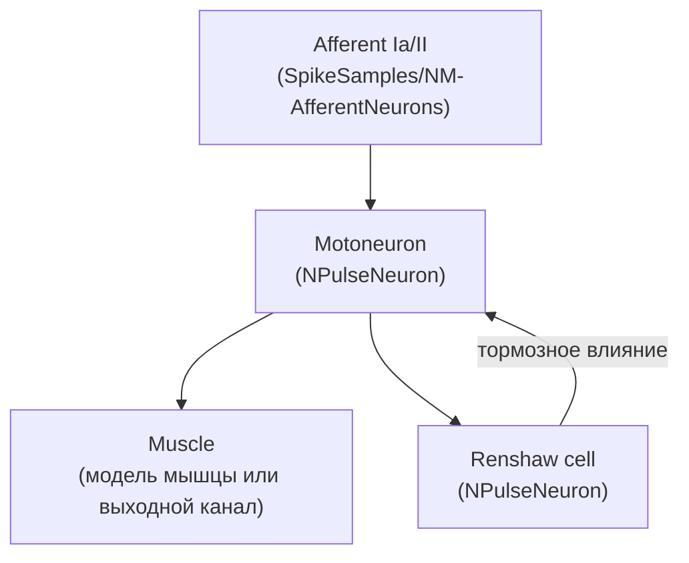

## Нейронные структуры управления мышечным сокращением

В работе [1] рассматриваются:

- афферентные нейроны (каналы Ia, II, Ib);
- мотонейроны, клетки Реншоу, тормозные интернейроны;
- способы регуляции силы мышечного сокращения (частота разрядов, количество активных мотонейронов);
- рефлекторные и возвратные контуры в спинном мозге.

### Соответствующие конфигурации SpikeSamples

В `Bin/Configs/SpikeSamples` этим темам соответствуют, прежде всего:

- `MC0-RCN/MC-RCN-00-*/...`
  — рефлекторные контуры (Ring/Reflex Control Networks) с мотонейронами, реншовскими клетками, ветвлением афферентных путей.
- `MC0-RCN/MC-RCN-01-NumMotionElements-Pendulum/...`
  — влияние количества двигательных элементов и структуры обратных связей на динамику маятниковой модели.
- `MC1-PCN/*` (`MotionControl_Test`, `MultiPositionControl_*`, `NewPositionControl_Test`)
  — более прикладные схемы позиционного управления с участием спайковых сетей.
- `EyeRetina/EyeRetinaMuscle`
  — пример зрительно‑двигательного контура «ретина → сеть обработки → мышца».

Каждая из этих конфигураций снабжена `Description.rtf` с подробным описанием экспериментов; новая документация в локальных `README.md` консолидирует эти описания в Markdown‑формате и дополняет их схемами (mermaid‑диаграммы), статусом валидации и ссылками на профильные статьи.

### Обобщённая схема контура мотонейрон – клетка Реншоу

Ключевые эффекты, которые демонстрируются в SpikeSamples‑конфигурациях:

- **возвратное торможение** мотонейронов через клетки Реншоу;
- **взаимное торможение антагонистических мышц** через интернейроны;
- **зависимость частоты разрядов мотонейронов** от частоты афферентного входа и параметров тормозных контуров.

### Связь с конкретными конфигурациями

- `MC0-RCN/*`
  — ближе всего к схемам, описанным в статье: явная реализация афферентных каналов, мотонейронов, реншовских клеток и мышечных моделей (маятник / DC‑двигатель).
- `MC1-PCN/*`
  — использует схожие принципы на более высоком уровне (позиционное управление), но может рассматриваться как развитие базовых RCN‑схем.
- `EyeRetina/EyeRetinaMuscle`
  — добавляет сенсорный (зрительный) фронт‑энд и связывает его с моторным контуром.

Для каждого из этих наборов конфигураций подготовлены локальные `README.md`, где:

- описывается биологическая мотивация эксперимента;
- приводится структура сети (включая mermaid‑диаграммы для конкретных вариантов);
- перечисляются сценарии стимуляции и качественные результаты (например, стабилизация частоты разрядов при росте частоты входа, согласованное управление несколькими мышцами и т.п.).

## SpikeSamples — нейронные структуры управления мышечным сокращением

Этот документ основан на работе [1] и описывает, как соответствующие схемы реализованы в конфигурациях `Bin/Configs/SpikeSamples`.

### Биологический прототип

Рассматривается классическая схема спинальных нервных структур:

- афферентные нейроны (Ia, II, Ib), передающие информацию от мышечных веретён и органов Гольджи;
- мотонейроны, иннервирующие мышечные волокна;
- тормозные интернейроны;
- клетки Реншоу, обеспечивающие возвратное торможение мотонейронов;
- мышца как объект управления.

Сеть реализует:

- моно- и дисинаптические рефлекторные дуги;
- возвратное торможение;
- альфа‑гамма‑координацию при наличии дополнительных управляющих входов.

### Конфигурации SpikeSamples, связанные с управлением движением

Основные конфигурации:

- `SpikeSamples/MC1-PCN/MotionControl_Test`
- `SpikeSamples/MC1-PCN/NewPositionControl_Test`
- `SpikeSamples/MC1-PCN/MultiPositionControl_SimpleTest`
- `SpikeSamples/MC1-PCN/MultiPositionControl_SoloModeTest`
- `SpikeSamples/MC1-PCN/MultiPositionControl_TaskTest`
- `SpikeSamples/MC1-PCN/MultiPositionControl_RememberStateTest`
- `SpikeSamples/MC1-PCN/MultiPC_TwoLevelsTask`

Дополнительно, некоторые аспекты афферентных каналов и сенсорики демонстрируются в:

- `SpikeSamples/NM-AfferentNeurons/*`
- `SpikeSamples/NeuralElements/NReceptor`

Каждая из конфигураций MC1‑PCN моделирует:

- подмножество описанной в статье схемы;
- конкретный сценарий управления (позиционное, многопозиционное, с запоминанием состояний, с многоуровневой иерархией и т.п.).

### Схема мотонейрон — клетка Реншоу (возвратное торможение)

Ключевой мотив статьи — возвратное торможение мотонейрона через клетку Реншоу, стабилизирующее частоту его разрядов при возрастании входной частоты.

Схематично это можно изобразить так:

В конфигурациях MC1‑PCN:

- роль афферентных входов могут играть генераторы спайков или афферентные нейроны (`NM-AN-*`);
- мотонейроны и клетки Реншоу реализованы на базе `NPulseNeuron` с разной структурой мембраны и входными связями;
- мышца представлена либо агрегированным выходом сети, либо отдельной подсистемой (в некоторых конфигурациях).

### Примеры сценариев из MC1-PCN

1. **MotionControl_Test / NewPositionControl_Test**
   - демонстрируют базовый контур «афферентация → мотонейрон → мышца» с обратной связью по положению;
   - в `README.md` следует описать:
     - какие каналы афферентной обратной связи используются;
     - как меняется паттерн разрядов мотонейронов при различных траекториях задания;
     - как это соотносится с результатами статьи (стабилизация, динамика выхода).

2. **MultiPositionControl_* и MultiPC_TwoLevelsTask**
   - расширяют базовую схему до многопозицонного и/или иерархического управления:
     - несколько мотонейронов и мышц‑эффекторов;
     - распределение ролей между уровнями (локальные и глобальные петли обратной связи);
   - в `README.md` важно зафиксировать:
     - карту нейронных блоков (какой конфигурационный узел соответствует какому элементу схемы из статьи);
     - сценарии: смена целевых позиций, память о предыдущем положении, взаимодействие антагонистических мышц.

3. **Связь с афферентными конфигурациями**
   - `SpikeSamples/NM-AfferentNeurons/*` и `SpikeSamples/NeuralElements/NReceptor` демонстрируют формирование афферентных импульсных потоков;
   - в их `README.md` стоит описывать:
     - АЧХ афферентного нейрона (зависимость частоты выходных импульсов от входного сигнала);
     - типы входного сигнала (растяжение мышцы, сила натяжения сухожилия и т.п.);
     - как эти каналы используются в конфигурациях MC1‑PCN.

### Рекомендации по README для конфигураций управления мышцей

Для каждой конфигурации MC1‑PCN:

- чётко прописать:
  - какие нейронные блоки моделируются (мотонейроны, клетки Реншоу, интернейроны, афферентные каналы);
  - каковы основные параметры (порог, глубина обратной связи, временные константы);
  - какие сценарии экспериментов рассматриваются (ступенчатое задание, синусоидальное, траектория, многопозиционный режим);
- привести хотя бы одну mermaid‑диаграмму структуры;
- связать наблюдаемые паттерны (ограничение частоты, стабилизация, фазовые соотношения) с соответствующими рисунками/графиками из статьи.

Этот документ задаёт рамку для таких README; конкретные детали по каждой конфигурации описываются на уровне её папки в `SpikeSamples/MC1-PCN/*`.

## Литература

1. [31] Моделирование нейронных структур управления мышечным сокращением. Схемы нейронных сетей. [онлайн](https://neuromodeler.ru/index.php?option=com_content&view=article&id=29:1&catid=67&lang=ru&Itemid=676)

