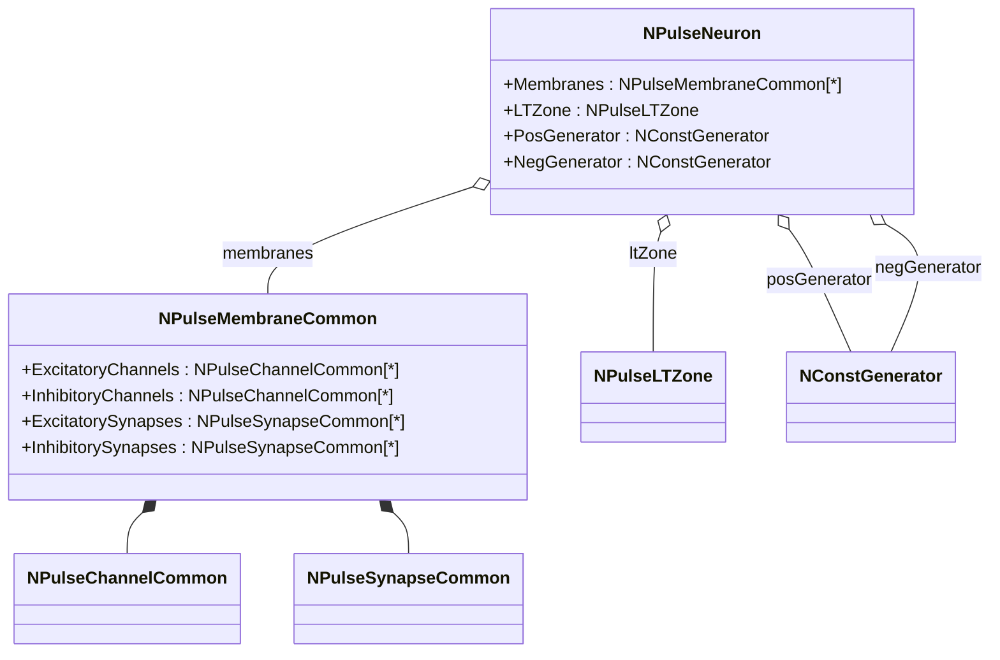
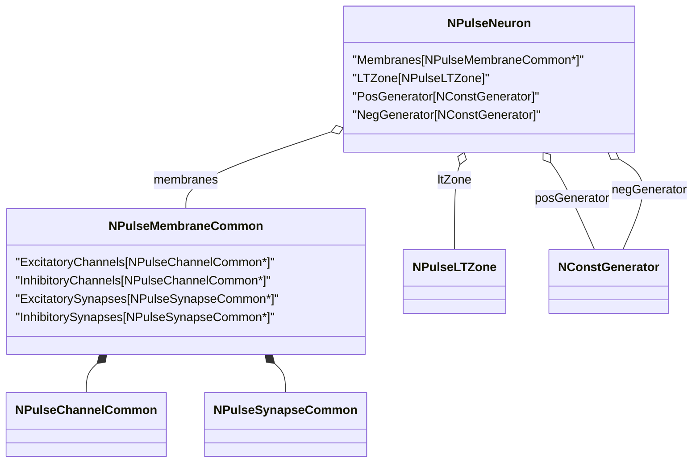

## Серия экспериментов: реакции одиночных нейронов

Работы [26], [29], [30] описывают **базовую модель импульсного нейрона** с разбиением мембраны на участки (дендриты, сома, низкопороговая зона) и исследуют:

- влияние размера сомы и числа участков мембраны на паттерн ответа;
- временную и пространственную суммацию возбуждающих/тормозных входов;
- пейсмекерные нейроны и нейроны с несколькими устойчивыми состояниями мембранного потенциала.

### Соответствующие конфигурации SpikeSamples

Конфигурации в `Bin/Configs/SpikeSamples/NM-Neurons` иллюстрируют приведённые в статьях схемы:

- `NM-Neurons/NM-PN-01-Neuron-1M1St1In1`
- `NM-Neurons/NM-PN-02-Neuron-1M1St3In3`
- `NM-Neurons/NM-PN-03-Neuron-4M4D3St3In`
- `NM-Neurons/NM-PN-04-Neuron-3M1St3In3`
- `NM-Neurons/NM-PN-05-Neuron-4M1D3St3In`
- `NM-Neurons/NM-PN-06-Neuron-1M4D3St3In`
- `NM-Neurons/NM-PN-07-LtmNeuron-1M1St3In3`
- `NM-Neurons/NM-PN-08-LtmNeuron-3M1St3In3`
- `NM-Neurons/NM-PN-NeuronSizeActivity`
- `NM-Neurons/LIF-Neuron`

Для каждой из этих конфигураций подготовлен локальный `README.md` с описанием:

- структуры нейрона (количество участков мембраны в соме и дендритах, структура LT‑зоны);
- типов входов (дендритные, соматические, пейсмекерные), их временного профиля;
- типичных реакций (число импульсов в пачке, зависимость частоты от числа участков сомы, пейсмекерная активность и т.д.).

### Концептуальная схема модели одиночного импульсного нейрона

В терминах работ [26], [29]:

- участки мембраны `Mi` реализуются как экземпляры `NPulseMembrane` / `NPulseMembraneCommon`;
- пары ионных механизмов (деполяризация/гиперполяризация) представлены возбуждающими и тормозными каналами (`ExcChannel` / `InhChannel`) и синапсами;
- низкопороговая зона и генератор потенциала действия — `NPulseLTZone` и связанная с ней обратная связь.

### Типовые сценарии экспериментов

Для большинства конфигураций серии PN‑нейронов в SpikeSamples сценарии повторяют или близки к описанным в работах [26], [29]:

- **Одиночный возбуждающий импульс** на одном из входов:
  - анализируется задержка и затухание сигнала при распространении по дендриту;
  - сравниваются реакции при стимуляции дистальных и проксимальных участков.
- **Серии импульсов различной частоты**:
  - для маленьких нейронов наблюдаются пачки импульсов с убывающей частотой;
  - для крупных нейронов — одиночные импульсы или редкие разряды.
- **Модификация структуры сомы**:
  - увеличение числа соматических участков ведёт к снижению частоты и изменению числа импульсов в пачке (см. `NM-PN-NeuronSizeActivity`).

Подробное соответствие каждого эксперимента конкретной конфигурации приведено в локальных `README.md` в `SpikeSamples/NM-Neurons/...`.

## SpikeSamples — реакции одиночных нейронов

Этот документ связывает конфигурации из `Bin/Configs/SpikeSamples/NM-Neurons/*` с моделью нейрона, описанной в работах [26], [29].

### Базовая модель спайкового нейрона

В основе всех конфигураций группы `NM-Neurons` лежит модель нейрона, где:

- мембрана представлена набором участков, каждый из которых содержит пару ионных механизмов (деполяризующий и гиперполяризующий);
- синапсы преобразуют входные импульсы в аналоговые величины (концентрация медиатора) и через изменение проводимости управляют эффективностью ионных механизмов;
- генератор потенциала действия формирует спайки при превышении суммарным мембранным потенциалом порогового значения.

В PulseLib это реализовано через связку:

- `NPulseNeuron` / `NPulseNeuronCommon` — нейрон как сеть участков мембраны и LT‑зоны;
- `NPulseMembrane` / `NPulseMembraneCommon` — участки мембраны (сома и дендриты) с каналами и синапсами;
- `NPulseChannel` / `NPulseChannelCommon` — ионные механизмы (возбуждающие и тормозные);
- `NPulseSynapse` / `NPulseSynapseCommon` — химические синапсы;
- `NPulseLTZone` — низкопороговая зона (генератор спайков).

Схематично одиночный нейрон можно изобразить так:

### Конфигурации NM-PN-01..08 и размер сомы

Конфигурации:

- `SpikeSamples/NM-Neurons/NM-PN-01-Neuron-1M1St1In1`
- `SpikeSamples/NM-Neurons/NM-PN-02-Neuron-1M1St3In3`
- `SpikeSamples/NM-Neurons/NM-PN-03-Neuron-4M4D3St3In`
- `SpikeSamples/NM-Neurons/NM-PN-04-Neuron-3M1St3In3`
- `SpikeSamples/NM-Neurons/NM-PN-05-Neuron-4M1D3St3In`
- `SpikeSamples/NM-Neurons/NM-PN-06-Neuron-1M4D3St3In`
- `SpikeSamples/NM-Neurons/NM-PN-07-LtmNeuron-1M1St3In3`
- `SpikeSamples/NM-Neurons/NM-PN-08-LtmNeuron-3M1St3In3`
- `SpikeSamples/NM-Neurons/NM-PN-NeuronSizeActivity`

демонстрируют влияние:

- **размера сомы** (числа участков мембраны, охваченных обратной связью генератора);
- **структуры дендритов** (число и топология последовательных участков);
- **расположения синапсов** (на дендритах или на соме)

на частоту и структуру спайковых паттернов ответа на однотипную стимуляцию.

В работах [26], [29] показано, что:

- малый нейрон (малая сома) при стимуляции одиночными входами генерирует пачки импульсов с убывающей частотой;
- крупный нейрон (большая сома) при тех же параметрах модели даёт одиночные спайки или короткие пачки;
- перемещение синапса с дендрита на сому увеличивает эффективность возбуждения.

Эти эффекты воспроизводятся в `SpikeSamples/NM-Neurons/*` за счёт изменения структуры мембраны при сохранении одинаковых параметров ионных механизмов и синапсов (R0, RF, Cm, τs, τd, порог P и т.п.) в `Parameters.xml`.

### Конфигурация LIF-Neuron

Конфигурация:

- `SpikeSamples/NM-Neurons/LIF-Neuron`

представляет упрощённую модель нейрона типа Leaky Integrate-and-Fire (LIF), реализованную средствами PulseLib. Она служит сравнительным примером между:

- полнодетализированными моделями мембраны (множество участков с деполяризующими/гиперполяризующими ионными механизмами);
- и упрощённой моделью с одной интегрирующей ёмкостью и утечкой.

В `README.md` этой конфигурации рекомендуется фиксировать:

- диапазон входных частот;
- зависимость числа спайков от частоты стимуляции;
- отличие формы мембранного потенциала от более сложных моделей.

### Кабельные конфигурации CableNeuron*

Группа:

- `SpikeSamples/NM-Neurons/CableModel/CableNeuron*`

содержит кабельные (компартментные) модели, в том числе варианты CSNM (compartmental spiking neuron model), которые используются в более поздних публикациях [7], [4] и др. Здесь мембрана представлена как цепочка или дерево участков, моделирующих распространение потенциала по дендриту.

В `README.md` этих конфигураций приведены:

- схема ветвления дендритов (mermaid‑диаграмма);
- описание типов экспериментов: локальное возбуждение дистальных участков, одновременное возбуждение нескольких ветвей, влияние длины и диаметра на затухание и задержку;
- связь с результатами, показанными на графиках в работах [26], [29] (например, задержка и амплитуда ответа в зависимости от точки приложения стимула).

### Как использовать этот документ

- Для каждого каталога `SpikeSamples/NM-Neurons/*` создан свой `README.md`, который:
  - ссылается на данный обзор;
  - уточняет конкретный сценарий эксперимента для данного конфигурационного файла;
  - приводит краткие результаты и ожидаемые графики (словами).
- Этот файл служит **мостом** между теоретическим описанием в работах [26], [29], [30] и конкретной структурой моделей в `SpikeSamples`.

## Литература

1. [31] Воспроизведение реакций естественных нейронов как результат моделирования структурно-функциональных свойств мембраны и организации синаптического аппарата // Нейрокомпьютеры: разработка, применение, №7, 2012. – с.25-35. [онлайн](https://neuromodeler.ru/index.php?option=com_content&view=article&id=20:2012-07-19-04-53-55&catid=67&lang=ru&Itemid=676) | [elibrary](https://www.elibrary.ru/item.asp?id=17997711)

2. [31] Математическое моделирование процессов преобразования импульсных потоков в естественном нейроне // Нейрокомпьютеры: разработка, применение, №3, 2009. – с.71-80. [онлайн](https://neuromodeler.ru/index.php?option=com_content&view=article&id=24:2012-11-07-16-42-21&catid=67&lang=ru&Itemid=676) | [elibrary](https://www.elibrary.ru/item.asp?id=13070281)

3. Романов С.П., [27] Математическая модель биологического нейрона // Труды семинара "Моделирование неравновесных систем - 2000" (20-22 октября 2000 г. Красноярск)

4. Korsakov, A., Astapova, L., Bakhshiev, A. The Method of Structural Adaptation of the Compartmental Spiking Neuron Model // Cyber-Physical Systems and Control II. CPS&C 2021. Lecture Notes in Networks and Systems, vol 460. Springer, Cham, 2023. [DOI](https://doi.org/10.1007/978-3-031-20875-1_51)

5. Bakhshiev A. V., Demcheva A. A. Compartmental spiking neuron model CSNM // Izvestiya VUZ. Applied Nonlinear Dynamics, 2022, vol. 30, iss. 3, pp. 299-310. [DOI](https://doi.org/10.18500/0869-6632-2022-30-3-299-310)

