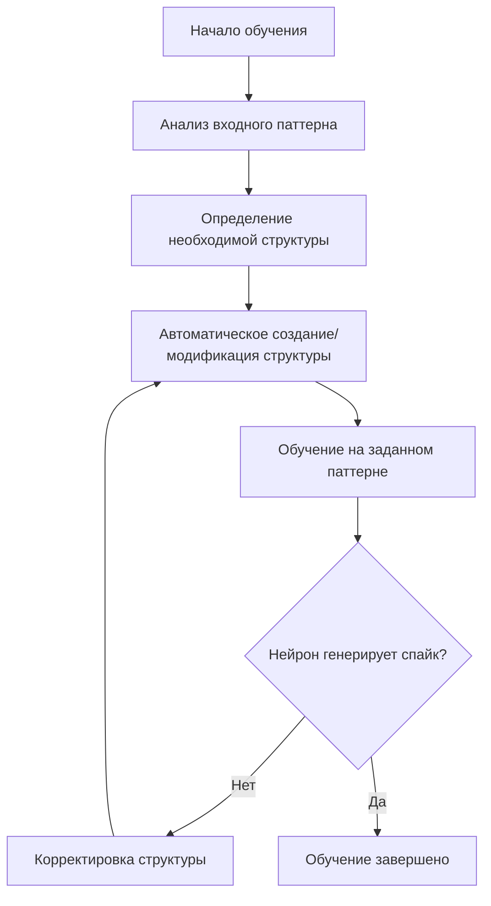
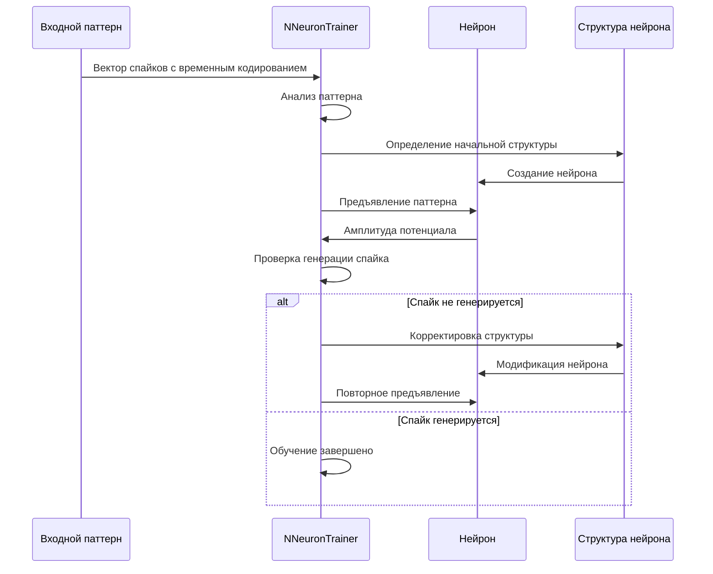

## Метод структурной адаптации компартментной спайковой модели нейрона

### Назначение метода

Метод структурной адаптации позволяет автоматически подбирать параметры компартментной спайковой модели нейрона в зависимости от заданного входного паттерна. В отличие от традиционных методов обучения, где изменяются только синаптические веса, структурная адаптация изменяет саму топологию нейрона: размер сомы, длину дендритов и количество синапсов на каждом дендрите.

### Основные концепции

#### Задача обучения

Задача обучения состоит в формировании ответа на паттерн, представленный **вектором одиночных спайков с временным кодированием**, где каждый компонент вектора входит в отдельный дендрит нейрона.

Временное кодирование означает, что числовая информация преобразуется в последовательность импульсов, где момент времени появления импульса несёт информацию о значении. Например, большее значение может кодироваться более ранним временем появления спайка.

#### Автоматический подбор параметров нейрона

В зависимости от заданного паттерна алгоритм автоматически выбирает следующие параметры модели нейрона:

1. **Размер сомы** (количество соматических участков мембраны, N_s)
   - Влияет на способность нейрона интегрировать входные сигналы
   - Большая сома обеспечивает более стабильную интеграцию, но может снижать чувствительность

2. **Длина дендритов** (количество сегментов в каждом дендрите, N_d)
   - Определяет задержку распространения сигнала от синапса к соме
   - Более длинные дендриты позволяют лучше обрабатывать временные паттерны
   - Каждый дендрит может иметь свою длину

3. **Количество синапсов на каждом дендрите** (N_syn)
   - Определяет количество входных каналов для каждого дендрита
   - Влияет на способность нейрона различать различные паттерны

#### Признак распознавания паттерна

Признаком распознавания паттерна обученной моделью является **генерация выходного спайка** нейроном при предъявлении соответствующего входного паттерна.

#### Универсальное значение порога активации

Экспериментально было определено **универсальное значение порога активации нейрона**, которое не зависит от размера вектора, описывающего входной паттерн. Это важное свойство позволяет использовать один и тот же порог для различных задач классификации без необходимости его подстройки.

### Алгоритм структурной адаптации

Процесс структурной адаптации можно представить следующими этапами:

**Схема процесса структурной адаптации:**



#### Этап 1: Анализ входного паттерна

- Определение размерности вектора паттерна (количество компонентов)
- Анализ временного кодирования (времена появления спайков)
- Определение требуемого количества дендритов (равно количеству компонентов вектора)

#### Этап 2: Определение необходимой структуры

- Выбор начальной структуры нейрона:
  - Количество соматических участков (обычно начинается с минимального)
  - Количество дендритов (равно размерности входного паттерна)
  - Начальная длина каждого дендрита (обычно начинается с 1 сегмента)
  - Количество синапсов на каждом дендрите (обычно начинается с 1)

#### Этап 3: Автоматическое создание/модификация структуры

На этом этапе происходит:
- Создание структуры нейрона с заданными параметрами
- Подключение входных генераторов к соответствующим синапсам
- Настройка параметров мембраны, каналов и синапсов

#### Этап 4: Обучение на заданном паттерне

- Предъявление входного паттерна нейрону
- Мониторинг активности нейрона
- Измерение амплитуды мембранного потенциала
- Проверка генерации выходного спайка

#### Этап 5: Корректировка структуры (при необходимости)

Если нейрон не генерирует спайк или генерирует его некорректно:
- Увеличение длины дендритов (для улучшения временной обработки)
- Изменение размера сомы (для изменения порога активации)
- Добавление синапсов (для усиления входного сигнала)
- Повторное обучение с новой структурой

### Реализация в NMSDK

В NMSDK структурная адаптация реализована через компонент `NNeuronTrainer` (библиотека `Nmsdk-PulseLib`).

#### Основные параметры NNeuronTrainer

- `NumInputDendrite` — количество входных дендритов (соответствует размерности входного паттерна)
- `MaxDendriteLength` — максимальная длина дендритов
- `InputPattern` — матрица входных паттернов (временное кодирование)
- `LTZThreshold` — порог активации низкопороговой зоны
- `FixedLTZThreshold` — фиксированный порог активации
- `TrainingLTZThreshold` — порог активации во время обучения
- `SpikesFrequency` — частота генерации спайков
- `StructureBuildMode` — режим сборки структуры (1 — структурная адаптация)
- `CalculateMode` — режим расчёта (определяет алгоритм обучения)

#### Процесс структурной адаптации в NNeuronTrainer

Компонент `NNeuronTrainer` реализует структурную адаптацию следующим образом:

1. **Инициализация структуры:**
   - Создание нейрона с начальной структурой
   - Создание генераторов импульсов для каждого входного дендрита
   - Подключение генераторов к синапсам на дендритах

2. **Итеративное обучение:**
   - На каждой итерации измеряется амплитуда мембранного потенциала
   - Если амплитуда увеличивается при увеличении длины дендрита — дендрит продолжает расти
   - Если амплитуда не увеличивается — дендрит укорачивается или обучение переходит к следующему дендриту

3. **Синхронизация дендритов:**
   - Алгоритм стремится синхронизировать времена достижения максимальной амплитуды на разных дендритах
   - Это обеспечивает оптимальную временную обработку паттерна

4. **Завершение обучения:**
   - Обучение завершается, когда все дендриты синхронизированы и нейрон генерирует спайк при предъявлении паттерна

### Соответствующие конфигурации SpikeSamples

Следующие конфигурации демонстрируют структурную адаптацию:

- **`SpikeSamples/StructTrain/SpikeTrainer`** — базовое структурное обучение
  - Демонстрирует процесс структурной адаптации на простом паттерне
  - Использует компонент `NNeuronTrainer` для автоматической подстройки структуры

- **`SpikeSamples/StructTrain/SpikeAnsTrainer`** — структурное обучение с ответами
  - Расширенная версия с возможностью обучения на нескольких паттернах
  - Демонстрирует формирование ответов на различные входные паттерны

- **`SpikeSamples/NM-Neurons/CableModel/CableNeuronMulti_CSNM*`** — CSNM модели с возможностью структурной адаптации
  - Демонстрируют структурную адаптацию на компартментных моделях нейронов
  - Показывают влияние пространственных параметров на процесс адаптации

### Параметры, влияющие на структурную адаптацию

#### Максимальная длина дендритов (`MaxDendriteLength`)

- Ограничивает максимальное количество сегментов в каждом дендрите
- Влияет на максимальную задержку обработки сигнала
- Рекомендуемые значения: от 10 до 100 сегментов в зависимости от задачи

#### Максимальное количество синапсов

- Определяется структурой нейрона и параметрами мембраны
- Влияет на способность нейрона интегрировать множественные входы
- Обычно устанавливается равным количеству входных дендритов

#### Порог активации нейрона (`LTZThreshold`, `FixedLTZThreshold`)

- Универсальное значение порога, не зависящее от размера входного паттерна
- Критически важен для правильного распознавания паттернов
- Может быть фиксированным или адаптивным в зависимости от режима обучения

#### Параметры временного кодирования

- `SpikesFrequency` — частота генерации спайков входными генераторами
- `Delay` — задержка начала обучения относительно старта системы
- `InputPattern` — матрица временных задержек для каждого компонента паттерна

### Схема процесса структурной адаптации

**Диаграмма последовательности процесса структурной адаптации:**



### Влияние параметров на результат адаптации

#### Размер сомы

- **Малая сома** (1-2 участка):
  - Высокая чувствительность к входным сигналам
  - Быстрая генерация спайков
  - Может быть нестабильной при сложных паттернах

- **Большая сома** (3+ участков):
  - Более стабильная интеграция сигналов
  - Более высокий порог активации
  - Лучше подходит для сложных паттернов

#### Длина дендритов

- **Короткие дендриты** (1-3 сегмента):
  - Минимальная задержка обработки
  - Быстрая реакция на входные сигналы
  - Ограниченные возможности временной обработки

- **Длинные дендриты** (10+ сегментов):
  - Значительная задержка обработки
  - Возможность обработки сложных временных паттернов
  - Может потребоваться больше времени на обучение

#### Количество синапсов

- **Один синапс на дендрит:**
  - Простая структура
  - Быстрое обучение
  - Ограниченная способность к интеграции

- **Несколько синапсов на дендрит:**
  - Более сложная структура
  - Улучшенная интеграция сигналов
  - Может потребоваться больше времени на обучение

### Связь с другими методами обучения

Структурная адаптация может комбинироваться с другими методами обучения:

- **STDP (Spike-Timing-Dependent Plasticity)** — изменение синаптических весов в зависимости от времени спайков
- **Инкрементальное обучение** — обучение на новых образцах без переобучения на всех предыдущих
- **Классификация** — применение структурной адаптации для решения задач классификации

### Примеры использования

#### Пример 1: Простое распознавание паттерна

```cpp
// Создание NNeuronTrainer
NNeuronTrainer* trainer = CreateComponent<NNeuronTrainer>("Trainer");

// Настройка параметров
trainer->NumInputDendrite = 3;  // 3 компонента в паттерне
trainer->MaxDendriteLength = 50;
trainer->LTZThreshold = 0.0117;  // Универсальный порог
trainer->SpikesFrequency = 1.5;

// Задание входного паттерна (временные задержки в секундах)
MDMatrix<double> pattern;
pattern.Resize(3, 1);
pattern[0] = 0.0;   // Первый спайк в момент 0
pattern[1] = 0.1;   // Второй спайк через 0.1 сек
pattern[2] = 0.2;   // Третий спайк через 0.2 сек
trainer->InputPattern = pattern;

// Запуск обучения
trainer->IsNeedToTrain = true;
trainer->Reset();
```

#### Пример 2: Обучение на нескольких паттернах

Структурная адаптация может использоваться для обучения нейрона распознавать несколько различных паттернов, где каждый паттерн соответствует отдельному классу.

### Результаты экспериментов

Согласно публикации [1]:

- Метод структурной адаптации успешно применяется для обучения компартментной спайковой модели нейрона
- Универсальное значение порога активации позволяет использовать один и тот же порог для различных размеров входных паттернов
- Качество распознавания паттернов сопоставимо с классическими методами обучения
- Структурная адаптация обеспечивает автоматический подбор оптимальной структуры нейрона для каждого паттерна

### Связанные материалы

- [`IncrementalLearning.md`](IncrementalLearning.md) — стратегия инкрементального обучения, использующая структурную адаптацию
- [`Classification.md`](Classification.md) — применение структурной адаптации для задач классификации
- [`CSNM-Models.md`](CSNM-Models.md) — описание компартментной спайковой модели нейрона
- [`ImpulseProcessingModel.md`](ImpulseProcessingModel.md) — модель преобразования импульсных потоков
- `Libraries/Nmsdk-PulseLib/Docs/Components/NNeuronTrainer.md` — документация компонента NNeuronTrainer

## Литература

1. Korsakov, A., Astapova, L., Bakhshiev, A. The Method of Structural Adaptation of the Compartmental Spiking Neuron Model // Cyber-Physical Systems and Control II. CPS&C 2021. Lecture Notes in Networks and Systems, vol 460. Springer, Cham, 2023. [DOI](https://doi.org/10.1007/978-3-031-20875-1_51)
